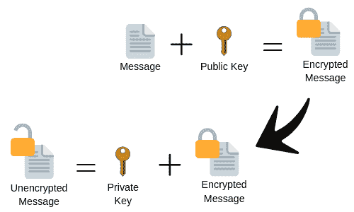

# 建立信任:为什么 TLS 对你很重要

> 原文：<https://dev.to/hammotime/establishing-trust-why-tls-should-be-important-to-you-1758>

*本文交叉转贴自 [hammo.io](https://www.hammo.io/2019/05/16/secure-tls-important/) 。*

在当今世界，信任是非常宝贵的。人们把他们的数据托付给你，在某些情况下，这意味着他们把他们的生活托付给你。从设计上来说，互联网是一个用于传递信息的开放透明的系统。这种设计与我们今天使用现代互联网的方式直接竞争。这就是为什么理解 TLS 并在你的网站上实现它是很重要的。TLS 不仅仅是一个软件，嵌入到根 CA 系统中的底层社会架构让用户相信，当他们连接到您的网站时，它实际上是您的网站，并且他们的连接是安全的。

# 什么是 TLS

TLS 基本上是在线交易的“沉默锥”。TLS 使双方(即“您”和“您的客户”)之间的交易能够安全进行。TLS 有两个部分:公钥加密和 TLS 通信。公钥加密是用于加密安全通信中使用的数据的方法，TLS 通信是指在 web 服务器上实施公钥加密。

# 公钥加密是如何工作的？

公钥加密(PKE)解决了一方如何与另一方通话而双方事先不知道通信的问题。这可以使用非对称加密来解决，这意味着用于加密和解密的密钥是不同的(即“非对称”)。这两个键是:

1.  私钥:这是可以用来解密数据的秘密密钥。在对称加密中，该密钥用于解密和加密。
2.  公钥:这是一个从私钥派生的密钥。此密钥用于加密数据，为发送数据做准备。

在 PKE 场景中，希望接收通信的一方分发他们的密钥，发送信息的一方使用该密钥来加密他们的消息。一旦他们加密了数据，他们就可以确保数据被安全地发送给接收者，即使是通过不安全的通信媒介。

# 为什么要信任证书颁发机构？

根证书颁发机构(Root CAs)是一个小的公司列表，这些公司有权被主流操作系统和 Web 浏览器预先信任。他们通过遵循[供应商](https://www.chromium.org/Home/chromium-security/root-ca-policy)制定的政策和程序[来获得这一权利。根 CA 需要遵守的主要策略之一是确保其根 CA 的私钥是安全的。大多数根 CA 通过颁发中间 CA 证书来实现这一点，中间 CA 证书具有较短的生命周期，并且可以很容易地被供应商撤销。](https://docs.microsoft.com/en-us/security/trusted-root/program-requirements)

当用户从 CA 请求证书时，他们必须验证他们请求证书的域是他们的。他们通常通过电子邮件或 DNS 记录做到这一点。确认后，CA 会向用户颁发证书。从现在开始，使用这个证书连接到服务器的人可以确定这个服务器实际上是属于域名持有者的。这种保证确保了用户不会受到试图拦截加密通信的中间人攻击或其他黑客攻击。

那些负责管理可信根 CA 列表的人可以在 CA 疏忽他们同意的承诺时采取行动。最近，谷歌决定撤销赛门铁克控制的一些根 ca，因为他们的[疏忽](https://www.darkreading.com/endpoint/google-wont-trust-symantec-and-neither-should-you/a/d-id/1328682)。这导致用户在浏览包含不可信网站的网站时看到下面的错误。这是第一次对不遵守既定规则的 CA 进行大规模处罚。这个反应给了我们对根 CA 系统的信心。

## 告诫

重要的是要注意，这个系统不一定验证一个人是谁，只验证他们拥有你正在连接的域名。它也不能验证服务器是否已经受损。仅信任证书不足以验证服务器是否值得信任。可信证书不起作用的情况示例:

1.  一个黑客已经侵入了一个服务器，并且正在窃取服务器上的信息，并且没有干扰服务器和客户端之间的通信。
2.  黑客购买了合法的域并拥有合法的证书。他们使用这个“合法的”安全服务器作为平台来执行网络钓鱼或托管间谍软件。
3.  一家公司错误地处理了他们的私钥，一个不受信任的第三方使用它们来创建新的证书，这些证书可以在不属于域所有者的服务器上使用。

# 那么，TLS、PKE 和 CAs 是如何协同工作的呢？

现在我们已经了解了 PKE 和 CAs 的工作原理，让我们来看看客户端和服务器建立安全通信的过程。

1.  客户端连接到服务器，并向它发送有关它可以使用的 TLS 版本的信息。
2.  服务器以关于客户端应该使用哪种协议、密码和其他方法来与服务器通信的指令来响应。服务器还包括它的 RSA 证书。
3.  客户端接收 RSA 证书，并根据其证书颁发机构(CA)根存储进行验证。这一步建立了社会信任:一个可信的实体(根 CA)已经保证你的服务器就是它所说的那个人。
4.  一旦客户端认为您的服务器值得信任，它就会生成一个临时密钥，并使用证书的公钥将其发送回服务器。
5.  服务器用它自己的临时密钥进行响应，这个临时密钥是用它的私钥签名的。
6.  客户端通过对照签名的临时密钥检查公共密钥来验证它从服务器接收的临时密钥。
7.  一旦所有的密钥都被验证，通信就被加密了。

握手完成后，您的通信将被加密，所有未来的消息都将使用临时密钥发送。

# 终究没那么复杂！

这是对 PKE、TLS 和根 ca 的简单介绍。虽然我没有涵盖所有内容，但我希望您现在明白了为什么它对您如此重要。在 web 服务器上激活 TLS 可以提供:

*   让用户相信你就是你所说的那个人。
*   保护您和您的用户之间的通信。

最棒的部分是什么？你可以使用[让我们加密](https://letsencrypt.org/)或者(如果你使用 AWS) [亚马逊证书管理器](https://aws.amazon.com/certificate-manager/)在你的服务器上免费实现证书。如果你想阅读更多这样的文章，请查看我在 [hammo.io](https://www.hammo.io) 的博客。

* * *

### 参考文献

*   [https://www . globalsign . com/en/SSL-information-center/what-is-public-key-cryptography/](https://www.globalsign.com/en/ssl-information-center/what-is-public-key-cryptography/)
*   [https://en.wikipedia.org/wiki/Transport_Layer_Security](https://en.wikipedia.org/wiki/Transport_Layer_Security)
*   [https://security . stack exchange . com/questions/90195/how-ecdhe-is-signed-by-RSA-ecdhe-RSA-cipher](https://security.stackexchange.com/questions/90195/how-ecdhe-is-signed-by-rsa-in-ecdhe-rsa-cipher)
*   [https://security . stack exchange . com/questions/8034/how-the-digital-signature-verification-process-work](https://security.stackexchange.com/questions/8034/how-does-the-digital-signature-verification-process-work)
*   [https://docs . Microsoft . com/en-us/security/trusted-root/program-requirements](https://docs.microsoft.com/en-us/security/trusted-root/program-requirements)
*   [https://www . chromium . org/Home/chromium-security/root-ca-policy](https://www.chromium.org/Home/chromium-security/root-ca-policy)
*   [https://wiki.mozilla.org/CA](https://wiki.mozilla.org/CA)
*   [https://www . dark reading . com/endpoint/Google-wont-trust-Symantec-and-noy-should-you/a/d-id/1328682](https://www.darkreading.com/endpoint/google-wont-trust-symantec-and-neither-should-you/a/d-id/1328682)
*   [https://security . Google blog . com/2018/03/untrust-of-Symantec-PKI-immediate . html](https://security.googleblog.com/2018/03/distrust-of-symantec-pki-immediate.html)