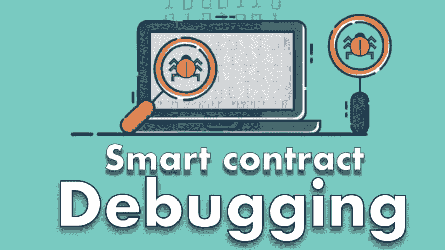

# 以太坊/ Solidity 智能合约调试课程

> 原文：<https://dev.to/jklepatch/ethereum--solidity-smart-contract-debugging-course-4dg1>

我刚刚发布了一个关于用 Solidity 进行[智能合约调试的课程。涵盖了 Remix debugger，Truffle debugger，如何像使用 Javascript 一样使用 console.log in Solidity 以及大量其他见解。](https://eattheblocks-pro.teachable.com/p/smart-contract-debugging)

花 [10 美元/月](https://eattheblocks-pro.teachable.com/p/all-access-monthly-subscription)你不仅可以在 EatTheBlocks Pro 上观看本课程，还可以观看所有其他视频——超过 70 个视频，10 小时的独家内容，每天 1 个新视频，这是以太坊/ Solidity 最大的学习资源，始终保持最新(Solidity 0.5.0，Truffle 0.5.0...).

[链接](https://eattheblocks-pro.teachable.com/p/smart-contract-debugging)

