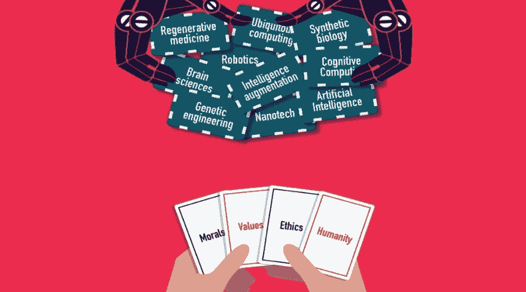
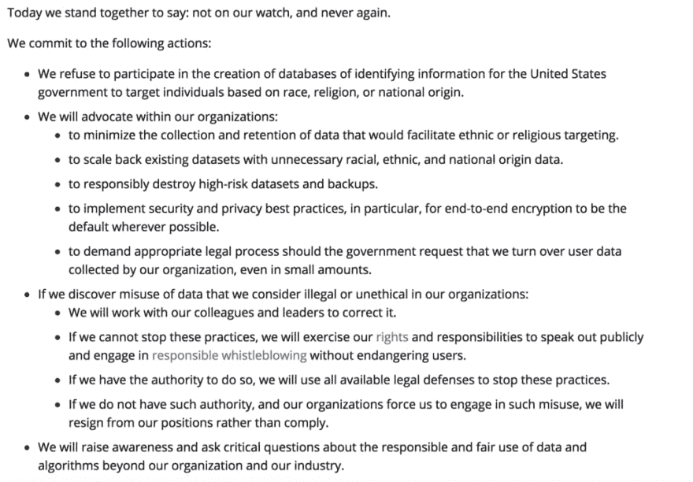
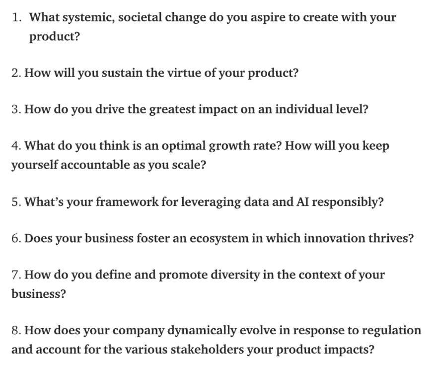

# 道德编码

> 原文：<https://dev.to/kcarrel/ethics-encoded-5bcl>

<figure>

<figcaption></figcaption>

</figure>

随着我在熨斗学校沉浸式软件工程项目的时间接近尾声，我发现自己在反思自己作为一名新兴初级开发人员的个人价值观和科技行业的道德规范。对我来说，进入科技行业最引人注目的一个方面是增长的速度有多快，该领域的进步有多快，以及需要应对的挑战有多多丰富。然而，在行业内以进步的名义滥用消费者数据和社会影响的案例层出不穷，这让我停下了脚步。我们有可能参与哪些系统并做出贡献？这些对社会和个人有什么影响？作为这个行业的新开发人员，我的角色是什么？它也越来越多地回避了一个问题——为什么科技行业内没有一个标准化的道德准则？

### 现实世界中的冲击

围绕道德技术创造和创新的对话在技术人员、公共领域和政治运动中迅速增长。

“快速行动，打破常规”是马克·扎克伯格(Mark Zuckerberg)现在臭名昭著的座右铭，在剑桥分析公司(Cambridge Analytica)的丑闻和脸书在缅甸罗辛亚人种族灭绝事件中的影响之后，它变得更加邪恶。不幸的是，虽然这是两个非常公开和极端的技术创新失败对现实世界产生影响的例子，但它们并不孤单。

*   社交媒体上的错误信息——脸书、推特和 Youtube 就是突出的例子
*   [中国的社会信用体系](http://reillytop10.com/2017/12/03/social-credit-systems/) —数据挖掘的潜在影响
*   [2016 年，优步向黑客支付了 10 万美元来掩盖一次暴露了 5700 万人个人数据的网络攻击](https://www.bloomberg.com/news/articles/2017-11-21/uber-concealed-cyberattack-that-exposed-57-million-people-s-data)
*   谷歌蜻蜓项目——谷歌试图将审查搜索带回中国
*   Palantir 是一家数据分析公司，构建并运营一个收集大量人类数据的基础设施，并将其出售给情报、执法和国土安全客户

这里的要点不应该是“所有的技术都是邪恶的”，而是在技术社区中，道德和负责任的实践有很大的增长空间。作为初露头角的开发人员，我们是推动和实施这一变革的关键角色之一。

### 怎么办？

> “我们对付科技公司的一个有效手段是员工压力。软件工程师很难雇佣，培训成本很高，而且需要很长时间才能更换。”—马切伊·切格洛夫斯基

2018 年，谷歌退出了他们的 A.I 与五角大楼的项目专家合作，此前约 4000 名员工签署了一份请愿书，要求“明确的政策表明，谷歌及其承包商都不会建造战争技术”，其他员工辞职以示抗议。您可以通过参与和采取行动来参与关于道德技术承诺的对话，从而对行业和您未来的公司产生影响。

*   研究你申请的公司——它们的价值观是什么？他们在建什么？
*   当感觉不对劲时，大声说出来并采取行动
*   对正在进行的对话进行自我教育，并参与其中
*   考虑向从事相关工作的组织捐赠金钱或时间

开发人员在其社区内采取行动的一个很好的例子是“永不再来”技术运动，这是由 50 名技术工人共同努力创建的，他们帮助创建、组织和管理了对“以下承诺”的支持。这是出于在技术界建立团结的愿望，通过公开承诺反对美国政府按种族、宗教或国籍识别人们的数据库。以下承诺于 2016 年发布。

<figure> 

<figcaption>[永不再理工誓言](http://neveragain.tech/about.html)</figcaption>

</figure>

虽然“永不再发生”科技誓言的公众签名征集期已经结束，但该组织的组织者还拥有进一步的资源来采取其他行动，在这个问题上有所作为。

### 作为创作者要问自己的问题

《哈佛商业评论》建议“MVP”这个词应该从“最低生存能力的产品”演变为“最低道德的产品”。虽然科技行业发展迅速，生产冲刺往往快至三周，但花时间检查和思考正在制造的产品的潜在影响非常重要。下面是 HBR 提供的一个列表，以帮助指导这一过程。

<figure>

<figcaption>[https://HBR . org/2019/01/the-era-of-move-fast-and-break-things-over](https://hbr.org/2019/01/the-era-of-move-fast-and-break-things-is-over)</figcaption>

</figure>

当我退出这个软件工程项目时，我相信我将获得一系列技能，这些技能将帮助我完成许多个人项目和目标。然而，在每一步，我都会面临这样的挑战——“是的，我能做到，但是我应该这样做吗？”

行业可以做得更好，我们可以提供帮助。

**资源**

[科技人文主义者宣言](https://medium.com/intuitionmachine/the-tech-humanist-manifesto-bf9ebaa1e45f)

[永不再科技誓言](http://neveragain.tech/)

[打造更好的怪物谈](https://idlewords.com/talks/build_a_better_monster.htm)

[马库拉应用伦理中心——做出伦理决策应用](https://www.scu.edu/ethics-app/)