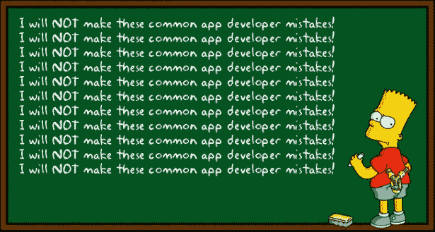

# 即使是大公司也会搞砸

> 原文：<https://dev.to/dan_starner/even-the-big-ones-mess-up-51dp>

今天早上，由于我的朋友和家人抱怨一些新的 Instagram 大修，我的 feed 爆炸了。显然，他们的提要是水平滚动的，而不是通常的垂直滚动。事实证明，这只是 Instagram 工程团队的一个大失误，正如他们的工程主管在推特上所说。

> 亚当·莫塞里@莫塞里[@ alexe heath](https://twitter.com/alexeheath)很抱歉，这本来应该是一个非常小的测试，但我们的范围超出了我们的预期。😬2018 年 12 月 27 日下午 16:08

当这样的事情发生时，有趣的是看到*支持*和*反对*这一变化的反应在社交媒体上传播得如此之快，但另一方面，这让我对自己是一名开发人员感觉更好。

## 如果他们能搞砸，你也能

像看 Instagram 不小心过度扩大了他们对新 UI 的测试，或者[亚马逊的 Alexa 因新设备涌入而在圣诞节崩溃](https://gizmodo.com/alexa-crapped-out-on-christmas-1831319216)这样的故事让我意识到，无论这些公司多么大或多么强大，它们仍然是由人类运营的，人类会失算和犯错。

所以，如果 Instagram 或亚马逊可以犯这些错误，为什么我有时会给自己写错误代码带来这么多麻烦？没有人能看到运行他们软件的所有用例及结果，错误确实会发生。

你、我、亚马逊或 Instagram...我们永远不会写出*完美的*软件或者总是把事情做对，因为没有正确的方法或完美的软件。无论当时对你、你的团队或你的公司起作用的是什么都足够好了，直到你不得不为新的用户/边缘情况做出修改。

如果我们作为开发人员一直编程，直到我们认为我们的代码是“完美”的，那么要么它不会真的*完美，要么我们永远不会完成它！尽可能提前设计和计划，但是不要因为写了错误的代码而责备自己，因为这是很自然的事情。如果没有任何错误的代码或系统需要修复，许多工程师将会失业🙈*

无论我们做了多少准备，我们都会犯错误，那只是生活的一部分。重要的是我们如何面对这些错误和问题，以及我们为使软件更好而带来的坚韧。无论我们是单独的开发者，还是像 Instagram 这样的大公司，这些想法都是有规模的。

那么你的想法是什么？当这么大的公司犯错时，我们应该给他们多大的麻烦？你对编写好的代码和足够好的代码有什么想法？你对科技债务和发布时间之间的平衡有什么想法？