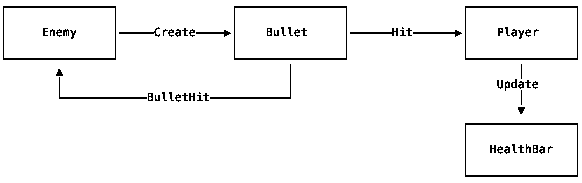
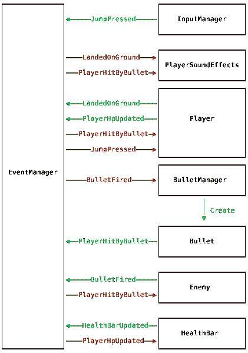

# Unity 中事件驱动的游戏开发

> 原文：<https://dev.to/vivavolt/event-driven-game-development-in-unity-5hi2>

我将花一点时间介绍一种不同的方式来构建你的 Unity 游戏。我的代码示例将特别适用于 Unity，但这种模式可以应用于任何引擎或语言，并且适用于几乎任何上下文，而不仅仅是游戏开发。

所以，你已经读过标题，你可能想知道:什么是事件驱动编程？简而言之，它认为应用程序中发生的是一系列事件，并围绕这一信念构建代码。这些事件作为你的不同系统之间的输入和输出，即`Jump Button Pressed`、`Player Landed On Ground`、`Sound Effect Played`。在常规的旧 unity 代码中，这是您的方法调用通常表示的内容:

```
void Update() {
  if (JumpButtonPressed()) {
    Jump();
  }
}

void LandedOnGround() {
  LandSound.Play();
} 
```

Enter fullscreen mode Exit fullscreen mode

当所有的东西都可以在同一个游戏对象中被捕获时，这是简单和可读的。更复杂的例子呢？假设我们有一个在`Player`解雇`Bullets`的`Enemy`。如果一个`Bullet`击中了一个`Player`，那么我们希望`Player`失去 HP(和他们的生命值更新)和一个声音播放。我们也希望`Enemy`能够庆祝他们成功射击玩家。

[](https://res.cloudinary.com/practicaldev/image/fetch/s--il30hGHx--/c_limit%2Cf_auto%2Cfl_progressive%2Cq_auto%2Cw_880/https://bf.wtf/event-driven-unity-one--basic-def699557f5b263c408809f08e4444c0.svg)T3】

```
// Enemy.cs

private float _timer = 0;

void Update() {
  _timer += Time.deltaTime;

  if (_timer > 2) {
    var bulletObject = GameObject.Instantiate(BulletPrefab, transform.position, Quaternion.identity);
    bulletObject.GetComponent<Bullet>().SetSourceEnemy(this);
    _timer = 0;
  }
}

public void BulletHit() {
  Animator.Play("Celebrate");
}

// Bullet.cs

void OnCollisionEnter2D(Collision2D col) {
  var player = col.gameObject.GetComponent<Player>();
  if (player) {
    player.Hit();
    sourceEnemy.BulletHit();
  }
}

// Player.cs

void Update() {
  if (JumpButtonPressed()) {
    Jump();
  }
}

public void Hit() {
  Hp -= 2;
  HealthBar.Update(Hp);

  HurtSound.Play();
}

void LandedOnGround() {
  LandSound.Play();
} 
```

Enter fullscreen mode Exit fullscreen mode

这是*好的*代码，但是我们开始在我们的脚本之间引入一些非常紧密的耦合。我们的子弹必须了解我们的玩家和敌人。更糟糕的是，我们的玩家类必须知道 UI！这与单一责任原则正好相反(T2 中的 S 是实心的 T3)。这里有许多不同的模块需要拆分:

*   项目符号——一个常见的问题，应该由能够处理对象池的项目符号管理器来处理
*   用户界面不应该直接链接到游戏实体
*   声音——一个 PlayerSoundEffects 管理器应该控制声音效果的播放方式，它们是否会相互干扰以及全局音量设置
*   敌人——只需要开枪，如果子弹击中了什么东西，就会得到通知
*   玩家-响应跳跃按钮跳跃，并在受伤时做出反应

相反，如果我们在这里引入一个中介呢？可以缓冲我们游戏中不同系统之间的通信的东西。我将称之为`EventManager`。我们的`EventManager`将让我们定义不同的事件类型，并允许我们游戏中的不同组件订阅这些事件的通知。看看[我的实现](https://gist.github.com/bfollington/39aa48eb09dc904c7636a6c676b98a1c)如果你感兴趣，这将最终作为一些开源 TwoPM 品牌 Unity 工具包的一部分发布。如果您打开该链接时感到有点不知所措，请不要担心，我写它时也是这样，它的内部工作方式对本文并不重要。

```
// Events.cs

public class PingEvent {}
public class PongEvent {}

// Pinger.cs

void Start() {
  EventManager.AddListener<PongEvent>(
    (ev) => {
      Debug.Log("Pong");
    }
  );
}

void OnClicked() {
  EventManager.Dispatch<PingEvent>();
}

// Ponger.cs

void Start() {
  EventManager.AddListener<PingEvent>(
    (ev) => {
      Debug.Log("Ping");
      EventManager.Dispatch<PongEvent>();
    }
  );
} 
```

Enter fullscreen mode Exit fullscreen mode

当我们运行这个并点击`Pinger`游戏对象时，我们将会看到下面的输出:

```
> "Ping"
> "Pong" 
```

Enter fullscreen mode Exit fullscreen mode

那么，这对于我们上面的项目符号示例来说会是什么样的呢？

[](https://res.cloudinary.com/practicaldev/image/fetch/s--EXkiXwzL--/c_limit%2Cf_auto%2Cfl_progressive%2Cq_auto%2Cw_880/https://bf.wtf/event-driven-unity-one--events-a5c5bdab9e025626195f94ad17e5e20d.svg)

哇，事情变得更复杂了。有更多的移动部分，正如你所料，这将转化为更多的代码行。这种模式是一个很好的例子，说明了**行代码与理解和处理程序**的难度几乎没有关系。

你可以这样想:我们设置事物的默认方式是一个庞大的对象网络，所有的对象都相互了解，并直接相互交流。但是，有了我们的`EventManager`，我们可以一次专注于一个*小的*子问题。当我试图重新设计我的用户界面时，我不想考虑音效。不要在物体中思考，试着在行为中思考。我们的玩家只是行为的集合:

```
// Behaviour: Update HealthBar
PlayerHitByBullet → PlayerHpUpdated → UiHealthBarUpdated

// Behaviour: Play Sounds
PlayerHitByBullet → PlayerHurtSoundPlayed 
LandedOnGround → PlayerLandedOnGroundSoundPlayed

// Behaviour: Jump
JumpPressed → PlayerJumped 
```

Enter fullscreen mode Exit fullscreen mode

无论这些行为都存在于一个对象上还是分散在场景中，都没有关系。这让我们可以根据代码*实际做的事情*来划分代码。那么我们的例子实际上是什么样的呢？我将只关注`Player`、`HealthBar`、`Enemy`、`BulletManager`和`Bullet`作为例子。

```
// Player.cs

void Start() {
  EventManager.AddListener<JumpPressed>(
    (ev) => {
      Jump(); // Let's pretend this exists
      EventManager.Dispatch<PlayerJumped>();
    }
  );

  EventManager.AddListener<PlayerHitByBullet>(OnHit);
}

private void OnHit(PlayerHitByBullet e) {
  Hp -= 2;
  EventManager.Dispatch(new PlayerHpUpdated(Hp));
}

// HealthBar.cs

void Start() {
  EventManager.AddListener<PlayerHpUpdated>(
    (ev) => {
      HealthBarDisplay.Value = ev.Hp;
      EventManager.Dispatch<HealthBarUpdated>();
    }
  );
}

// Enemy.cs

private float _timer = 0;

void Start() {
  EventManager.AddListener<PlayerHitByBullet>(
    (ev) => {
      // Did the bullet THIS ENEMY fired hit?
      if (ev.Source == this) {
        Animator.Play("Celebrate");
      }
    }
  );
}

void Update() {
  _timer += Time.deltaTime;

  if (_timer > 2) {
    EventManager.Dispatch(new BulletFired(this));
    _timer = 0;
  }
}

// BulletManager.cs

void Start() {
  EventManager.AddListener<BulletFired>(OnBulletFired);
}

private void OnBulletFired(BulletFired e) {
  var bulletObject = GameObject.Instantiate(BulletPrefab);
  bulletObject.GetComponent<Bullet>().SetSourceEnemy(e.Source);
}

// Bullet.cs
private Enemy _source;

void OnCollisionEnter2D(Collision2D col) {
  var player = col.gameObject.GetComponent<Player>();
  if (player) {
    EventManager.Dispatch(new PlayerHitByBullet(_source));
  }
} 
```

Enter fullscreen mode Exit fullscreen mode

唷。我们现在开始了解情况了！虽然这是相当多的代码，但实际上很容易使用。这种架构最好的一点是，如果你读取这些文件中的任何一个，你实际上不需要检查任何其他文件来理解逻辑。我们也可以轻松地扩展这个系统，而无需修改我们的任何原始代码！如果我们照原样采用以上内容，并想要添加音效，我们可以在一个新组件中完成所有这些工作。

```
// PlayerSoundEffects.cs

void Start() {
  EventManager.AddListener<PlayerHitByBullet>(
    (ev) => PlayerHurtSound.Play()
  );
} 
```

Enter fullscreen mode Exit fullscreen mode

就是这样。没有其他变化，我们继续专注于当前的小任务。

希望在那个小演示之后，你对这种做事方式至少有了一点积极的感觉。让我们回顾一下我们已经看到的优势，并讨论一些其他优势。

## 外卖

### 联轴器松动

关于*为什么*松耦合好，我想我不用多说。这是软件架构最基本的目标之一:保持模块尽可能的隔离。这反过来又让我们能够运用*的智慧，“偏爱组合胜过继承”。*由于其实体-组件结构，Unity 已经推动我们进行组合式思考。我们可以在游戏对象上添加新的组件，并以渐进的方式增强它们的行为。

通过采用事件驱动的架构，我们可以进一步发展这种模式，超越只在一个游戏对象内合成的限制。我们可以添加、更改和删除行为&自由地重构我们的场景图，而不必重新编写代码和处理损坏的对象引用。

### 扩展性

假设你要在 Steam 上运行你的游戏。你已经决定要添加成就！其中一项成就是跳 10 次。现在，我们可以给`Player`加一个`jumpCounter`，每次递增，然后解锁成就:

```
// Player.cs

private int _jumpCounter = 0;

private void Jump() {
  // ... Jump logic ...

  _jumpCounter++;

  if (_jumpCounter >= 10) {
    SteamAchievements.Unlock("JumpedALot");
  }
} 
```

Enter fullscreen mode Exit fullscreen mode

但这真的很丑。现在我们`Player`班要知道 Steam 成绩了！如果游戏不在 Steam 上运行，我们需要禁用成就怎么办？如果我们想添加逻辑来保持游戏会话之间的`_jumpCounter`呢？

相反，对于事件，我们可以只添加一个新的`JumpAchievementTracker`。

```
// JumpAchievementTracker.cs

private float _counter = 0;

void Start() {
  EventManager.AddListener<PlayerJumped>(
    (ev) => {
      _counter++;
      CheckAchievement();
    }
  );
}

private void CheckAchievement() {
  if (_counter > 10) {
    SteamAchievements.Unlock("JumpedALot");
  }
} 
```

Enter fullscreen mode Exit fullscreen mode

这使得我们的`Player`代码完全隔离，并给我们一个方便的地方来添加任何持久性逻辑。我们还可以通过打开和关闭`JumpAchievementTracker`来轻松启用和禁用这种行为！

### 测试

众所周知，游戏很难编写测试。我们经常以如此多的交错依赖关系而告终，以至于测试变成了一堆嘲弄的代码。现在，为了简单有效地测试 Unity 代码，它不应该是`MonoBehaviour`的一部分(因为你不能简单地在 Unity 之外运行`MonoBehaviour`)。为了简单起见，我选择保持上面的`MonoBehaviour`形式，但是还有更好的方法(包括控制反转和依赖注入),我将在以后谈到。让我们举一个修改后的例子进行测试:

```
// Player.cs

void Start() {
  PlayerController.Init(EventManager);
}

// PlayerController.cs 

public class PlayerController {
  private bool _jumping = false;
  public bool IsJumping => _jumping;

  public void Init(EventManager eventManager) {
    eventManager.AddListener<JumpPressed>(
      (ev) => {
        Jump();
        eventManager.Dispatch<PlayerJumped>();
      }
    );
  }

  public void Jump() {
    _jumping = true;
  }
}

// PlayerControllerTests.cs

public class PlayerControllerTests {

  [Test]
  public void ItJumpsWhenInputPressed() {
    // Arrange
    var em = new EventManager();
    var controller = new PlayerController();

    controller.Init(em);

    var called = false;

    // Act
    em.AddListener<PlayerJumped>((ev) => called = true);
    em.Dispatch<JumpPressed>();

    // Assert
    Assert.IsTrue(called);
    Assert.IsTrue(controller.IsJumping);
  }

} 
```

Enter fullscreen mode Exit fullscreen mode

## 接下来是什么？

一天就够了！在未来，我计划介绍它是如何与以下内容相结合的:

1.  使用[zenjet](https://github.com/modesttree/Zenject)进行控制和依赖注入的反转
2.  协程和过场动画
3.  可观测量(通过 [UniRx](https://github.com/neuecc/UniRx)
4.  数据聚合和持久性

### 资源

*   [EventManager.cs](https://gist.github.com/bfollington/39aa48eb09dc904c7636a6c676b98a1c)
*   进一步利用[事件源](https://martinfowler.com/eaaDev/EventSourcing.html)