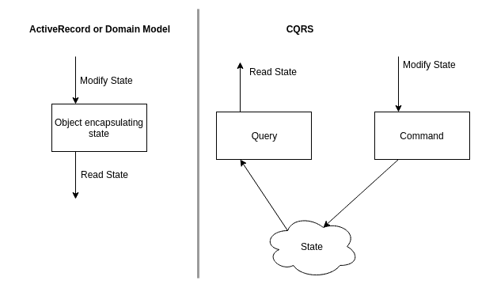
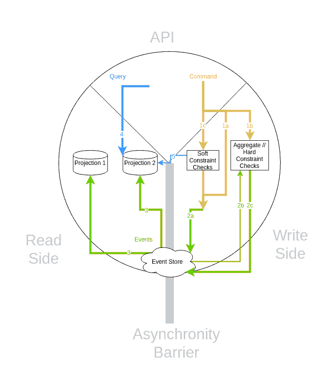
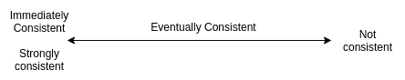

# 活动采购和 CQRS

> 原文：<https://dev.to/skurfuerst/event-sourcing-and-cqrs-4mo0>

我很高兴与 Mathias Verraes 一起参加了在法兰克福举行的 EventSourcing 和 CQRS 研讨会，以确定如何将 Event Sourcing 和 CQRS 应用到 Neos 内容存储库中的后续步骤。

这篇博文是关于我的总体学习，而不是关于我们在 Neos 的具体实施计划。

## 设置阶段:如何处理和修改状态

通常在 web 应用程序中，人们使用关系数据库来存储他们的应用程序状态。许多框架应用诸如[活动记录](http://www.martinfowler.com/eaaCatalog/activeRecord.html)或[域模型](http://martinfowler.com/eaaCatalog/domainModel.html)的模式来使状态可访问并修改它。不管使用什么模式，通常一个对象既负责读取状态，也负责更新状态。当使用 CQRS 时，这是不同的。

**CQRS** 代表命令查询责任分离；基本上意味着您将使用一个对象读取状态(查询)，使用另一个对象修改状态(命令)。

这允许您将读取端和写入端分开；允许对状态修改和读取使用不同的表示——并且允许使用**多个命令和多个读取模型**(稍后将详细介绍)！

通常，您将状态存储在数据库中。您拥有包含当前用户名、当前网站上显示的内容或当前可用产品的表格。当该状态被修改时，这是相当隐含地发生的(例如，通过导致数据库查询的一些方法调用)。我们现在将把这个状态修改看作一个事件。

**事件源**背后的核心思想与传统方法不同:我们不会存储当前状态，而是**导致它的所有事件**。这些事件将被存储在一个**事件存储库**中，这个事件存储库在概念上是一个长长的、有序的、仅附加的列表，列出了系统中曾经发生过的所有事件。

这样，我们可以通过一个“空白”状态建立当前状态，然后应用所有已经发生的事件，这样我们就有了当前状态。当然，这将是非常低效的(稍后会有更多的介绍，我们目前处于概念层面)。更重要的是，我们能够在时间中来回旅行:我们还可以计算系统中存在的所有先前状态。

如果我们不存储当前状态，而是存储导致当前状态的所有事件，会怎么样？

能够访问系统中发生的所有以前的状态是一个非常强大的范例:例如，您可以看到数据被修改的频率。被谁。旧值是多少。所以你有一个审计日志。

此外(对我来说，这是核心好处)，您可以获取系统中所有的旧事件，并使用它们来构建额外的状态，以回答不同于最初预期的问题。我们稍后会谈到这一点。

事实证明，活动采购和 CQRS 合作得非常好:

*   在编写方面，您“基本上”只需创建存储在事件存储中的事件。

*   在读取端，您消费事件并为您的应用程序构建您需要的状态。这被称为**投影**。

## 命令、事件和投影

让我们确保我们在一些核心词汇上意见一致:

一个**命令**是一个状态突变意图。这还没有发生。它仍然可能失败。它相当于 CQRS 的“写”的一面。通常一个命令被写成“创建用户”或“向系统添加节点”。

另一方面，**事件**是状态突变已经发生的指示。通常是用过去式写的，像“用户已经创建”或者“节点已经添加到系统中”。一个事件被保存在**事件存储库**中，这是一个所有事件的附加日志。

一个**投影**读取所有事件并从中创建只读状态。它对应于 CQRS 的“阅读”面。当新事件到来时，状态会相应地更新。通常，投影状态存储在标准数据库表中。本质上，通过清除它们的状态并再次应用所有事件(从时间的开始),总是可以重新创建投影。基本上，投影类似于缓存。

# 事件采购和 CQRS-统一模型

下图显示了 CQRS 和事件采购是如何协同工作的。图表分为三个部分:

*   最上面是我们系统的外部/API 端。
*   右边是命令端，它通过生成事件来改变状态。
*   左侧是读取侧，包含可以查询的不同投影。

通过事件存储库有**固有的异步性**。这意味着当一个命令被执行(并作为事件存储在事件存储中)时，可能需要一段时间才能更新读取端的投影。

### 1 -简单情况-无约束

在最简单的情况下，会发生以下情况:

*   1a -发送一个可以一直应用的命令(“更新用户的姓氏”)
*   2a -命令被直接转换为事件(“用户的姓氏已被更新”)并存储在事件存储中。
*   (异步)
*   3 -有时稍后，考虑到事件，预测被更新。
*   现在，当用户查询投影时，他将看到更新的状态。

### 2 -硬约束-通过聚集强制执行

有时，您需要确保状态的不变量始终为真。例如，定义“永远不可能两次分配一个用户名”可能是有用的我们基本上需要一个安全措施来确保“UserCreate”命令总是有不同的用户名。这种保护措施被称为聚合。(不要与领域驱动设计中的术语“聚合”混淆。)这种安全措施是如何工作的？它无法读取投影，因为该投影可能已过期。

因此，聚合通常以下列方式工作:

*   1b -命令被发送到集合/命令处理器。
*   必须重新构建聚合的状态，以便它可以做出决定:
    *   2b -聚合首先接收它以前从事件存储中发出的所有事件。
    *   这样，它就能从先前的事件中重建它的状态。
*   然后，检查硬约束；即，在我们的例子中，检查用户名是否已经被使用。
*   2c -如果满足约束，事件将被发送到商店。
*   否则，该命令将无法执行，并会返回一个错误。

### 3 -软约束-查询读取端以确保“几乎总是”满足不变量

事实证明，并不总是需要硬约束；恰恰相反:如果你认真思考一个问题，你就很少需要它们。另一方面，软约束不是真正的约束，因为不变量总是被满足；但是极有可能仍然满足不变量。我们稍后将更深入地讨论这一点。包含软约束的工作流以下列方式工作:

*   1c -发出命令。
*   在将命令转换为事件之前，可以通过以下方式进行软约束检查:
*   5 -我们查询一些预测，知道它可能还没有完全更新。
*   2a -根据预测结果，我们要么接受该命令并将其相应的事件分派给存储，要么放弃该命令。

# 一致性、约束和不变量

在我们深入研究什么时候应该使用哪些约束之前，让我们先谈一谈一致性。

我们经常喜欢认为系统是**立即一致的**(也称为**强一致的**)。这意味着一个事件在某个时间点进入系统，在这个事件被应用后，每个访问系统的人将能够直接检索新的状态。

另一方面，系统可能**根本不一致**——这通常是一种你很难避免的状态；因为通常情况下，您不容易从那里恢复到一致的状态。

在立即一致和不一致的系统之间，有一个很大的空间叫做**最终一致**。核心思想是，系统不一致的某些时段可能是可以接受的，但是需要确保在“一段时间”(最终)之后系统再次一致。我们将进一步探讨这个想法！

## 最终的一致性

所以，让我们探索一下最终的一致性到底意味着什么。基本上，我们希望确保系统**看起来尽可能的一致**。对我来说,“看起来”一致主要是指用户对他所做的事情有一个“一致”的看法，也就是说，当他在一篇文章上创建评论并重新加载页面时，他应该能看到他的评论；所以我们需要有很高的概率相关的投影已经被更新。

另一方面，当其他用户看到评论时，这并不重要；如果有几秒钟的延迟(对于“最终一致性”来说，这是一个很长的时间)，这是没有问题的。例如搜索索引何时更新也无关紧要。

因此，我们可以应用两个技巧来使系统被认为是一致的，尽管“按常规”它最终是一致的:

*   我们通常不需要同步更新所有的投影，但是很多可以异步更新。
*   当一个更改对一个用户可见时，它不需要立即对系统的其他用户可见。

一个小的旁注:通常建议用户界面应该“模拟”行为，例如，在我们从服务器得到评论被成功添加的确认之前，已经显示了新的评论。我个人认为这是提高应用程序可感知的响应性的一个很好的技巧；但是我仍然会确保所需的投影基本上同步运行。否则，你会得到奇怪的效果时，如网页重新加载等。

## 为什么软约束往往是充分的

我觉得这个最好用一个例子来说明。在 Neos 内容树中，有一个“MovedNode(source，target)”事件，表示“source”节点已被移动到“target”。假设用户 1 试图将“A”移动到“B”中，而用户 2 试图将“A”移动到“C”中。因此，有一个冲突。

当我想到防止冲突时，我直接想到的是带有聚合的硬约束如何防止这种冲突。然而，用一个聚合来实施这个约束实际上并不容易。

让我们想一想当应用软约束时会发生什么。如果两个人同时向不同方向移动同一个节点，软约束检查(上图中的 5)将会成功，因为投影尚未更新。因此，两个移动事件都将命中事件存储。现在，在投影时间，我们有几个选择:

*   我们可以将节点从 A 移动到 B，放弃用户 2 的移动
*   我们可以从内部 C 移动节点，放弃用户 1 的移动
*   我们可以将节点从 A 移动到 B 内部，然后将节点从 B 内部移动到 C 内部(反之亦然，这取决于事件的顺序)

在所有情况下，一个用户会有点困惑，因为他的更改看起来好像被系统忽略了；而对于另一个用户来说，最终结果是所期望的。如果我们有适当的硬约束，那么“第二个”用户将会得到一个移动不能发生的错误——这对他来说也是意想不到的。因此，无论我们使用硬约束还是软约束，在这个例子中，我们总是有一个困惑的用户和一个非困惑的用户。除此之外，命令失败的用户可能只是重新尝试他的动作；用户的操作现在生效的可能性非常高。(当然，除非另一个用户在完全相同的时间再次移动节点:-)。因此，如果最终用户的体验与使用软约束时大致相同，为什么还要使用硬约束呢？

总而言之，软约束很重要，因为它们抓住了常见的情况。它们确保您的系统被认为是一致的。它们使得系统的行为极有可能对用户来说是可预测的。

通常，你会发现很少情况下补偿一个错误是非常昂贵的；这些通常是硬约束的良好候选。然后，尝试创建聚合，其中每个聚合应该只关注这些约束中的一个。

软约束抓住了常见的情况。它们确保您的系统被认为是一致的。

# 实现细节

以下是一些在细节层面上很重要的进一步实施细节:

*   如前所述，尽可能减少硬约束的数量。
*   将您的聚合视为写入端的实现细节。毕竟，它们只是非常强大的约束检查器。
*   以它们所保护的不变量来命名你的聚合。称它们为 UserUniquenessAggregate，而不是 UserAggregate。
*   如果一个集合变得太不理想，您通常可以进一步划分这些集合；例如，用户名的每个第一个字符有一个 UserUniquesAggregate。
*   应该在你的命令管道内部检查软约束[我还是不喜欢这个名字]；例如在命令被转换成事件并保存在事件存储中之前。

有一个主题我还没有涉及到，但是对于许多现实世界的应用程序来说很重要:进程管理器的概念。基本上，流程管理器监听发出的事件(就像投影一样)；并且可以通过发出新命令来对事件做出反应。它们允许封装副作用，比如访问配置或获取当前系统时间。此外，它们允许编排更大的流量，非常像 React Redux Sagas。

## 我们将如何在 Neos 内容存储库中使用这一切

这篇文章涵盖了我的想法和心态，我目前使用的方法 Neos 内容存储域。它还没有显示我们想要用来应用 CQRS /事件采购方法的细节。这是另一篇博文的主题！

PS:此处表达的观点均为本人观点；当然，还有所有的错误和误解——[@ Mathias](https://dev.to/mathias)——我希望这里没有太多的错误和误解:-)
PPS: *这是我在公司博客* 上的[的交叉帖子](https://sandstorm.de/de/blog/post/event-sourcing-and-cqrs.html)