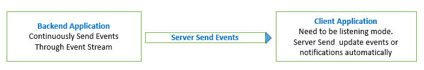

# 事件流-服务器-发送事件

> 原文：<https://dev.to/mesadhan/event-stream-server-send-events-5afk>

> 服务器发送事件是一个 web API，用于订阅服务器发送的数据流。这向服务器打开了一个网络请求，这样我们就可以进行流式传输。把它想象成一个永不兑现的承诺。使用原生 JavaScript 或反应式编程获取事件流数据很容易实现。

[](https://res.cloudinary.com/practicaldev/image/fetch/s--xJGTmfDd--/c_limit%2Cf_auto%2Cfl_progressive%2Cq_auto%2Cw_880/https://thepracticaldev.s3.amazonaws.com/i/bt0ysdohed1b80n0wix4.png)

# 实现方式:

> laravel-后端应用程序源:

```
 // HomeController.php
// import at the begining
use Symfony\Component\HttpFoundation\StreamedResponse;

//-----------------

class HomeController extends Controller
{

    public function getEventStream() {

        $random_string = chr(rand(65, 90)) . chr(rand(65, 90)) . chr(rand(65, 90));
        $data = [
            'message' => $random_string,
            'name' => 'Sadhan Sarker',
            'time' => date('h:i:s'),
            'id' => rand(10, 100),
        ];

        $response = new StreamedResponse();
        $response->setCallback(function () use ($data){

             echo 'data: ' . json_encode($data) . "\n\n";
             //echo "retry: 100\n\n"; // no retry would default to 3 seconds.
             //echo "data: Hello There\n\n";
             ob_flush();
             flush();
             //sleep(10);
             usleep(200000);
        });

        $response->headers->set('Content-Type', 'text/event-stream');
        $response->headers->set('X-Accel-Buffering', 'no');
        $response->headers->set('Cach-Control', 'no-cache');
        $response->send();
    }

}

//-----------------
// Application routes `web.php`

Route::get('/getEventStream', 'HomeController@getEventStream'); 
```

> JavaScript-前端应用程序

```
 // javascript

let evtSource = new EventSource("/getEventStream", {withCredentials: true});

evtSource.onmessage = function (e) {
 let data = JSON.parse(e.data);
 console.log(data);
}; 
```

# 现场项目演示:

[演示应用](https://frozen-brook-25821.herokuapp.com/)

# 源代码:

[源代码](https://github.com/mesadhan/laravel-event-stream-sample)