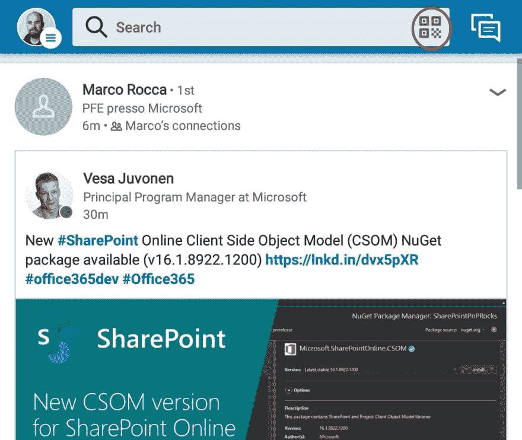
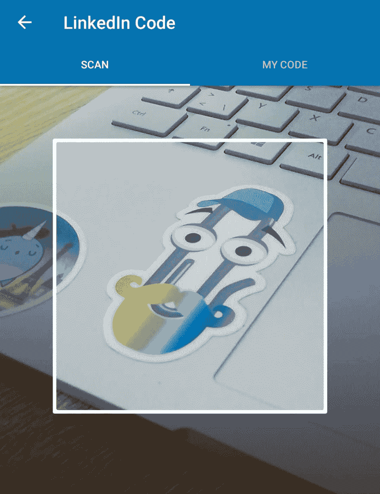
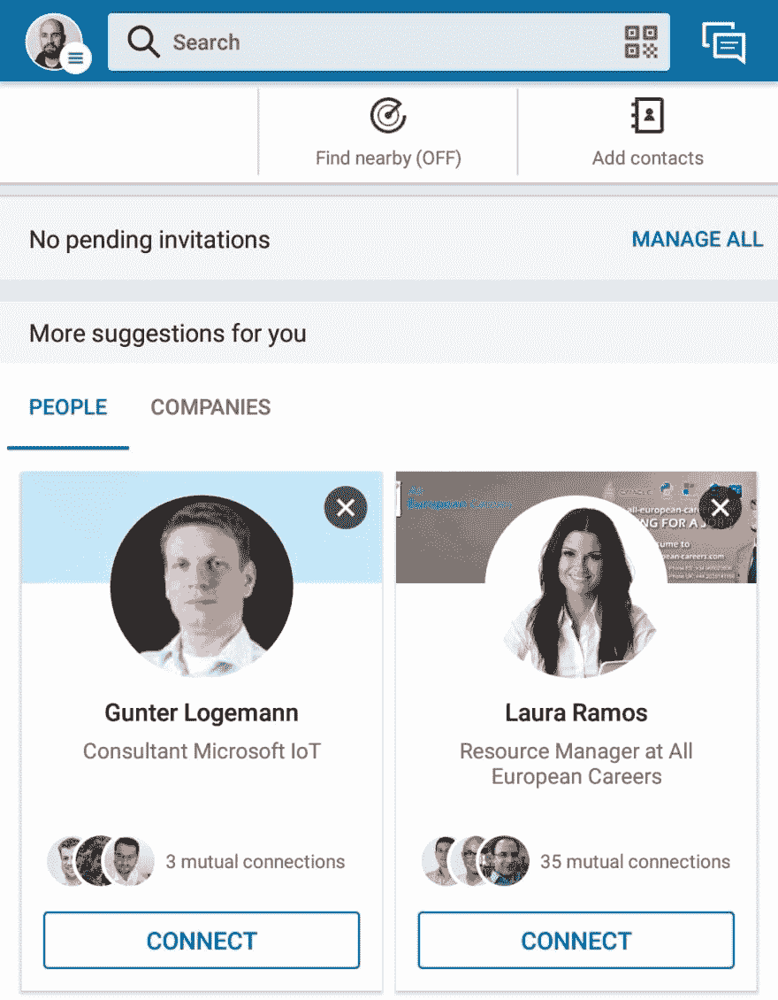

# 活动提示和技巧:在 Linkedin 上轻松找到关系

> 原文：<https://dev.to/kasuken/event-tips-and-tricks-easily-find-connections-on-linkedin-2of9>

这几天我正在威斯巴登参加合作峰会。
一如既往，内容为王，但人脉和关系网是参加这类活动的主要原因。

你如何优化这些体验？如何获取我在那里遇到的每个人的所有联系人信息？

有了 LinkedIn，你有两个选择。

## 二维码

如果你在活动中遇到一个新的人，你可以直接一对一地分享你的联系方式。不用在 LinkedIn 工具栏上搜索，也不用尴尬的问“对不起，你能记得你的名字吗？”。
用手机扫描二维码即可，反之亦然。

从应用程序的主窗口，你可以点击搜索栏的上角。

在这个屏幕上，如果你点击“我的代码”，你可以与他人分享你的二维码，或者你可以将代码保存在你的图库中，以便以后更快地分享你的数据，或者将图片添加到你的幻灯片上。

如果返回上一屏幕，您可以扫描另一部手机或图库中图片的二维码。

## 找到附近

这是我在 LinkedIn 上最喜欢的功能之一。当你在一个有很多人的大地方时，或者当你在一个活动或一个挤满人的会议上发言时，这一功能很有用。

在 LinkedIn 应用程序的主屏幕上，点击底部的“网络”图标。现在，在顶部主栏的中间，你可以点击“查找附近”按钮。
首次访问应用程序的蓝牙设置时，您必须同意。
如果你激活这个功能，当你在手机上打开 LinkedIn 时，同屏的人，开始出现在列表中。
现在，只需轻按姓名，您就可以开始将他们添加到您的联系人列表中。

在会议结束或者公开演讲结束的时候真的很有用。

## 结论

有了这两个简单快捷的功能，你可以给你的朋友和同事带来惊喜，但首先，可以帮助你找到新的业务联系人。