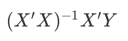

# 一切都是函数

> 原文：<https://dev.to/korenmiklos/everything-is-a-function-4171>

大多数科学家开始以一种[过程风格](https://en.wikipedia.org/wiki/Procedural_programming)编程。我当然有。程序编程对科学家来说是很自然的，因为它读起来就像一个实验的精确的 T2 协议。*做这个*。然后做那件事。

[](https://res.cloudinary.com/practicaldev/image/fetch/s--BWxXzc1L--/c_limit%2Cf_auto%2Cfl_progressive%2Cq_auto%2Cw_880/https://cdn-images-1.medium.com/max/1600/1%2A5UdOie2kHbfcSgd51cZmoA.jpeg)

> 汉斯·雷尼尔斯在 [Unsplash](https://unsplash.com/search/photos/lab-test?utm_source=unsplash&utm_medium=referral&utm_content=creditCopyText) 拍摄的照片

我没见过有人用 [Clojure](https://clojure.org/) 、 [Erlang](https://www.erlang.org/) 、 [Haskell](https://www.haskell.org/) 或者其他函数式语言做数据分析。

```
output = function(inputs) 
```

奇怪，因为仔细想想，**数据分析中的一切都是函数**。数据清理从杂乱的数据映射到整洁的数据。统计估计量从样本映射到实数。可视化从数据映射到彩色位图。对于数据分析，我们几乎专门编写不需要用户交互的代码，并且非常适合函数式范例。

函数式编程的传统定义是“没有副作用”你只能从输入中计算输出。你不能依赖任何其他信息，也不能传递任何其他信息。这个非常严密的学科对科学非常有用，因为它更容易 [**争论正确性**](https://en.wikipedia.org/wiki/Referential_transparency) 。例如，多元回归的普通最小二乘估计，

[](https://res.cloudinary.com/practicaldev/image/fetch/s--GNhzlZ3d--/c_limit%2Cf_auto%2Cfl_progressive%2Cq_auto%2Cw_880/https://cdn-images-1.medium.com/max/1600/1%2AT4wr_Wr3xGLlFoZhvO7txg.png)

是一个数学函数，你可以用铅笔和纸来描述它。朱莉娅的等价物，

```
function OLS(X, Y)  
    return inv(X' * X) * X' * Y  
end 
```

独立于您在代码中的其他地方所做的工作。(顺便说一句，`X\Y`用 Julia 来写这个比较好。)

此外，将计算自动化为一个函数链也更容易。如果`f(X,Y)`是多元系数的估计量，`g(b,X)`是预测规则，那么`g(f(X,Y),X)`就是你拟合的机器学习模型。依靠纯函数使得数据科学过程更具可复制性。

#### 功能链方法的一些现有实现是什么？

您可以通过管道操作符将小工具链接到一个类似 Unix 的 shell [中。该工具从 STDIN 读取数据，并写入 STDOUT，并且(希望)不会触及中间的任何内容。作为一名数据科学家，您可以专注于正确实现功能，而不是担心如何获得数据以及谁用它做什么。这就是为什么我是来自命令行](http://swcarpentry.github.io/shell-novice/04-pipefilter/index.html)的[数据科学的忠实粉丝](https://medium.com/wunderlist-engineering/is-yelp-international-an-excuse-to-roll-data-with-the-command-line-415dc04499a3)

一个更好的例子是 r 的`%>%`管道(Julia 有一个类似的[管道操作员](https://docs.julialang.org/en/v1.1/base/base/#Base.:%7C%3E))。)据我从 R 同事那里了解，现在大多数惯用代码都使用这种语法。

```
x  %>%  log()  %>%  diff()  %>%  exp()  %>%  round(1) 
```

在某种程度上，甚至像 Stata do-files 这样的脚本语言也可以被认为是一个函数链。Stata 的一个严格限制是一次只能对一个数据帧进行计算。不过，这种限制有巨大的好处。您可以编写从数据帧的一种状态映射到下一种状态的函数代码。举个例子，

```
generate y = log(x)  
replace y = 0 if x < 0 
```

是两个函数的链。易于阅读，易于调试。这和熊猫法则是一样的

```
df['y'] = math.log(df['x'])  
df['y'][df['x'] < 0] = 0 
```

呃，什么？这看起来更复杂，因为我们要控制更大范围的状态。我们想要使用什么日志函数？我们选择哪个数据帧？我们要改变哪个数据帧？

#### 什么是没有功能的？

笔记本和其他 REPL 不是，乔尔·斯波尔斯基和 T2 非常讨厌它们。当您在单元格之间上下移动，保存工作空间中的各种变量时，您会弄不清什么是当前计算的输入。我有时会在 ipython 笔记本上到处玩，但我总是有罪恶感。

RStudio and tidyverse 的 Jenny Bryan 也对副作用发表了看法。

> Hadley Wickham@ Hadley Wickham唯一让 [@JennyBryan](https://twitter.com/JennyBryan) 😤😠🤯。而是用 projects+here::here()[# rstats](https://twitter.com/hashtag/rstats)2017 年 12 月 11 日上午 00:50[](https://twitter.com/intent/tweet?in_reply_to=940021008764846080)[](https://twitter.com/intent/retweet?tweet_id=940021008764846080)304[](https://twitter.com/intent/like?tweet_id=940021008764846080)990

#### 更好的数据科学愿望清单(或新年决心)

1.  在 Python 中实现管道运算符。我知道这很难，但是我们能不能只讨论 Python 的 *tidyverse* ？
2.  写纯功能的 Stata 代码。从纯数据操作代码中分离出输入/输出甚至模型估计、图形。
3.  探索真正的函数式语言的数据科学库。我知道，SQL 是函数式的，但是读起来很复杂。
4.  更一般地说，留意副作用。我需要这个全局参数吗？我需要把这个写到磁盘上吗？目标是编写尽可能纯的函数。