# 关系数据库关于(关系)数据库你需要知道的一切

> 原文：<https://dev.to/lmolivera/everything-you-need-to-know-about-relational-databases-3ejl>

数据库是当今(几乎)每一个软件的重要组成部分。在这篇文章中，我将告诉你开始与他们合作所需要知道的一切。

# 什么是数据库？

如果您管理文件或文件夹中的信息，您迟早会发现:

*   您有多个包含相同信息的文件
*   您有多个关于相同主题但信息不同的文件，这使得很难理解哪个文件具有正确/更新的信息。
*   每次你想改变一些信息的时候，你必须更新多个文件，这花费了大量的时间，并且有可能犯错误，导致前面的两个问题。

这种处理信息的方法是低效的，数据库就是为了解决这些问题而产生的。

数据库是一个允许每个人共享、管理和使用数据的系统。要使用它，你首先需要了解一些事情:

*   很多人会使用它，所以你必须找到一种方法让他们轻松地输入和提取数据。
*   数据库还存在用户窃取或覆盖重要信息等风险，因此在设计数据库时应该考虑安全性和权限。
*   您还需要小心不要丢失任何数据。系统可能会停机，或者硬盘可能会出现故障。数据库需要从这种故障中恢复的机制。

### 数据库类型

数据库有很多种，这三种是数据库最常用的数据模型:

*   **分层数据模型**，数据之间存在树状关系。
*   **网络数据模型**，其中各条数据之间存在重叠关系。
*   **关系数据模型**，使用易于理解的表格概念处理数据。

要使用分层数据模型和网络数据模型，您必须记住数据的物理位置和顺序来管理数据，因此很难对数据进行灵活和高速的搜索。

这就是为什么我们将使用关系数据模型。

# 什么是关系数据库？

关系数据库是一种数据库。它使用的结构允许我们识别和访问数据库中与另一条数据相关的数据。关系数据库中的数据被组织成表。

### 表格，记录，字段，行&列

*   一个**表**是一组数据元素(值)。
*   文件中的一段数据称为一个**记录**。
*   记录中的每一项被称为一个**字段**。

[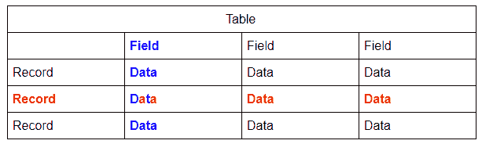](https://res.cloudinary.com/practicaldev/image/fetch/s--LFRV2Ygk--/c_limit%2Cf_auto%2Cfl_progressive%2Cq_auto%2Cw_880/https://thepracticaldev.s3.amazonaws.com/i/acc34n6kn7g4uyncsoix.PNG)

*   一条数据或记录被称为一个**行**。
*   每个项目或字段称为一个**列**。

### 主键，唯一&空

[](https://res.cloudinary.com/practicaldev/image/fetch/s--Mc8nL-Z1--/c_limit%2Cf_auto%2Cfl_progressive%2Cq_auto%2Cw_880/https://thepracticaldev.s3.amazonaws.com/i/hccsa1yjjlkxd6yqic13.PNG)

在数据库中，一个字段经常被赋予一个重要的角色，当这种情况发生时，我们称这个字段为**主键**。在本例中，产品代码是主键。下一节将提供更多相关信息。

一个**唯一的**值是一个不能重复的值(就像产品名称一样，你不应该有两个同名的产品)。

**Null** 是没有值(如上面“备注”中所见，其中有空值)。一些字段可以为空(取决于数据库)。

### 按键类型

*   **Key** :数据库表中的一列或多列，用于对表中的行进行排序和/或标识。例如，如果您按“薪金”字段对人员进行排序，那么“薪金”字段就是关键字段。
*   **主键**:主键是唯一标识表中某一行的一个或多个字段。主键不能为空(空白)。主键被编入索引(稍后将详细介绍索引)。
*   **外键**:外键是两个数据库表(其中一个有索引)中的列之间的关系，旨在确保数据的一致性。
*   **组合键**:由一列或多列组成的主键。可以使用这些字段来形成主键(尽管不太可取)。
*   **自然关键字**:由现实世界中已经存在的属性(字段)组成的复合主键(例如名、姓、社会安全号)。
*   **代理键**:内部生成的主键(通常是自动递增的整数值)，在现实世界中并不存在(例如，ID 只用来标识记录，别无其他)。
*   **候选关键字**:表格中的一列或一组列，可以唯一地标识任何数据库记录，而无需引用任何其他数据。每个表可能有一个或多个候选键，但是有一个候选键是唯一的(主键)。
*   **复合键**:由两个或多个字段组成的复合键，唯一描述表中的一行。复合键和候选键的区别在于复合键中的所有字段都是外键；在候选关键字中，一个或多个字段可以是外键(但这不是强制性的)。

# 设计数据库

当您尝试自己创建数据库时，第一步是确定您尝试建模的数据的条件。

### E-R 模型

用于分析以制作图表的模型。在这个模型中，你用实体和关系的概念来考虑现实世界。

*   **E 指实体**。现实世界中可识别的物体。例如，当向其他国家出口水果时，**水果**和**出口**目的地可以被认为是实体。用矩形表示。
    *   每个实体都有**属性**，描述实体的特定属性(例如，水果中的产品名称)。用椭圆形表示。

[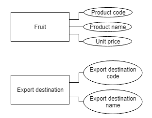](https://res.cloudinary.com/practicaldev/image/fetch/s--o4LLm7pR--/c_limit%2Cf_auto%2Cfl_progressive%2Cq_auto%2Cw_880/https://thepracticaldev.s3.amazonaws.com/i/vyo30fopflvkj8osi2oz.png)

*   **R 指关系**。实体如何相互关联。例如，水果和出口目的地相互关联，因为您向出口目的地销售水果。用菱形表示。水果出口到许多出口目的地，出口目的地购买多种水果。我们称之为**多对多关系**。在 E-R 模型中，考虑了实体之间的关联数量，这被称为**基数**。

[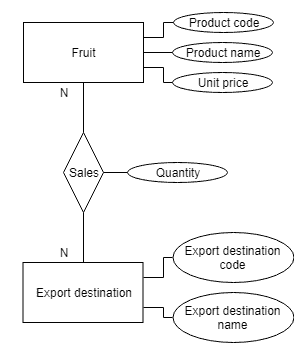](https://res.cloudinary.com/practicaldev/image/fetch/s--NYiquFrp--/c_limit%2Cf_auto%2Cfl_progressive%2Cq_auto%2Cw_880/https://thepracticaldev.s3.amazonaws.com/i/bb2submtxhrjy2rqp7yz.png)

*   **基数**:实体间关联的数量。
    *   **一对一关系(1-1)** :我只卖水果给你，你只从我这里买水果。
    *   **一对多(或多对一)关系(n-1 或 1-n)** :我卖水果给其他家庭，那些家庭只从我这里买水果。
    *   **多对多关系(n-n)** :你上面有个例子。

### 归一化

按照一系列步骤将现实世界中的数据列表到关系数据库的过程。为了正确管理关系数据库，有必要对数据进行规范化。标准化主要用于两个目的:

*   消除冗余(无用)数据。
*   确保数据相关性有意义，即数据以逻辑方式存储。

#### 非规范化形式

从该表创建第一范式**。您为一个给定实体标识的所有属性可能被组合在一个平面结构中。这就是规范化过程发挥作用的地方，用来组织属性。**

#### 第一范式

对于处于第一范式的表，它应该遵循以下 4 个规则:

*   **它应该只有单值(原子)属性/列**:这意味着，例如，一个水果不应该在数据库中有两个名字。
*   **存储在一个列中的值应该属于同一个域**:这更像是一个“常识”规则。在每一列中，存储的值必须是相同的种类或类型。
*   **表格中的所有列都应该有唯一的名称**:这个规则要求表格中的每一列都应该有唯一的名称。这是为了在检索数据或对存储的数据执行任何其他操作时避免混淆。
*   **数据存储的顺序无关紧要**:这条规则表明数据在表中的存储顺序无关紧要。

#### 重要

在继续之前，你必须首先知道这一点:

*   主要属性:给定关系表的候选键的一部分。
*   非主属性:不是候选关键字的一部分。

#### 第二范式

*   应该是第一范式。
*   它不应该有**部分依赖**。如果关系的非主属性仅由复合候选关键字的一部分导出，则这种依赖性被定义为部分依赖性。
    *   依赖性:当你必须使用主键来获得一个特定的值时(例如，你的**名字**知道你的**年龄**)。

#### 第三范式

*   这是第二范式。
*   它没有**传递依赖**。如果关系的非主属性是由另一个非主属性或者候选关键字的一部分与非主属性的组合得到的，那么这种依赖性将被定义为传递依赖性。

### 设计数据库的步骤

现在，您已经熟悉了基本术语和 ER 模型，可以开始设计数据库了。

1.  确定数据库的用途。
2.  确定所需的表格。
3.  确定需要的字段。
4.  确定专用字段。
5.  确定表之间的关系。
6.  定义约束以保持数据完整性(不要忘记规范化)。

# SQL

当您使用数据库时，您必须使用 SQL(结构化查询语言)输入或检索数据。SQL 允许您与数据库通信。根据您使用的数据库管理系统(例如 SQL Server ),某些命令可能会有所不同。

它的命令可以分为三种不同的类型:

*   **数据定义语言(DDL)** :与数据结构相关。

    *   创造
    *   滴
    *   改变
*   **数据操作语言(DML)** :与存储的数据相关。

    *   挑选
    *   插入
    *   更新
    *   删除
*   **数据控制语言(DCL)** :管理用户访问。

### 选择

最基本的 SQL 语句。

```
SELECT product_name /*The column you want to see...*/
FROM product; /*...from the table it belongs.*/ 
```

Enter fullscreen mode Exit fullscreen mode

### 哪里

用于指定您想要的信息。

该语句从产品表中检索单价大于或等于 200 的所有数据。

```
SELECT *     /*This selects every column in the table.*/
FROM product
WHERE unit_price>=200; /*Very easy to understand right?*/ 
```

Enter fullscreen mode Exit fullscreen mode

这个函数检索产品名为“apple”的所有数据。

```
SELECT *
FROM product
WHERE product_name=’apple’; 
```

Enter fullscreen mode Exit fullscreen mode

#### 比较运算符

[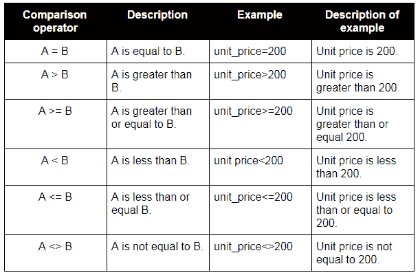](https://res.cloudinary.com/practicaldev/image/fetch/s--weY89oGv--/c_limit%2Cf_auto%2Cfl_progressive%2Cq_auto%2Cw_880/https://thepracticaldev.s3.amazonaws.com/i/fdideqrlqhu6vu3jz5sr.PNG)

#### 逻辑运算符

[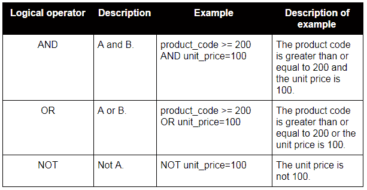](https://res.cloudinary.com/practicaldev/image/fetch/s--d_7M5C69--/c_limit%2Cf_auto%2Cfl_progressive%2Cq_auto%2Cw_880/https://thepracticaldev.s3.amazonaws.com/i/om8fkvymhxfeyioawn5c.PNG)

### 其他

```
SELECT *
FROM product
WHERE unit_price
BETWEEN 150 AND 200; /*Between doesn’t need explanation I think.*/ 
```

Enter fullscreen mode Exit fullscreen mode

```
SELECT *
FROM product
WHERE unit_price is NULL; /*This one neither.*/ 
```

Enter fullscreen mode Exit fullscreen mode

### 喜欢

当您不知道具体要搜索什么时，可以通过在 LIKE 语句中使用通配符，在条件中使用模式匹配。
[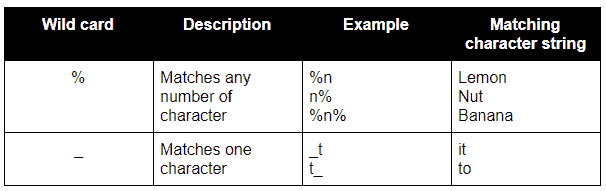T3】](https://res.cloudinary.com/practicaldev/image/fetch/s--Z7OEaIKa--/c_limit%2Cf_auto%2Cfl_progressive%2Cq_auto%2Cw_880/https://thepracticaldev.s3.amazonaws.com/i/179st9pc62uwq62okzox.PNG)

示例:

```
SELECT *
FROM product
WHERE product_name LIKE "%n"; /*Will search for data ending with the letter ‘n’.*/ 
```

Enter fullscreen mode Exit fullscreen mode

### 排序依据

基于特定列对数据进行排序。

```
SELECT *
FROM product
WHERE product_name LIKE "%n"
ORDER BY unit_price; /*Easy to understand, right*/ 
```

Enter fullscreen mode Exit fullscreen mode

### SQL 中的聚合函数

也称**设定功能**。您可以使用它们来聚合最大值或最小值等信息。
T3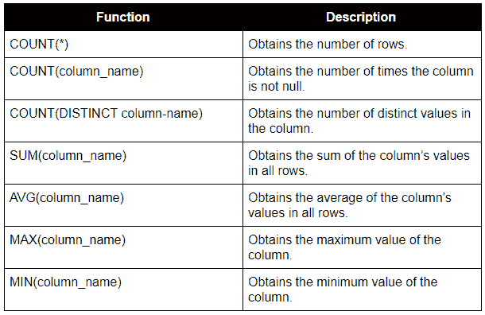T5】

示例:

```
SELECT MAX(unit_price) FROM product 
```

Enter fullscreen mode Exit fullscreen mode

#### 分组汇总数据

如果对数据进行分组，就可以很容易地获得聚合值。若要对数据进行分组，请将聚合函数与 GROUP BY 结合使用。

```
SELECT district, AVG(unit_price)
FROM product
GROUP BY district; /*Output: Average unit price per district*/ 
```

Enter fullscreen mode Exit fullscreen mode

#### 拥有

不能在聚合函数中使用 WHERE，必须使用 HAVING。

```
SELECT district, AVG(unit_price)
FROM product
GROUP BY district;
HAVING AVG(unit_price)>=200; /*Filters result after being grouped.*/ 
```

Enter fullscreen mode Exit fullscreen mode

### 搜索数据

SQL 中还有更复杂的查询方法。

#### 子查询和在

您可以将一个查询嵌入到另一个查询中(这称为子查询)。

```
SELECT *
FROM product
WHERE product_code
IN (
SELECT product_code
FROM sales_statement
WHERE quantity>=1000
); 
```

Enter fullscreen mode Exit fullscreen mode

首先执行括号中的查询。根据结果执行另一个选择。IN 操作符允许多个 WHERE 值(这就是为什么第一个 select 与第二个一起工作)。

#### 关联查询

子查询可以引用外部查询中的数据，这称为相关查询。

```
SELECT *
FROM sales_statement U /*Alias? Maybe more on this later*/
WHERE quantity>
(
SELECT AVG(quantity)
FROM sales_statement
WHERE product_code=U.product_code
); 
```

Enter fullscreen mode Exit fullscreen mode

### 别名

SQL 别名用于为表或表中的列提供临时名称。通常用于缩短列名，以便于使用(主要在连接中)。别名只在查询期间存在。

```
SELECT o.OrderID, o.OrderDate, c.CustomerName
FROM Customers AS c, Orders AS o
WHERE c.CustomerName="Around the Horn" AND c.CustomerID=o.CustomerID; 
```

Enter fullscreen mode Exit fullscreen mode

### 加入表格

联接用于根据两个或多个表之间的相关列来组合它们的行。

#### 不同类型的 SQL 连接

以下是 SQL 中不同类型的联接:

*   (内部)联接:返回在两个表中具有匹配值的记录。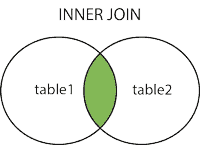
*   左(外)连接:返回左表中的所有记录，以及右表中的匹配记录。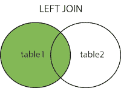
*   右(外)连接:返回右表中的所有记录，以及左表中的匹配记录。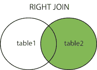
*   完全(外部)连接:当左表或右表中有匹配项时，返回所有记录。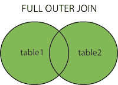

#### 等值联接

根据关联表的相等或匹配列值进行联接。等号(=)在 where 子句中用作比较运算符，表示相等。

```
SELECT *
FROM table1 
JOIN table2
[ON (join_condition)] 
```

Enter fullscreen mode Exit fullscreen mode

```
/*You can also do it without JOIN*/
SELECT column_list 
FROM table1, table2....
WHERE table1.column_name =
table2.column_name; 
```

Enter fullscreen mode Exit fullscreen mode

### 创建表格

根据您使用的数据库类型，代码可能会有所不同。

```
CREATE TABLE product /*This line needs no explanation, right?*/
(
product_code INT NOT NULL,
product_name VARCHAR(255),
unit_price INT,
PRIMARY KEY(product_code)
); 
```

Enter fullscreen mode Exit fullscreen mode

*   INT 表示整数。
*   VARCHAR 表示数据库需要文本。255 表示不超过 255 个字符。

#### 约束一个表

防止数据冲突的表规范。

[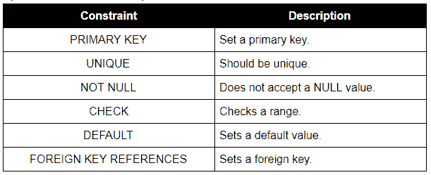](https://res.cloudinary.com/practicaldev/image/fetch/s--kPV1HmIu--/c_limit%2Cf_auto%2Cfl_progressive%2Cq_auto%2Cw_880/https://thepracticaldev.s3.amazonaws.com/i/975c35mams0xs8teiqyq.PNG)

### 向表格中插入数据

```
INSERT INTO product (product_code, product_name, unit_price)
VALUES (101, "melon", 800); 
```

Enter fullscreen mode Exit fullscreen mode

```
INSERT INTO product VALUES (101, "melon", 800); 
```

Enter fullscreen mode Exit fullscreen mode

两种说法都是一样的。您可以按照定义的类型和顺序插入数据。记住约束(比如主键)。

### 更新行

允许您修改表中的数据。

```
UPDATE product
SET product_name="cantaloupe"    /*New value*/
WHERE product_name="melon";    /*Specific value to overwrite*/ 
```

Enter fullscreen mode Exit fullscreen mode

### 删除行

从表中删除数据。

```
DELETE FROM product
WHERE product_name="apple"; /*Row to delete*/ 
```

Enter fullscreen mode Exit fullscreen mode

### 创建视图

您可以创建一个只有在用户查看时才存在的虚拟表。这是一个观点。从中派生视图的表称为基表。

```
CREATE VIEW expensive_product /*The view name is "expensive_product"*/
(product_code, product_name, unit_price)
AS SELECT *
FROM product
WHERE unit_price>=200; 
```

Enter fullscreen mode Exit fullscreen mode

要使用视图:

```
SELECT *
FROM expensive_product
WHERE unit_price>=500; 
```

Enter fullscreen mode Exit fullscreen mode

当您希望公开表中的部分数据时，创建视图是很方便的。

### 下降

允许您删除:

```
/*A view:*/
DROP VIEW expensive_product; 
```

Enter fullscreen mode Exit fullscreen mode

```
/*A base table:*/
DROP TABLE product; 
```

Enter fullscreen mode Exit fullscreen mode

```
/*A database:*/
DROP DATABASE name; 
```

Enter fullscreen mode Exit fullscreen mode

# 操作数据库

### 交易

一个数据操作单元称为一个事务。例如:读取数据，写入数据。事务总是以**提交**或**回滚**操作结束。

确保可以处理多个事务而不产生数据冲突是很重要的。保护数据不出现不一致也很重要，以防在处理事务时出现故障。为此，下表列出了事务所需的属性，这些属性的拼写令人难忘。

#### 交易所需的属性

[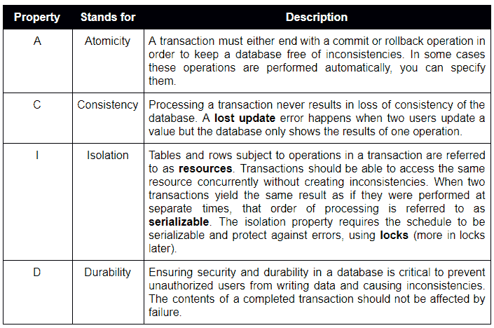](https://res.cloudinary.com/practicaldev/image/fetch/s--q8am4swk--/c_limit%2Cf_auto%2Cfl_progressive%2Cq_auto%2Cw_880/https://thepracticaldev.s3.amazonaws.com/i/ylsuvfc6mth48q2h798c.PNG)

### 提交

当每个事务被正确处理时，数据库中的操作就完成了。这种终结被称为提交操作。

### 锁定

许多用户的操作受到控制，因此当他们并发访问数据库时不会出错。为此，使用了一种称为**锁**的方法。
你锁定数据是为了防止数据被错误地处理。

如果我在数据库上执行一些操作，数据将被锁定，直到我的操作完成，然后被解锁以供另一个用户使用，数据将再次被锁定，并在该用户完成时被解锁。

虽然锁在数据库中有自己的作用，但不应该过度使用，因为它会妨碍它的目的:与许多人共享数据。所以我们根据情况使用不同类型的锁。

#### 共享锁

例如，当读操作是唯一需要的操作时，可以使用共享锁。其他用户可以读取数据，但不能对其执行写操作。

#### 独占锁定

当执行写操作时，用户应用排他锁。当它被应用时，其他用户不能读取或写入数据。

#### 并发控制

当一个锁用于控制两个或多个事务时。并发性允许尽可能多的用户同时使用一个数据库，同时防止发生数据冲突。

##### 两相闭锁

为了确保一个调度是可序列化的，我们需要遵守设置和释放锁的特定规则。这些规则中的一个是**两阶段锁定**，对于每个事务应该使用两个阶段:一个用于设置锁，另一个用于释放锁。

##### 锁定粒度

有许多资源可以被锁定。资源被锁定的程度被称为**粒度**。**粗粒度**发生在很多资源同时被锁定的时候，**细粒度**发生在很少资源被锁定的时候。当粒度较粗(或较高)时，每个事务所需的锁数量会减少，从而减少所需的处理量。

##### 其他并发控制

当事务数量较少或读取操作数量较多时，可以使用更简单的方法。

*   时间戳控制:包含访问时间(时间戳)的标签被分配给事务期间访问的数据。如果另一个时间戳更晚的事务已经更新了数据，则不允许该操作。当不允许读或写操作时，事务被回滚。

*   乐观控制:该方法允许读操作。当尝试写操作时，会检查数据以查看是否发生了任何其他事务。如果另一个事务已经更新了数据，则该事务将被回滚。

##### 隔离等级

您可以设置可以并发处理的事务的级别，这被称为隔离级别。SET TRANSACTION 语句可用于指定以下事务的隔离级别:

*   未提交读取
*   已提交读取
*   可重复读
*   可序列化

```
SET TRANSACTION ISOLATION LEVEL READ UNCOMMITTED; 
```

Enter fullscreen mode Exit fullscreen mode

根据隔离级别设置，可能会发生以下任何操作:
[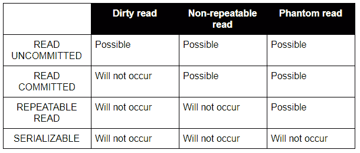](https://res.cloudinary.com/practicaldev/image/fetch/s--bXyPHKXk--/c_limit%2Cf_auto%2Cfl_progressive%2Cq_auto%2Cw_880/https://thepracticaldev.s3.amazonaws.com/i/tz0mdce3ni8o85x3dkpf.PNG)

*   脏读:当事务 2 在事务 1 之前读取一行时。
*   不可重复读取:当一个事务两次读取相同的数据并得到不同的值时。
*   幻像读取:当一个事务搜索匹配特定条件的行，但由于另一个事务的更改而找到错误的行。

#### 死锁

两个用户在两个表上使用排他锁。然后，双方都将尝试对另一个表应用相同的锁。因为他们每个人都必须等待另一个用户应用的锁被释放，所以两个人都不能继续任何操作。这种情况称为**死锁**，除非释放其中一个锁，否则无法解决。

#### 回滚

当发生死锁时，可以查找已经排队一段时间的事务并取消它们。取消一个事务(其中的每个操作)被称为**回滚**。例如，如果您想对所有价格为 150 英镑或更高的水果应用折扣，但其中一个失败了，那么您取消了所有操作，数据库的行为就像没有执行任何操作一样。

# 数据库安全

如果不保护数据库，数据可能会在未经许可的情况下被删除或修改。一个好的解决方案可能是要求用户名和密码来限制用户，并将操作限制在特定用户(例如，只有管理员才能删除表)。

### 授予

您可以使用 grant 向用户授予访问权限。

```
GRANT SELECT, UPDATE ON product TO Overseas_business_department; 
```

Enter fullscreen mode Exit fullscreen mode

### 数据库权限

[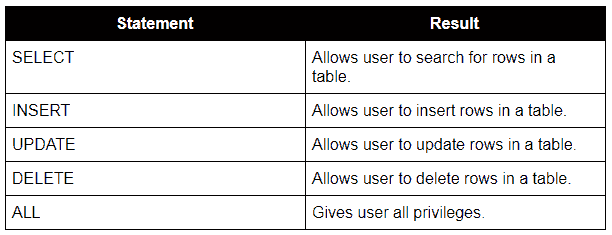](https://res.cloudinary.com/practicaldev/image/fetch/s--Rh-N1MnE--/c_limit%2Cf_auto%2Cfl_progressive%2Cq_auto%2Cw_880/https://thepracticaldev.s3.amazonaws.com/i/wmzfgh0wydcujg6lbvuw.PNG)

使用 WITH GRANT 选项授予权限使用户能够向其他用户授予权限。

```
GRANT SELECT, UPDATE ON product TO overseas_business_department WITH GRANT OPTION; 
```

Enter fullscreen mode Exit fullscreen mode

### 撤销

取消一个用户的特权。

```
REVOKE SELECT, UPDATE ON product FROM overseas_business_department; 
```

Enter fullscreen mode Exit fullscreen mode

一些数据库产品可以将许多特权分组，并一次授予多个用户。分组使得权限管理更加容易。使用视图可以实现更高的安全性，允许某些用户查看视图，还可以保护视图中的选定数据。

# 灾难恢复

数据库需要有一种机制，能够在出现故障时保护系统中的数据。确保交易的持久性是强制性的，任何失败都不会产生不正确或错误的数据。为了保护自己免于失败，数据库执行各种操作，包括创建备份和事务日志。

每当执行数据操作时，都会保存名为**日志**的记录。当系统出现问题时，首先要重启系统，并利用日志来恢复数据库。恢复方法因事务是否已提交而异。

### 故障类型

*   **交易失败**:由于交易本身的错误导致交易无法完成。出现此故障时，事务将回滚。
*   **系统故障**:当系统因电源故障或其他中断而停机时。如果问题发生在事务已经提交之后，可以通过对数据库重新应用操作来恢复数据。这种方法称为前滚。如果事务尚未提交，则会发生回滚。参考更新前的值来取消交易。
*   **介质故障**:包含数据库的硬盘损坏。

# 检查站

为了提高数据库中写操作的效率，缓冲区(用于临时保存数据的内存段)通常用于短期写数据。缓冲区和数据库的内容是同步的，然后写入一个检查点。当数据库写入检查点时，它不必对在检查点之前提交的事务执行任何故障恢复。必须恢复在检查点之前未提交的事务。

# 索引

随着数据库的增长，越来越多的人开始使用它，一些问题可能会出现。数据量越大，搜索操作就越慢。

索引像书一样起作用。在一本书里盲目搜索一条信息需要时间，所以你检查索引来加快搜索速度。搜索某些数据时，浏览所有行非常耗时。如果您为产品代码创建索引，您可以立即了解产品数据存储在指定产品的何处。它告诉你在磁盘上的位置，减少磁盘访问计数，从而加快未来的搜索。

由数据库管理员来添加索引。创建过多的索引可能会导致效率低下(想象一下一本书有大量的索引，不会有什么好处)。

# 存储程序

### 类型

[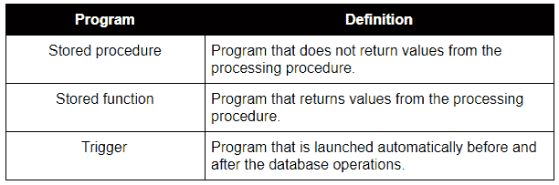](https://res.cloudinary.com/practicaldev/image/fetch/s--C0iFB3x4--/c_limit%2Cf_auto%2Cfl_progressive%2Cq_auto%2Cw_880/https://thepracticaldev.s3.amazonaws.com/i/2jmcr8vovt3yzxq0o7ra.PNG)

数据库服务器内部的程序逻辑(基本上是服务器内部的查询)。它们有助于降低网络负载，因为它消除了频繁传输 SQL 查询的需要。

# 分布式数据库

一种数据库，其中并非所有存储设备都连接到一个公共处理器，而是连接到位于同一物理位置或分散在互连计算机网络中的多台计算机上。请记住，它可以作为一个单一的数据库来处理。

# 练习

*   W3Schools 有很多基本的 SQL 练习，[练习它们](https://www.w3schools.com/sql/sql_exercises.asp)。
*   W3Resources 为你提供了各种各样的练习来提高你的技能。
*   数据库漫画指南包括练习及其答案，不仅是 SQL，也是设计阶段的练习。
*   也可以试试谷歌或 Youtube。

# 来源

*   封面图片:谷歌。
*   数据库漫画指南:非常值得推荐的读物。用一个简单的故事解释了关于数据库的一切(本文的大部分内容都基于它)。包括更多技术信息和练习的部分。非常有用。
*   我自己的高中笔记。
*   [https://www.codecademy.com/articles/what-is-rdbms-sql](https://www.codecademy.com/articles/what-is-rdbms-sql)
*   [https://basededatosaplicado . blogspot . com/2011/10/v-behaviourldefaultvmlo . html](https://basededatosaplicado.blogspot.com/2011/10/v-behaviorurldefaultvmlo.html)
*   [https://wofford-ECS . org/DataAndVisualization/er model/material . htm](https://wofford-ecs.org/DataAndVisualization/ermodel/material.htm)
*   [https://www . study tonight . com/DBMS/database-normalization . PHP](https://www.studytonight.com/dbms/database-normalization.php)
*   [https://www.w3schools.com/sql/sql_like.asp](https://www.w3schools.com/sql/sql_like.asp)
*   [https://www.w3schools.com/sql/sql_having.asp](https://www.w3schools.com/sql/sql_having.asp)
*   [https://www.w3schools.com/sql/sql_join.asp](https://www.w3schools.com/sql/sql_join.asp)
*   [https://www.w3schools.com/sql/sql_alias.asp](https://www.w3schools.com/sql/sql_alias.asp)
*   [https://www . w3 resource . com/SQL/joins/perform-an-equi-join . PHP](https://www.w3resource.com/sql/joins/perform-an-equi-join.php)
*   [https://en.wikipedia.org/wiki/Distributed_database](https://en.wikipedia.org/wiki/Distributed_database)
*   http://www.informit.com/articles/article.aspx?p=27785&seqNum = 3
*   [https://germoroney . WordPress . com/2012/11/26/不同类型的数据库密钥/](https://germoroney.wordpress.com/2012/11/26/different-types-of-database-keys/)
*   [https://www . quora . com/What-is-the-difference-that-partial-and-transitive-dependency-in-database-management](https://www.quora.com/What-is-the-difference-between-partial-and-transitive-dependency-in-database-management)
*   [https://medium . com/@ jimmyfarillo/the-basics-of-database-indexes-for-relational-databases-bfc 634d 6 bb 37](https://medium.com/@jimmyfarillo/the-basics-of-database-indexes-for-relational-databases-bfc634d6bb37)

*感谢您的阅读。别忘了在 dev.to 和 Twitter 上关注我！*