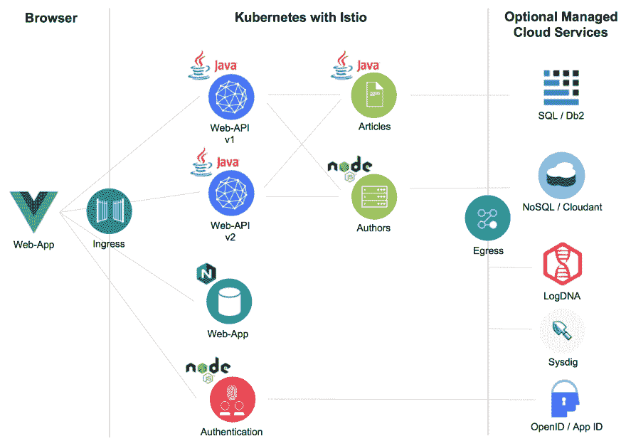
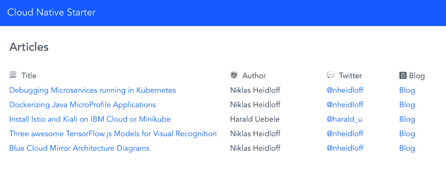

# 通过 Kubernetes 在云中运行的 Java 应用示例

> 原文：<https://dev.to/nheidloff/example-java-app-running-in-the-cloud-via-kubernetes-2lb7>

在过去的几周里，我开发了一个新的示例应用程序，它演示了如何构建基于微服务的架构。虽然我还想补充一些小东西，但我认为这个示例现在已经相当全面了，对于开发人员，尤其是 Java EE 开发人员来说，是学习微服务和云原生模式的一个很好的选择。

这个例子是开源的。GitHub repo 被称为[云原生启动器](https://github.com/nheidloff/cloud-native-starter)。

**立方、本能和 Java**

在构建云原生应用时，开发人员面临着如何解决流量路由、弹性、分布式监控、服务发现等问题的挑战。幸运的是，这些新挑战中的大部分都由编排平台 [Kubernetes](https://kubernetes.io/) 和服务网格 [Istio](https://istio.io/) 处理。这种功能一般适用于微服务，不管它们是用什么语言实现的，也不改变应用程序逻辑。

然而，编排平台和服务网格不能覆盖某些功能。相反，它必须在微服务的业务逻辑中处理，例如特定于应用程序的故障转移功能、指标和细粒度授权。

Java 开发人员可以利用 [Eclipse MicroProfile](https://microprofile.io/) 来实现这一功能。MicroProfile 是 Java EE(企业版)的扩展，用于构建基于微服务的架构，它补充了 Kubernetes 和 Istio 的功能。除了 Kubernetes 和 Istio 无法处理的特定于应用程序的逻辑之外，它还附带了开发微服务时通常需要的便利功能，例如调用 REST API 的机制和实现 REST API(包括它们的文档)的功能。

**设计原则**

示例应用程序遵循以下设计原则:

*   尽可能多地利用平台——尽可能少地使用特定于语言的框架
*   仅对应用程序的核心服务使用开源组件
*   让第一次体验尽可能简单
*   能够在不同的环境中运行应用程序

让我更详细地解释一下设计原则。

*尽可能多地利用平台——尽可能少地使用特定语言框架*

将 Kubernetes 和 Istio 用于流量管理等功能的优势在于，这些功能是与语言无关的。云原生应用可以是，而且经常是多语言的。这使得开发人员可以为特定的任务选择最好的语言。

*仅将开源组件用于应用的核心服务*

在我作为开发倡导者的角色中，我与许多开发人员交谈过。几乎每个人都喜欢开源。为了接触尽可能多的开发人员，示例应用程序只使用开源项目作为应用程序的核心服务。例如，Java 栈利用了 [OpenJ9](https://www.eclipse.org/openj9/) 、来自[的 open JDK AdoptOpenJDK](https://adoptopenjdk.net/)、 [OpenLiberty](https://openliberty.io/) 和[微文件](https://microprofile.io/)。Kubernetes 和 Istio 显然也是开源项目。不作为开放源代码提供的应用程序组件是可选的，可以交换。

*让第一次体验尽可能简单*

有许多针对各种云原生特性的示例、片段、文章和教程，其中许多都非常好。然而，我遇到了在一个应用程序中同时运行这些功能的问题。有时他们使用不同的 Java 栈，有时使用不同的版本，有时文章已经过时。

示例应用程序展示了几个协同工作的特性，详见下文。还有一些脚本可以非常轻松地部署服务，基本上每个服务一个脚本，类似于 Cloud Foundry 应用程序的“cf push”体验。

*能够在不同环境下运行应用*

幸运的是，这是 Kubernetes 的主要优势之一，因为您可以在内部、混合或公共云基础架构上运行工作负载。repo 有如何将应用程序部署到 Minikube 和托管的 IBM Cloud Kubernetes 服务的说明。

**示例应用程序的功能**

项目[展示了](https://github.com/nheidloff/cloud-native-starter#demos)以下功能:

*   [对接 Java 微文件服务](http://heidloff.net/article/dockerizing-container-java-microprofile)
*   [交通管理](https://github.com/nheidloff/cloud-native-starter/blob/master/documentation/DemoTrafficRouting.md)
*   [认证和授权](http://heidloff.net/article/authentication-authorization-openid-connect-istio)
*   [弹性](https://github.com/nheidloff/cloud-native-starter/blob/master/documentation/DemoResiliency.md)
*   [REST API 实现，包括文档](http://heidloff.net/article/rest-apis-microprofile-javaee-jaxrs)
*   [REST API 调用](http://heidloff.net/invoke-rest-apis-java-microprofile-microservice)
*   [监控和指标](http://heidloff.net/article/prometheus-metrics-microprofile-microservices-istio/)
*   [分布式记录和监控](https://github.com/nheidloff/cloud-native-starter/blob/master/documentation/DemoDistributedLoggingMonitoring.md)

下图显示了服务和组件:

web 应用程序调用 BFF(后端对前端)服务的 API 来显示作者的文章。

**行动号召**

如果你想学习云原生应用，获取[示例应用](https://github.com/nheidloff/cloud-native-starter)的代码，并按照[的说明](https://github.com/nheidloff/cloud-native-starter#setup)建立本地 Minikube 环境并部署微服务。如果您已经有了一个 Kubernetes 集群，安装时间不应该超过半个小时。

您还可以在 IBM Cloud Kubernetes 服务上运行这个应用程序，这是一个托管服务，带有一个 [Istio 插件](https://cloud.ibm.com/docs/containers?topic=containers-istio#istio)。IBM 提供了一个免费的 [IBM Cloud Lite](http://ibm.biz/nheidloff) 账户，不需要信用卡，也没有时间限制。为了使用 Kubernetes 服务，请联系 [Harald](https://twitter.com/harald_u) 和[本人](https://twitter.com/nheidloff)获取促销代码。然后按照这些[指令](https://github.com/nheidloff/cloud-native-starter/blob/master/documentation/IKSDeployment.md)将服务部署到 IBM Cloud。

一如既往，我希望得到反馈。请让我知道你对这个例子的看法，以及如何改进。我在 Twitter 上的直接消息是开放的: [@nheidloff](https://twitter.com/nheidloff)

我还要感谢所有帮助创建这个应用程序的人，尤其是 Harald Uebele，他编写了大量代码和脚本。