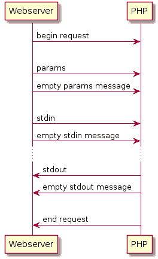

# 擅长 PHP

> 原文：<https://dev.to/michaelneu/excel-ing-at-php-14i9>

自从我发表了关于使用微软 Excel 中的普通 VBA 宏构建 web 服务器的文章已经有一段时间了。您可能已经通过标题图片猜到了，这一次我们没有构建 REST 后端，而是在 webxcel 中添加了对 PHP 的支持，基本上是任何支持 FastCGI 的语言，比如 Perl 或 Python。

这篇文章将分为两个部分:首先，我们将通过检查 PHP 的协议来研究现成的 web 服务器如何集成 PHP，稍后我们将看到如何自己构建它。如果您只是为了代码而来，请随意查看 [webxcel repo](https://github.com/michaelneu/webxcel) 。

## 你连 PHP 都不会？

当我在学校开始做 webdev 时，PHP 是必经之路。当时在 Windows 上，启动和运行最简单的解决方案是简单地在本地安装一个预配置的包。我的选择是 [XAMPP](https://www.apachefriends.org/index.html) ，它附带了一个 Apache 服务器、PHP、MySQL 和一个邮件服务器，所有这些都配置为开箱即用。一旦你准备好了你的站点，你就可以把它部署到一个 webhoster 上，它为你运行 PHP 和 webserver。

现在是 2019 年，人们使用更复杂的设置，例如[像这样的](https://gist.github.com/michaelneu/2ca7987ef00fa3fbe4fd7b9c07834cc7)为每个服务提供单独的容器。介绍一下基础知识:PHP 本身支持两种主要的操作模式，CLI 和 FastCGI。如果您运行类似这样的东西，您可以直接从您的 shell 启动 PHP 脚本。

```
$ cat foo.php
<?php echo "hello world\n"; ?>
$ php foo.php
hello world 
```

使用 CLI 向服务器添加 PHP 支持会很方便，因为我们可以在每次收到服务器请求时启动这个过程。这就是普通 CGI 的本质:根据每个请求启动流程。但是这种方法也意味着相对较大的开销(每个进程分配单独的内存，一个“冷 VM”和容器内的进程限制等等)，所以 PHP 也附带了 FastCGI，以便为多个请求重用进程。

## 90 年代打电话来，他们想要回他们的协议

FastCGI 最初是在 20 世纪 90 年代发布的，目的是让通用网关接口(CGI)更快。为了理解它内部是如何工作的，我们应该阅读手册，但是监视 NGINX 对 PHP 进行 FastCGI 调用更有趣。通常，Wireshark 会是我选择的工具，但是通过实现一个快速而肮脏的 [Python 中继代理](https://gist.github.com/michaelneu/5bf8b99a904cf8c1fa67aadfaeb741d0)，它实质上监听传入的数据并将其转发到我们的 PHP 容器，我们可以完全控制来回发送的原始数据。

为了理解这些信息，我们仍然必须阅读[规范](http://www.mit.edu/~yandros/doc/specs/fcgi-spec.html)。FastCGI 消息以一个 2 字节的版本和消息类型字段开始，每个字段的宽度为一个字符，随后是 6 个字节的消息头。头用一个 2 字节的整数指定主体的内容长度，范围从 0 到 65，535。因此，每次我们的 FastCGI 服务器需要发送超过 64kB 的数据时，它必须将数据分成多个数据包，每次添加一个 8 字节的报头。对于一个 1MB 的网站来说，这意味着 16 个 64kB 的数据块和一个 8 字节的头，这意味着我们 1MB 的文件将导致总共 128 字节的开销。如果你追求“1 秒优化”，你应该考虑在把你的网页传到你的网络服务器之前缩小它们，但是另一方面，谁真的关心那种开销\_(ツ)_/

根据消息的不同，正文可以是结构或纯文本。大多数消息都很容易反序列化，除了“最复杂”的消息 FastCGI params。每个参数作为一个`${key.length}${value.length}${key}${value}`字符串发送，也需要被解析。如规范中所述，param 的键或值不能超过 255 个字符，因为每个字符的长度被编码为一个字节。这意味着，如果我们想让我们的客户发送一个长参数到我们的服务器，我们必须把它分成多个单独的头，然后我们自己把它连接起来。附带说明:最常见的浏览器中最长的用户代理字符串可能来自 Edge，它跨越 140 个字节，显然是< 255，所以这也不是问题。

典型的 FastCGI 请求看起来有点像这样:

[](https://res.cloudinary.com/practicaldev/image/fetch/s--UnDuBZYM--/c_limit%2Cf_auto%2Cfl_progressive%2Cq_auto%2Cw_880/https://www.plantuml.com/plantuml/png/SoWkIImgAStDuU8AJqqgJYqgIorIqBLJ2F08i598IatFp5CeIYqiJIqkuUAggQd1fgeWiIWnjnYBH6fkGKabL5eXDxMuE34z5QSfnIKfcNau3G7B8ipGqzD3DiD65sv6Vca95Wcu8K1fd2w1AyvBGVZP0SW3XWu0)

要启动 FastCGI 请求，web 服务器必须发送一个“begin request ”,它描述了 PHP 的角色并包含一些修改协议的标志。通常，我们只会看到 web 服务器向 PHP 发送`FCGI_RESPONDER`，因为我们希望它用一个网站来响应我们。在发送我们的参数之后，web 服务器将我们的 stdin 发送给 PHP，这意味着它将发送我们的请求体。如果我们正在做一个`GET`请求，我们没有主体，所以我们可以立即发送一个空的 stdin。在出现`POST`或`UPDATE`请求的情况下，我们必须通知 PHP 我们已经发送完了 stdin。为此，web 服务器发送一个空的 stdin。相同的消息流也用于参数，如上图所示。

现在 PHP 可以执行我们的脚本了——它通过参数接收脚本名，并从 stdin 获取请求体。一旦完成，它会立即发送回 stdout。注意，还有一个 stderr 消息类型，但是即使在 PHP 中引发错误，我们通常也只会收到 stdout 消息。与 stdin 类似，PHP 在 stdout 中发送完我们的网站后，会发送一条空消息给 signal。最终，PHP 将发送一个“end request”消息，其中包含一个用于脚本退出代码和协议是否成功结束的字段。

## 将 FastCGI 集成到 webxcel 中

现在怎么才能把这个放进 webxcel 呢？首先，我们需要找到一种连接到任意套接字的方法，然后我们“只”需要解序列化/序列化 FastCGI 消息，我们就完成了。小菜一碟。

### VBA hell

如果你曾经编写过 VBA 宏，并且在调试时遇到了问题:想象一下从一个关于如何使用 winsocks 的零散文档中导入本机函数。使用套接字本身并不难，在 Python 中只需`import socket`并开始运行，但在 VBA，我们需要自己导入套接字函数。幸运的是，大部分东西在构建 webxcel 的 TCP 服务器时就已经存在了，但似乎有多种不同的方法可以使用 winsocks 连接到套接字，因此使用 VBA 的“this variable is 0”调试器找到正确的方法可能会被认为是困难的。

为了让你免于这个令人沮丧的过程，最终:

[](https://res.cloudinary.com/practicaldev/image/fetch/s--JEiIiQA7--/c_limit%2Cf_auto%2Cfl_progressive%2Cq_auto%2Cw_880/https://i.kym-cdn.com/photimg/newsfeed/000/217/040/48ACD.png%3F1323900430)

这里的关键是在`sockaddr_in`中设置正确的值，并隐式地将其转换为通用的`sockaddr`类型，这允许我们使用`connect(SOCKET*, sockaddr, sizeof(sockaddr))`。

#### 写(UInt16 值)

VBA 来自不同的时代。当它被创建时，内存比现在更神圣，对于集成脚本语言，一个 2 字节有符号整数就可以了。但是我们想和一个使用普通的 4 字节整数的服务器通信，那么我们该怎么做呢？

在网络上发送一个整数通常是以大端顺序进行的，因此，例如，数字`1337`或`0x0539`将作为`39 05`发送。在 VBA，`Long`是 4 个字节，`Integer`是 2 个字节，`Byte`显然是 1 个字节。移动一个值`i >> n`足够的次数将或多或少地产生第`n`个字节，这最终可用于将该值编组为一个大端字节数组，然后该数组可通过网络发送。

尽管 VBA 没有提供移位操作符，但是除以`0xFF`并使用余数和结果来构建字节表示也同样有效。此外，VBA 没有原始字节数组，但可以用字符串来模拟它们:VBA 提供了对字符串的原始访问，就像 C 中的`char`数组一样，它也由 1 个字节的`char`组成。因此，要将一个`Long`封送到它的字节，要做的就是足够频繁地对它进行划分，并将它的字节分配给一个适当大小的`String`。

FastCGI 有 2 和 4 字节的整数，它们将被整理成 2 和 4 字节宽的字符串。固定大小的字符串可以由`Dim foo As String * size`分配，但是这被限制为常量`size`，如果有一个更动态的解决方案就更好了。因此，要重新创建一个`malloc(size)`函数，可以尝试简单地添加一个`RepeatString(size, char)`函数，它基本上将一个字符串重复`size`次，例如`\0`。

事实证明，这确实有效。您可以使用任意字符串从 VBA 分配内存(每个字符串高达 [2GB)，我们可以原始访问这些字符串。我想我们需要 C 来完成这个。](https://stackoverflow.com/questions/2516702/getting-around-the-max-string-size-in-a-vba-function) 

```
' the first malloc(n) with O(n) runtime complexity!
Public Function Malloc(ByVal size As Long) As String
  Malloc = ""

  Dim i As Long
  For i = 1 To size
    Malloc = Malloc & Chr(0)
  End For
End Function 
```

有趣的事实:在分配的字符串之外写入内存可能会导致分段错误，导致 Excel 崩溃。

### 解析并序列化消息

编组就绪后，FastCGI 消息就可以解编/序列化了。通过创建一个抽象类`IFastCGIRecord`，所有的消息都可以继承一个一致的接口来进行反序列化。每条消息包含一个头和一个主体，所以每条消息中应该有一个`FastCGIHeader`字段，还有消息主体字段，例如`FastCGIBeginRequest`消息的`role`字段。反序列化/序列化记录现在可以遵循经典的组合模式:首先通过调用消息头的序列化方法来序列化消息头，然后发送消息体，就像这样:

```
' overload for IFastCGIRecord.WriteToTcpClient
Private Sub IFastCGIRecord_WriteToTcpClient(client As TcpClient)
    Dim header As IFastCGIRecord
    Set header = m_header
    ' serialize the header first
    header.WriteToTcpClient client

    Dim bytes As String
    bytes = ""

    bytes = bytes & Marshal.Int16ToBytes(Role)
    bytes = bytes & Marshal.Int8ToBytes(Flags)
    bytes = bytes & Reserved

    client.SendString bytes
End Sub 
```

VBA 的 2 字节`Integer`是有符号的，一旦我们试图反序列化现实生活中的消息，我们将很快看到消息大小使用了符号从我们这里偷走的那一个额外的位。让我们用一个`Long`代替[，今天就到此为止](https://github.com/michaelneu/webxcel/blob/72c08ee4c58e1c1ed48bab54c75753401872e547/src/Modules/Marshal.bas#L31-L33)，因为 VBA 可能不会很快出现一个`UInt16`。

在 webxcel 中，使用`IWebController`类可以很容易地添加更多功能。通过编写新的 [`FastCGIWebController`](https://github.com/michaelneu/webxcel/blob/72c08ee4c58e1c1ed48bab54c75753401872e547/src/Classes/FastCGIWebController.cls) ，我们可以连接到 FastCGI 服务器并交换 FastCGI 消息。

## 总结

所以，我们把 PHP 变成了 webxcel。我们到底为什么想要这个？

尽管有些愚蠢，但这实际上是令人兴奋的。我们编写了自己的基本 FastCGI 实现，它不仅允许我们运行 PHP，还允许我们运行任何支持 FastCGI 的语言，例如 Perl。老实说，谁不想在 Excel 中运行 Perl 脚本呢？