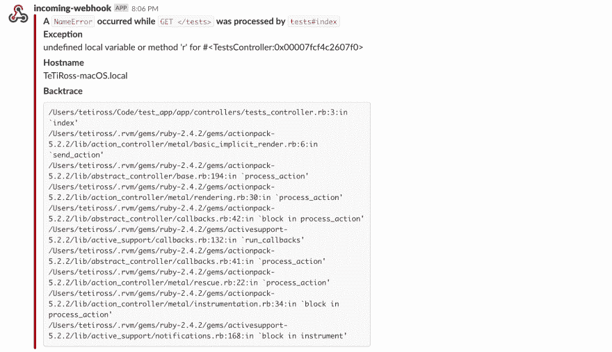
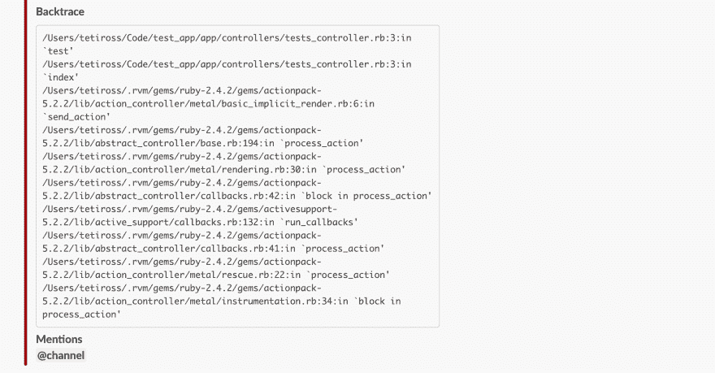

# exception_notification:时差提及

> 原文：<https://dev.to/tetiross/exceptionnotification-slack-mentions-5e06>

你试过 [`exception_notification`宝石](https://github.com/smartinez87/exception_notification)吗？它可以帮助你捕捉 rails*应用中的错误，并通过电子邮件、Slack 或其他支持的通知方法发送给你。*

 *我遇到的问题是，如果你用 [Slack 作为通知者](https://github.com/smartinez87/exception_notification/blob/master/docs/notifiers/slack.md)，它会默默地给 channel 发消息，没有任何提及。好吧，如果您设置了延迟通知来发送每条消息的通知，这不是问题。但是，如果您只收到提到的消息的通知，您可能会在看到此消息之前失去一些时间，这不是很好。

在这篇文章中，我将向你展示如何在由`exception_notification` gem 生成的 Slack 消息中添加提及。

因此，首先让我们看看如果您想使用 Slack 作为消息接收者，基本配置是什么样子的。

```
Rails.application.configure do
  config.middleware.use ExceptionNotification::Rack,
    slack: {
      webhook_url: ENV['SLACK_WEBHOOK_URL'],
      channel: ENV['SLACK_CHANNEL_NAME'],
      additional_parameters: {
        mrkdwn: true
      }
    }
end 
```

Enter fullscreen mode Exit fullscreen mode

以及生成的消息在 Slack 中的样子。

[](https://res.cloudinary.com/practicaldev/image/fetch/s--DDwkFm5G--/c_limit%2Cf_auto%2Cfl_progressive%2Cq_auto%2Cw_880/https://thepracticaldev.s3.amazonaws.com/i/7ji1o7q2e8yu3ub8hy37.png)

您可以看到该消息由几个部分组成。首先是主文本，然后是一些字段，如**异常**、**主机名**和**回溯**。所有这些字段都是由`exception_notification`自动生成的，但是您也可以添加自己的自定义字段。

在我们的配置文件中，除了`webhook_url`、`channel`和`additional_parameters`，您还可以添加`additional_fields`选项，它将接受带有`title`和`value`键的散列数组。该选项负责将更多的**回溯**类字段添加到 Slack 消息中。

因此，我们可以添加带有`title` : `Mentions`和`value` : `<!channel>`的字段。

```
Rails.application.configure do
  config.middleware.use ExceptionNotification::Rack,
    slack: {
      webhook_url: ENV['SLACK_WEBHOOK_URL'],
      channel: ENV['SLACK_CHANNEL_NAME'],
      additional_parameters: {
        mrkdwn: true
      },
      additional_fields: [
        { title: 'Mentions', value: '<!channel>' }
      ]
    }
end 
```

Enter fullscreen mode Exit fullscreen mode

这将在我们的 Slack 消息中再添加一个字段，该字段将引发`@channel`提及，该渠道中的所有用户都将收到通知。

[](https://res.cloudinary.com/practicaldev/image/fetch/s--D0PJXA9F--/c_limit%2Cf_auto%2Cfl_progressive%2Cq_auto%2Cw_880/https://thepracticaldev.s3.amazonaws.com/i/mcb5m9vvcif2gkxz7bp1.png)

在`value`字段我们写了`<!channel>`，不仅仅是`@channel`，因为 Slack 使用了[特殊的消息格式](https://api.slack.com/docs/message-formatting#linking_to_channels_and_users)。例如，如果你想提到某个用户，你需要这样写:`<@username>`。*