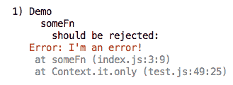

# 使用 chai-as-promised 进行错误测试时 expect(await fn())与 await expect(fn())的比较

> 原文：<https://dev.to/ccleary00/expectawait-fn-vs-await-expectfn-for-error-tests-with-chai-as-promised-n6n>

***原载于 [coreycleary.me](https://www.coreycleary.me/expectawait-fn-vs-await-expectfn-for-error-tests-with-chai-as-promised/)** 。这是我的内容博客的交叉帖子。我每一两周发布一次新内容，如果你想直接在收件箱里收到我的文章，你可以[注册我的时事通讯](https://www.coreycleary.me/about/)！我也定期发送备忘单和其他赠品！*

### 问题场景

啊，写错误测试。很有趣，不是吗？你是否曾经编写过一个单元测试，期望用 Chai 发现一个错误，然后得到类似下面这样的结果？

> 不明白为什么` expect(await fn()). to . be . rejected with(`我是个错误！`)`失败了...我们调用这个函数，得到一个错误，然后断言它...为什么不通过？

[](https://res.cloudinary.com/practicaldev/image/fetch/s--brb-lry8--/c_limit%2Cf_auto%2Cfl_progressive%2Cq_auto%2Cw_880/https://www.coreycleary.me/wp-content/uploads/2018/12/Screen-Shot-2018-12-30-at-1.42.33-PM.png)

编写测试经常会半途而废，当失败的测试让你抓狂时，你很可能会直接删除测试。

我们希望测试变得简单，并且令人愉快。如果不是，那就是出问题了。

在之前，我已经介绍了一点关于[如何针对承诺/异步函数的错误编写测试，但是现在让我们更深入地了解一下**为什么当你期望一个错误/拒绝的承诺时**做`expect(await fn())`不会起作用。](https://www.coreycleary.me/why-isnt-this-unit-test-catching-an-error-from-this-async-await-function/)

### 当我们写' expect(await fn()). to . be . rejected with(error)'时，我们真正在做什么

假设我们正在测试的函数如下:

```
const someFn = async () => {
  throw new Error(`I'm an error!`)
} 
```

这里是我们使用 Chai / chai-as-promised 的测试设置:

```
const chai = require('chai')
const chaiAsPromised = require('chai-as-promised')

const { someFn, otherFn } = require('./index')

const expect = chai.expect
chai.use(chaiAsPromised) 
```

为了演示错误测试，我们故意抛出一个错误/拒绝承诺。
在我们的测试中，当我们这样做时:

```
expect(await fn()).to.be.rejectedWith(`I'm an error!`) 
```

和这样做是一回事:

```
const res = await someFn()
expect(res).to.be.rejectedWith(`I'm an error!`) 
```

将`await someFn()`结果提取到一个变量中有助于更清楚地了解正在发生的事情。

因为我们没有捕捉函数的结果，所以我们没有捕捉错误。错误最终被打印到控制台，测试失败。 [](https://res.cloudinary.com/practicaldev/image/fetch/s--brb-lry8--/c_limit%2Cf_auto%2Cfl_progressive%2Cq_auto%2Cw_880/https://www.coreycleary.me/wp-content/uploads/2018/12/Screen-Shot-2018-12-30-at-1.42.33-PM.png) 
*边注:通常我们应该预料到一个未处理的 PromiseRejection 也会出现在控制台上，但是 Mocha 有一些内置的错误处理/承诺拒绝处理来捕捉这种情况。*

### 我们应该做的是

相反，我们应该做的是测试我们的错误/被拒绝的承诺:

```
await expect(someFn()).to.be.rejectedWith(`I'm an error!`) 
```

当我们把`await`放在`expect`前面时，Chai / chai-as-promised 就可以检查被拒绝的承诺。我们在断言上`await`，这允许我们捕捉和检查错误。

### 包扎

在 JavaScript/节点世界中，类似这样的古怪事情会让你偏离轨道。就像我前面提到的，如果测试写起来很麻烦，通常它们就不会被写出来。

我为未来计划了更多的测试内容，所以如果你觉得这很有帮助，并且想直接收到你的收件箱，而不必记得回来查看这里，[在这里注册邮件列表！](https://www.coreycleary.me/expectawait-fn-vs-await-expectfn-for-error-tests-with-chai-as-promised/)