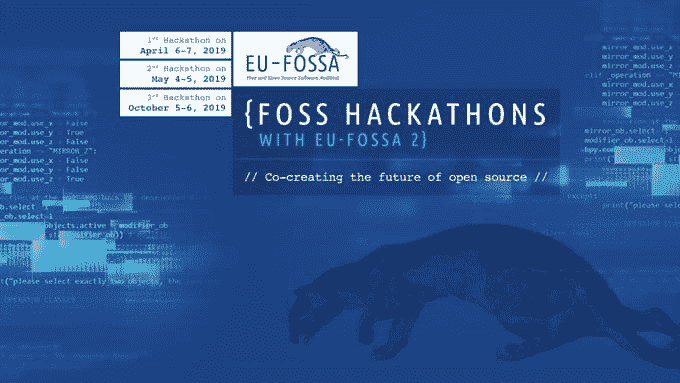
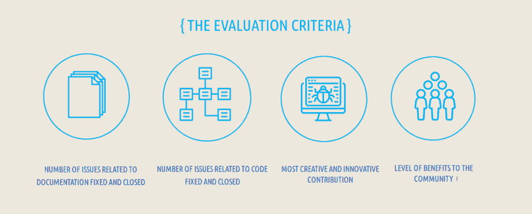
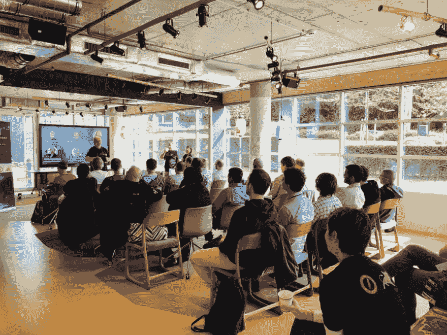
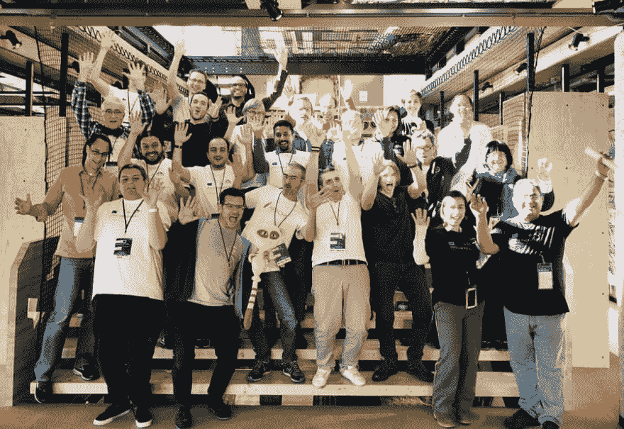

# 体验由欧盟组织的黑客马拉松

> 原文：<https://dev.to/niklasmerz/experiencing-an-hackathon-organized-by-the-european-union-2ana>

### 我很幸运地参加了欧盟在布鲁塞尔组织的一个非常特别的关于 Apache 项目的黑客马拉松。

EU FOSSA 在 5 月组织的第二次自由/开源软件黑客马拉松主办了一次活动，一些 Apache 软件基金会社区的人聚在一起见面。一些社区是老的和成熟的项目，如 Apache Tomcat，而其他的是非常小的、年轻的或不太为人所知的社区。该活动为一起工作但从未见过面的人提供了一个走到一起的机会，也为社区提供了一个相互了解的机会。

想了解更多关于 EU FOSSA 的信息和事件的背景，请阅读我同时发表的[帖子](https://blog.merzlabs.com/posts/eu-opensource)。这篇文章更多的是关于我在活动中的经历，以及对活动和开源努力的一些自以为是的想法。如果你想知道更多关于每个社区在活动中做了什么，看看 Github 上正在进行的工作[主页](https://eufossa.github.io/apache-hackathon-2019/)。这个页面还没有完全完成，因为与会者正在通过拉请求编辑内容。

我不是作为这些项目的一部分参加的，更多的是作为一个开源爱好者。我观察 Apache 社区已经有一段时间了。我很快遇到了其他对所有这些项目都完全陌生的与会者。我认为邀请像我和学生这样的人来获得对事物的不同看法，分享知识和 Apache 社区的价值观是一个好主意。

我首先要非常感谢组织者。尽管我的申请是在最后一分钟完成的，但去布鲁塞尔旅行并参加证明对我来说是完美的。在那里是一次愉快的经历，团队真的很好，组织了一切。银广场凯旋门的酒店和场地提供了一个很好的环境来与人们交谈和进行项目工作。

在一些开场白和关于欧盟和 FOSSA 的介绍之后，与会者开始讨论和工作他们的项目。与他们的项目没有直接关系的与会者加入了小组，并以多种方式参与。

很快就清楚了，我们不会遵循之前黑客马拉松的议程。我认为组织者做得很好，他们走出了一条路，让社区按照他们自己的步调来决定做什么，“阿帕奇方式”。我和可能其他人的印象是，与开源社区一起工作没有时间表和明确的目标，而是更加有机的。我们只是做了我们想做的事情，并在时间合适的时候来到会议室介绍我们正在做的事情。我们真的有机会让它成为我们的活动，结果证明它是有趣和富有成效的。

这个周末我没有自己写任何代码。我确实在合作创建的网站和博客上写了一些文字。比起会议、文档等，我通常更喜欢编码。但是这一次不同。与每个人交谈真的很有趣，很有启发性，我可以提高我的沟通和写作技巧。这确实是活动的精神所在，因为分享知识和社区比编写代码更重要。活动中的项目大部分是用 Java 编写的，我在某种程度上熟悉 Java 开发，但就我个人而言，我需要花一些时间来熟悉代码库，以编写有用的代码。我确实读过很多项目的代码。我也从源代码中自己构建了一些项目，并获得了项目中有趣部分的介绍。其他参与者在短时间内用代码完成了一些令人印象深刻的工作。我认为在这次活动中，与人交谈、学习我从未听说过的新技术、帮助整理文档以及获得 Apache 精神对我来说更加重要。

有经验的 Apache 提交者建议使用密钥签名。包括我和委员会成员在内的一些与会者从未做过这样的事情，这是另一个机会，所以看看并谈谈开源是如何工作的。密钥签名和信任网是开源社区确保信任和安全的重要实践。所以这完全符合黑客马拉松的环境。

心脏出血是启动 EU FOSSA 的触发因素之一，也是活动期间讨论的话题。有些人记得他们当时做了什么，以及这对某个组织有多么重要。这向我展示了在没有人真正注意到的情况下，小型软件项目是多么重要。这就是像 FOSSA 这样的倡议如此重要的原因。开源领域的大部分热门话题和关注都集中在大公司或基金会的大项目上。他们通常有很多钱，并管理开源项目，如公司内部的商业产品。像 OpenSSL 这样被数以百万计的产品使用的小项目看起来就像没人注意的陈旧的不性感的项目。但是这些项目的安全性对于数百万用户的安全至关重要。Apache 有许多重要的项目，它们都是由社区领导的项目，有自己的精神和工作方式。

Tomcat 就是一个很好的例子。这是一个非常成熟的项目，多年来一直是一个值得信赖的解决方案。Tomcat 上的开发比闪亮的新项目进展更慢，因为关注的是稳定性。社区意识到它对 Tomcat 用户的责任，并发布可靠的版本。这就是为什么决策和作为社区讨论变化比编写代码更重要的原因。听到有些版本只有三个人决定发布一个如此重要的项目，真的让我很惊讶。每个人都可以很容易地从源代码构建 Tomcat，并投票支持发布。只要多一点点的参与就可以改进 Tomcat 版本并发现 bug。

像 Apache 这样的开源软件和公司做的开源软件是完全不同的。我认为像这样的活动真的有助于像欧盟这样的组织理解它，并找到支持它的方法。

在我看来，另一件重要的事情是树立对开源的意识。我认为这是黑客马拉松的另一个目的，以提高欧盟机构内部的意识。但是对于我这样一个开源开发者来说，开源社区的人们参与到与像欧盟这样的公共机构的对话中来也是很重要的。EU FOSSA 在沟通他们在做什么和他们的使命是什么方面变得越来越好。让人们直接参与也有助于与更广泛的受众分享，并获得更多的关注。写关于它的文章并在社交媒体上发布只是一个小小的贡献。

福萨只是旅程的开始。欧盟需要找出通过支持其社区来提高开源软件的安全性和质量的最佳或最有效的方式。黑客马拉松或其他类型的活动可能是一种方式。

在一次圆桌会议上，我们分享了我们的想法，即很难衡量成功。像问题已解决或安全缺陷已修复这样的指标并不能真正捕捉到事件的价值。建立社区可能是最重要的事情。在一个房间里真的有持久的影响。因为许多不同的项目走到了一起，协同作用被发现，这将显示未来的成就。

另一个重要的方面是捕捉事件中发生的事情。使用 Github 合作创建了一个活动网站。我认为这是一个完美的想法，因为 Github 已经是开发人员工具的一部分，对于记录我们一起做的事情非常有帮助。

你可以清楚地看到，FOSSA 2 正在做许多不同的事情，以找出如何应对开源中的挑战。我认为这是最好的方法，因为没有人知道什么是最好的。我真的希望 FOSSA 2 在结束后成为一个永久的预算项目，并且准备行动成功。FOSSA 所做的不仅对欧盟机构重要，对公众也很重要。把公共资金花在公共机构的开源解决方案上真的很有意义。FOSSA 有限的时间和预算应该负责任地使用，以确保该项目中的措施成为欧盟议程上的永久事项。

开源有很多方面。我不能把我所想的一切都用文字表达出来，但我尽力记录了黑客马拉松上发生的事情。我对 FOSSA 所做的一切非常乐观，希望将来也能如此。

我希望你喜欢这篇文章，我几乎可以肯定我会写更多关于 FOSSA 和开源的内容。

第二版的参与者是被邀请的 Apache 成员和像我一样感兴趣的人。就在几天前，我通过@EU_DIGIT 在 Twitter 上得知了这件事。我通过网站上的在线表格申请，并被录取了。参加活动是免费的，交通和住宿由组织者承担。

## 更多资源

*   [@EU_DIGIT 在 Twitter 上发布关于未来活动的消息](https://twitter.com/EU_DIGIT)
*   [是 Hackathon 主页](https://eufossahackathon.bemyapp.com/)
*   [#推特上的福沙克顿](https://twitter.com/hashtag/fosshackathons)