# 用 JavaScript 试验脑机接口

> 原文：<https://dev.to/devdevcharlie/experimenting-with-brain-computer-interfaces-in-javascript-1bdk>

*帖子最初发表在[媒体](https://medium.com/@devdevcharlie/experimenting-with-brain-computer-interfaces-in-javascript-8d6cb891fda8)T3 上*

[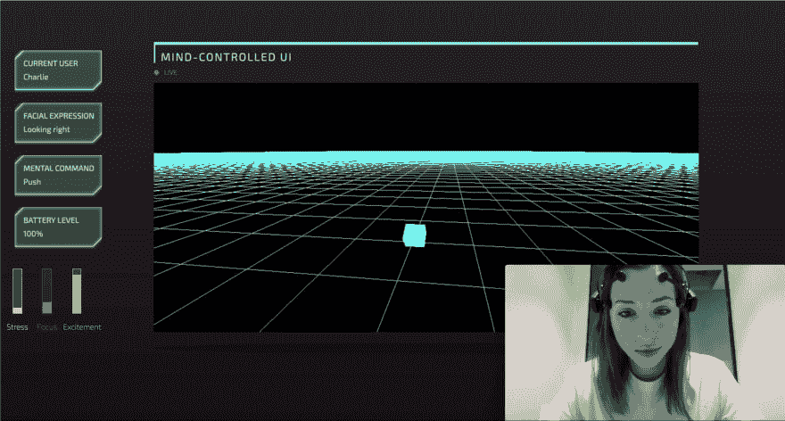](https://res.cloudinary.com/practicaldev/image/fetch/s--2I3jS1pC--/c_limit%2Cf_auto%2Cfl_progressive%2Cq_auto%2Cw_880/https://thepracticaldev.s3.amazonaws.com/i/pwhrc7ycdrc9snkzhap6.png)

在过去的几年里，我对神经技术越来越感兴趣。这篇博文是关于分享我一路走来学到的东西，希望能帮助那些想开始的人！

在进入主题之前，我想我应该先简单说说我是如何进入这个话题的。

# 背故事

— -

我没有计算机科学背景(我学的是广告和市场营销)，所以我通过在大会上参加沉浸式编码训练营来学习编码。

在我找第一份工作的时候，我开始摆弄 JavaScript 和硬件，我做过的第一个项目是用我的手在一个[跳跃动作](https://www.leapmotion.com/)上的移动来控制一个 [Sphero](https://www.sphero.com/) 机器人球。

[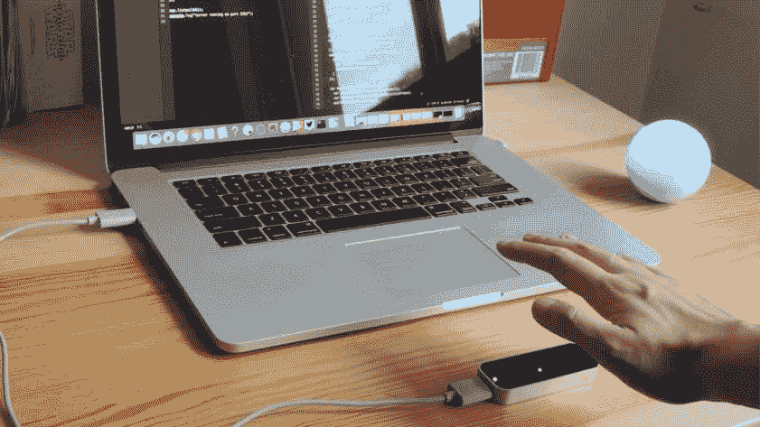](https://res.cloudinary.com/practicaldev/image/fetch/s--Yk6PQUnn--/c_limit%2Cf_auto%2Cfl_progressive%2Cq_auto%2Cw_880/https://thepracticaldev.s3.amazonaws.com/i/1984j61oah10m34i3ljz.jpg)

这是我第一次使用 JavaScript 来控制浏览器之外的东西，我立刻就被迷住了！

从那以后，我花了大量的个人时间制作交互式项目的原型，每次，我都试图挑战自己多一点来学习新的东西。

在尝试了一些不同的设备后，我正在寻找我的下一个挑战，这时我遇到了我的第一个大脑传感器 [Neurosky](http://neurosky.com/) 。

# 首次用大脑传感器进行实验

— -

当我开始对大脑传感器的实验感兴趣时，我决定先买一台 Neurosky，因为它比其他选择便宜得多。

[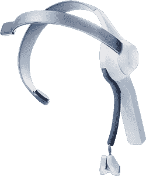](https://res.cloudinary.com/practicaldev/image/fetch/s--g3dN5R5n--/c_limit%2Cf_auto%2Cfl_progressive%2Cq_auto%2Cw_880/https://thepracticaldev.s3.amazonaws.com/i/vvy22hvab8v6pvws81ly.png)

我真的不知道我是否有技能为它编写任何东西(我刚刚完成了我的编码训练营)，所以我不想浪费太多的钱。幸运的是，已经有一个为 Neurosky 构建的 JavaScript 框架，所以我可以很容易地开始。我努力用我的专注程度来控制一个 Sphero 和一个 Parrot AR 无人机。

我很快意识到这个大脑传感器不是超级准确。它只有 3 个传感器，所以它给你你的“注意”和“调解”水平，但以一种非常不规则的方式。它们还可以让你访问来自每个传感器的原始数据，所以你可以像可视化一样建立东西，但 3 个传感器真的不足以得出任何关于你大脑中发生了什么的结论。

当我对其他可用的大脑传感器做一些研究时，我遇到了 [Emotiv Epoc](https://www.emotiv.com/) 。它看起来有更多的功能，所以我决定买下它，这样我就可以继续用脑机接口进行实验。

在解释这款耳机的工作原理之前，我们先简单说一下大脑。

# 大脑是如何工作的

— -

我肯定不是神经科学方面的专家，所以我的解释会不完整，但如果你想更好地了解大脑传感器和神经技术，你需要知道一些基本的事情。

大脑由亿万个神经元组成。这些神经元是处理信息的专门细胞，我们知道大脑不是随机分布的，而是由负责不同生理功能的不同部分组成。

举个例子，我们就拿:搬家。

在大脑中，负责运动和协调的部分包括初级运动皮层(在额叶)和小脑。当协调运动时，这些部位的神经元被触发，并将其轴突发送到脊髓。然后，它们触发运动神经元，激活肌肉并导致运动。

[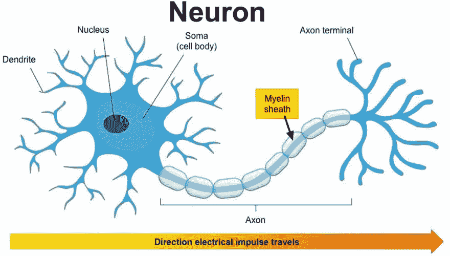](https://res.cloudinary.com/practicaldev/image/fetch/s---RhioX1V--/c_limit%2Cf_auto%2Cfl_progressive%2Cq_auto%2Cw_880/https://thepracticaldev.s3.amazonaws.com/i/rs1iuiarricj1pv6a280.jpg)

正如我之前所说，这是一个非常简单的解释，但最重要的是，这些发出的电信号实际上可以被头皮表面的 EEG(脑电图)设备跟踪。

其他系统可以用来跟踪大脑的活动，但它们通常更具侵入性，更昂贵，并且需要手术。例如，您也有 ECog(皮层脑电图),其中植入物被放置在颅骨内。

希望这是有意义的，我们现在可以花一些时间来讨论 Emotiv Epoc 如何跟踪这些电信号。

# 大脑传感器是如何工作的

— -

Emotiv 有 3 种不同的设备可用:

*   情绪洞察力
*   史诗级 flex
*   情感史诗

Epoc 在头部周围有 14 个传感器(也称为通道)。

10/20 国际脑电图系统(左下方)被用作描述和应用头皮电极位置的参考。它基于电极位置和大脑底层区域之间的关系。这样，它允许在设备和科学实验中使用某种标准。

在绿色和橙色部分，您可以看到 Epoc 上使用了哪些传感器(在右侧)。

[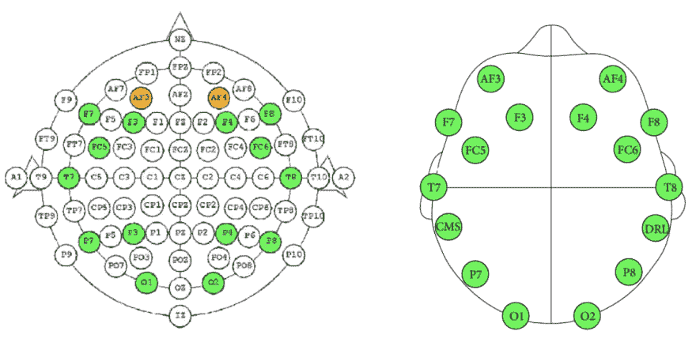](https://res.cloudinary.com/practicaldev/image/fetch/s--RLsmJ-JX--/c_limit%2Cf_auto%2Cfl_progressive%2Cq_auto%2Cw_880/https://thepracticaldev.s3.amazonaws.com/i/fv4b7cobl1heboh5g1l4.png)

正如你所看到的，即使 14 个通道听起来很多，但实际上比医疗设备上的传感器数量少得多，然而，它们似乎在头部分布得很好。

Epoc 的采样速率为 2048 内部下采样至 128 SPS 或 256 SPS，频率响应在 0.16 至 43 Hz 之间。

这意味着它每秒从连续信号中获取 2048 个样本，其中响应频率从 0.16Hz 变化到 43Hz。

如果我们观察不同类型的脑电波，我们可以看到它们在 0.5 赫兹到 100 赫兹之间工作。

[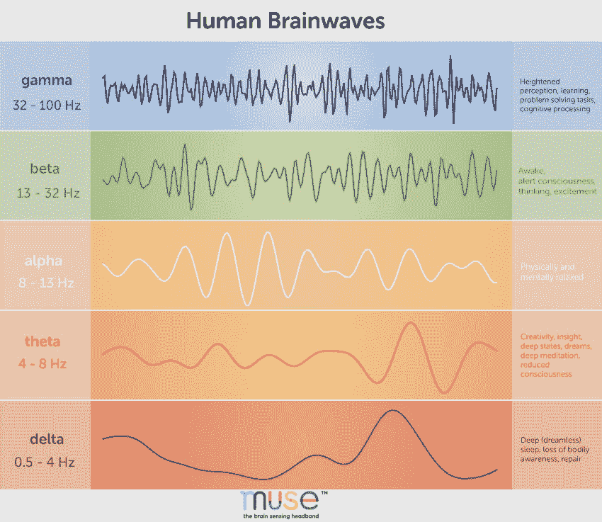](https://res.cloudinary.com/practicaldev/image/fetch/s--nHegriaS--/c_limit%2Cf_auto%2Cfl_progressive%2Cq_auto%2Cw_880/https://thepracticaldev.s3.amazonaws.com/i/6n5tdxztitu8exrr6em5.jpg)

为什么这很重要？因为根据我们希望用器件构建的应用类型，我们可能希望只关注在特定频率下工作的某些波。例如，如果我们想开发一个冥想应用程序，我们可能只想专注于θ波，频率在 4-8Hz 之间。

现在我们知道了这个设备是如何工作的，让我们来谈谈它允许你追踪什么。

# 特性

— -

Emotiv 软件不是开源的，所以你无法获得每个传感器的原始数据。相反，它们让您可以访问:

*   加速度计和陀螺仪轴。
*   绩效指标(兴奋程度、参与度、放松程度、兴趣、压力和专注程度)
*   面部表情(眨眼、左右眨眼、惊讶、皱眉、微笑、握拳、大笑、假笑)
*   精神命令(推、拉、举、降、左、右、向左旋转、向右旋转、顺时针旋转、逆时针旋转、反向旋转、消失)

只有精神命令需要每个用户的训练。要训练这些“思想”，你得下载[他们的软件](https://www.emotiv.com/developer/)。

一旦你完成了一些训练，文件就会保存在本地或者云中。

如果你想写自己的程序，你可以用他们的 [Cortex API](https://emotiv.github.io/cortex-docs/#introduction) ，他们的[社区 SDK](https://github.com/Emotiv/community-sdk) (他们在 3.5 版之后就不再维护了)或者，如果你想用 JavaScript，你可以用我做过的框架 [epoc.js](https://github.com/charliegerard/Epoc.js) 。

# Epoc.js

— -

Epoc.js 是一个在 JavaScript 中与 Emotiv Epoc 和 Insight 交互的框架。它让您可以访问上述相同的功能(加速度计/陀螺仪数据、性能指标、面部表情和精神命令)，并允许您与[仿真器](https://github.com/Emotiv/community-sdk/tree/master/tools/XavierComposer/Mac)进行交互。

您只需要几行代码就可以开始了:

[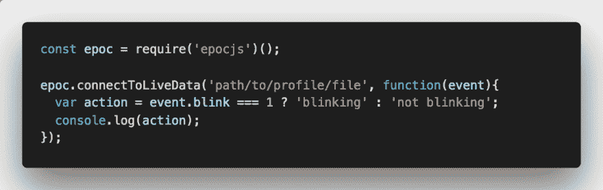](https://res.cloudinary.com/practicaldev/image/fetch/s--ZERsJFHE--/c_limit%2Cf_auto%2Cfl_progressive%2Cq_auto%2Cw_880/https://thepracticaldev.s3.amazonaws.com/i/lijygycoqk20yytrxqxa.png)

在上面的代码示例中，我们从请求和实例化节点模块开始。然后，我们调用 connectToLiveData 方法，并将训练后保存的用户文件的路径传递给它。我们得到一个回调，其中包含了我们可以跟踪的不同属性的对象。例如，如果我们想跟踪用户是否在眨眼，我们使用 event.blink。

每个属性在未激活时返回 0，在激活时返回 1。

可用属性的完整列表可以在存储库的 [README 中找到。](https://github.com/charliegerard/Epoc.js)

在后台，这个框架是使用 Emotiv C++ SDK、Node.js 和 3 个节点模块构建的:Node-gyp、Bindings 和 Nan。

这是创建 node-addon 的老方法，所以如果你有兴趣了解更多，我推荐你去看看 [N-API](https://nodejs.org/api/n-api.html) 。

现在，我们已经讨论了不同的特性以及如何开始，这里是我到目前为止构建的一些原型。

# 原型

— -

### 大脑键盘

[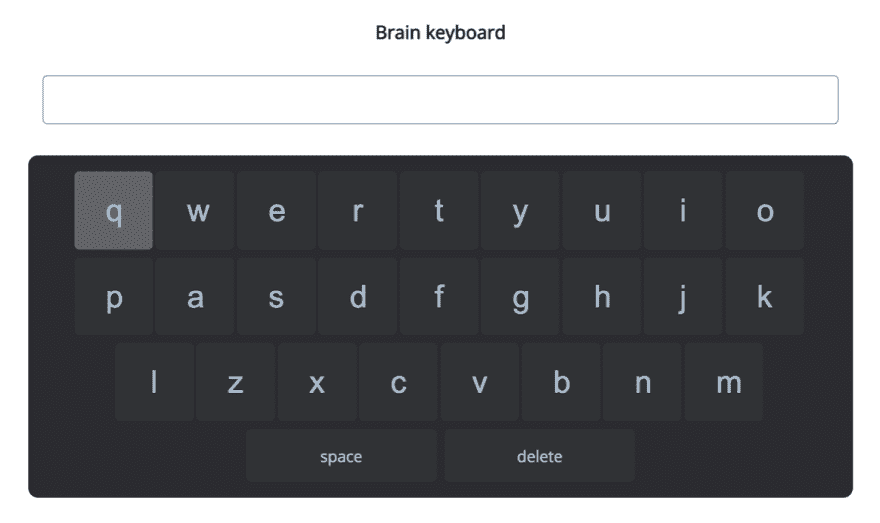](https://res.cloudinary.com/practicaldev/image/fetch/s--KF-KJFdd--/c_limit%2Cf_auto%2Cfl_progressive%2Cq_auto%2Cw_880/https://thepracticaldev.s3.amazonaws.com/i/l9mdbofefk3k7wkw1nkx.png)

我用 Emotiv Epoc 制作的第一个演示是一个大脑键盘。我的目标是看看我是否可以建立一个快速的界面，让人们可以使用面部表情进行交流。

使用眼球运动，向右或向左看突出显示右边/左边的字母，眨眼选择该字母并将其显示在输入栏中。

这是一个非常简单的原型，但它的工作原理！！

### WebVR

我的第二个原型涉及精神命令。我想看看我能否只用思想在 3D 空间中导航。

[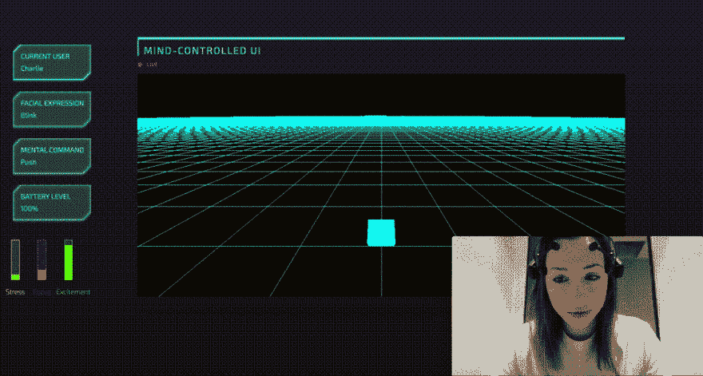](https://res.cloudinary.com/practicaldev/image/fetch/s--9NWAUZee--/c_limit%2Cf_auto%2Cfl_progressive%2Cq_66%2Cw_880/https://thepracticaldev.s3.amazonaws.com/i/3qdnovzqf3dlxuan3knl.gif)

在这个原型中，我使用 Three.js 来创建基本的 3D 场景，使用 epoc.js 来跟踪精神命令，并使用 web 套接字将它们从服务器发送到前端。

### 物联网

我的第三个原型是关于用 JavaScript 控制硬件的。这是我几年来一直在摆弄的东西，所以我很高兴能建立一个快速的项目来使用思想控制 Parrot mini 无人机！

[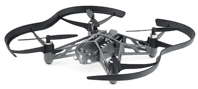](https://res.cloudinary.com/practicaldev/image/fetch/s--2TKyk9ur--/c_limit%2Cf_auto%2Cfl_progressive%2Cq_auto%2Cw_880/https://thepracticaldev.s3.amazonaws.com/i/4xr5fn99av0rmsf6fyot.jpg)

所有这些原型都很小。主要目标是验证一些想法，并了解这种技术的可能性和局限性，所以让我们从讨论局限性开始。

# 极限值

— -

尽管这项技术看起来令人兴奋，但仍有相当多的重要限制。

### 训练

事实上，每个用户都必须通过培训课程来记录脑电波，并将它们与特定的命令进行匹配，这是意料之中的，但对大多数人来说，这是一个障碍。除非应用程序解决了真正的需求，并且设备的精确度非常好，否则我无法想象人们会花时间训练大脑传感器。

### 潜伏期

当使用精神命令构建我的原型时，我意识到在我开始思考一个特定想法的时刻和我可以在程序中看到反馈的时刻之间有一点延迟。

我假设这是因为后台使用的机器学习算法实时从设备接收数据，并需要一定时间的样本，才能根据之前训练的思想对当前思想进行分类。

这确实会影响您可以使用传感器构建的应用类型。例如，构建一个冥想应用程序是可以的，因为延迟不会对用户体验产生重大影响，但是，如果你想构建一个思想控制的轮椅，你可以想象延迟会产生非常重要的影响。

### 有创与无创

脑电图设备很棒，因为你不需要任何手术；你只需戴上耳机，在传感器上加一些凝胶，就可以开始了！然而，它是非侵入性的事实意味着传感器必须通过头骨跟踪电信号，这使得这种方法的效率较低。

时间分辨率真的很好，因为采样率相当快，但空间分辨率不是很大。脑电图设备只能跟踪头皮表面周围的大脑活动，所以大脑深处的活动无法被跟踪。

### 社会认可

戴上大脑传感器并不是最光鲜的事情。只要这些设备看起来是这样，我不认为它们会被消费者采用。随着技术的进步，我们可能能够建造可以隐藏在帽子等配件中的设备，但还有另一个问题，大脑传感器在几分钟后会变得不舒服。

由于脑电图设备是非侵入性的，传感器必须在头皮上施加一点压力，以更好地跟踪电信号。可想而知，这种轻微的压力刚开始还可以，时间久了慢慢就不舒服了。此外，如果一个设备需要在所有传感器上使用凝胶，这对人们使用它是一个额外的障碍。

即使脑电图传感器的当前状态不能使它们对大多数人可用或有吸引力，未来仍有一些有趣的可能性。

# 可能性

— -

如果我们考虑该技术目前的状态，以及未来的发展，我们可以想到一些不同的应用。

### 可达性

我希望大脑传感器能够帮助患有某种残疾的人过上更好的生活，更加独立。

这是我在制作我的第一个大脑键盘原型时的想法。我知道原型还没有完成，但我真的很有兴趣看看一个普通的消费设备是否能帮助人们。不是每个人都可以使用复杂的医疗系统，我真的很高兴看到一个更容易使用的设备，你可以在网上购买，实际上可以帮助！

### 正念

目前已经成为一些大脑传感器(例如缪斯)焦点的一个应用是正念。

冥想可能很难。很难知道你做得对不对。大脑传感器可以帮助人们对他们的表现有直接的反馈，甚至指导他们如何随着时间的推移而改进。

### 预防

如果大脑传感器像我们使用手机一样被广泛使用，我们可能会开发出一些应用程序来跟踪某些生理功能何时没有正常工作。例如，如果我们可以根据大脑活动建立检测算法来防止中风，焦虑发作或癫痫发作，那将是非常棒的。

### 生产力

大脑传感器可以帮助冥想，同样，它们也可以跟踪你一天中注意力最集中的时间。如果我们定期佩戴传感器，它最终将能够告诉我们何时应该完成某些任务。你甚至可以想象你的时间表会被相应地组织起来，以确保你的每一天都更有效率。

### 艺术

我喜欢科技和艺术的交叉，以此来探索我在工作中没有机会做的事情。我真的认为，用大脑传感器构建创造性的东西不应该被低估，因为它允许我们在转向更“有用”的应用之前探索该技术的不同可能性和限制。

### 与其他传感器的组合

我最近开始思考这样一个事实，大脑传感器不应该被独立对待。大脑只通过身体的其他部分感知世界，没有眼睛就看不见，没有耳朵就听不见，等等。所以如果我们想理解脑电波，我们可能也应该跟踪其他生物功能。

这样做的主要问题是，我们最终的设置会是这样的:

[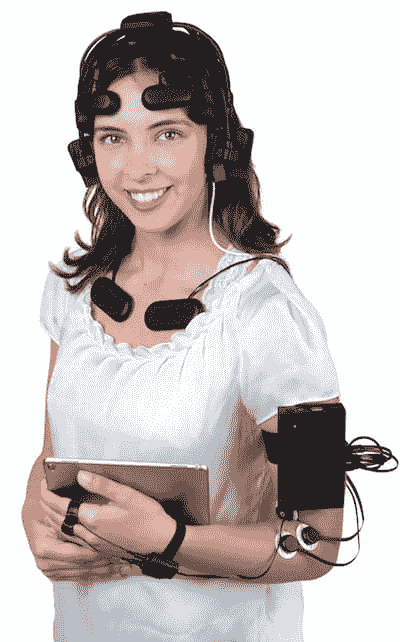](https://res.cloudinary.com/practicaldev/image/fetch/s--kxcEnocO--/c_limit%2Cf_auto%2Cfl_progressive%2Cq_auto%2Cw_880/https://thepracticaldev.s3.amazonaws.com/i/mena08hyn72umyj62ore.png)

我们可以肯定，没有人会每天都穿着它…

# 接下来

— -

几周前，我买了一个新的大脑传感器，名为 [OpenBCI](https://openbci.com/) 。我的下一步是修补原始数据和机器学习，所以我认为这个设备是完美的，因为它是完全开源的！

我只有时间来设置它，所以我还没有用它建立任何东西，但这里有一个设备和界面看起来像什么的预览。

[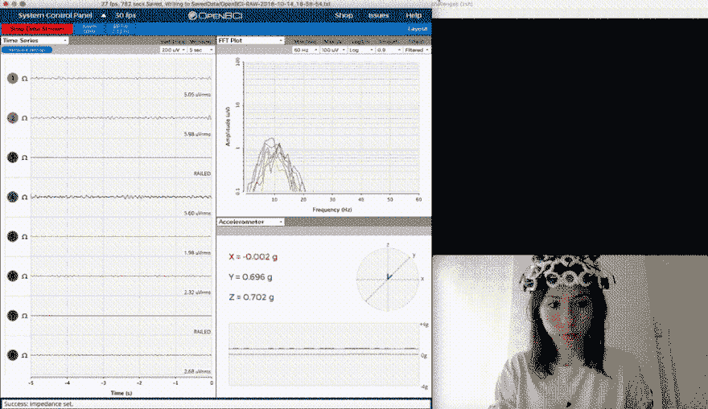](https://res.cloudinary.com/practicaldev/image/fetch/s--wAzTTj6S--/c_limit%2Cf_auto%2Cfl_progressive%2Cq_66%2Cw_880/https://thepracticaldev.s3.amazonaws.com/i/8s49r4ri5g51l59iidjh.gif)

暂时就这样吧！

我意识到这是一个很长的帖子，所以如果你读了所有的内容，非常感谢你！

我边走边学，所以如果你有任何意见，反馈或者你想分享资源，请随意！

# 资源

— -

如果你想尝试一些工具，或者想了解更多，这里有一些链接！

### 框架

[Epoc.js](https://github.com/charliegerard/Epoc.js) —与 Emotiv Epoc 交互的 JavaScript 框架。

[Brain bits](https://github.com/dashersw/brain-bits) —一种用于 Emotiv 耳机的 P300 在线拼写机制。

[Wits](https://github.com/dashersw/wits) —一个 Node.js 库，用 Emotiv EPOC 脑电图耳机读取你的思维。

[大脑监测器](https://github.com/dashersw/brain-monitor) —用 Node.js 编写的终端 app，实时监测大脑信号。

[神经节 BLE](https://github.com/neurosity/ganglion-ble) —基于 OpenBCI 的神经节脑机接口网络蓝牙客户端。

[BCI . js](https://github.com/pwstegman/bcijs)—JavaScript 中的脑电信号处理与机器学习。

### 有用的链接

[NeurotechX](http://neurotechx.com/)

[脑机接口](https://www.amazon.com/Brain-Computer-Interfacing-Introduction-Rajesh-Rao/dp/0521769418)(书)

[神经科学原理](https://www.amazon.com/Principles-Neural-Science-Fifth-Kandel/dp/0071390111)(书)

神经科学技术简介 —尤里·沙克德

利用脑机接口检测大脑活动状态 —维亚切斯拉夫·内斯特罗夫

### 人

[阿历克斯·卡斯蒂洛](https://github.com/alexcastillo)

安德鲁·杰伊·凯勒

康纳·鲁斯曼诺

[Uri Shaked](https://twitter.com/UriShaked)

娜塔莉娅·科斯梅娜

– -