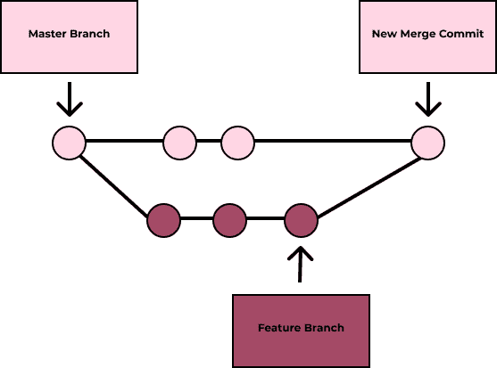
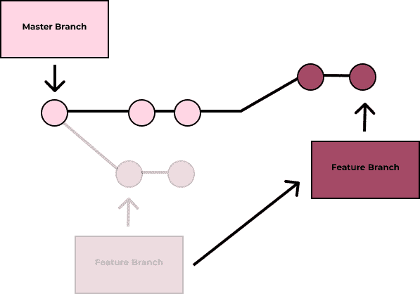

# ELI5: Git Rebase vs. Merge

> 原文：<https://dev.to/karaluton/explain-like-i-m-five-git-rebase-vs-merging-1k69>

到目前为止，我只合并了一个又一个分支，但是最近我发现了另一个选择——重定基础！重置基础和合并本质上是做同样的事情，那么它们的幕后到底发生了什么呢？

### 合并

Git merge 将多个提交合并到一个历史中。它会查看您想要合并的两个分支，并在它们之间找到一个共同的提交。接下来，它获取特性或源分支的内容，并通过创建一个全新的提交，将它与目标(在我们的示例中是主)分支集成在一起。这个新提交保存了两个分支的历史。因此，您将看到所有提交按时间顺序排列。

### Rebase

重置基础有点不同。您并没有从一个基础提交中将两个分支的历史合并在一起，而是实际上让它看起来像是从一个不同于您最初所做的提交创建了您的分支。这允许你保持一个线性的项目历史。如果你有一个 bug，这使得将来恢复一个变更变得容易得多，因为你不必深究提交是在时间线的什么地方进行的。

那么，你更喜欢哪个？重定基础还是合并？我很想在下面的评论中听到！

* * *

一定要在 Twitter 上关注我的许多关于科技的推文，如果我是诚实的，也有许多关于狗的推文。