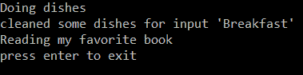
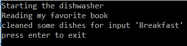
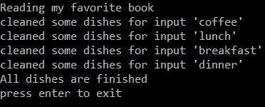

# 解释异步等待

> 原文：<https://dev.to/collenbrecht/explaining-async-await-384>

# 异步等待

## 为什么

I/O 或 CPU 密集型操作

## 如何

Async 和 await 关键字

## 举例

洗碗是单调乏味的工作。当你第一次开始洗碗时，它是同步的:你在洗碗池洗碗。你做不了别的。如果有什么能帮你做这件事，你就可以做别的事情了。进来的是:洗碗机。当你收拾好碗碟，装满肥皂，你告诉它为你洗碗。同时，你可以在等待的时候去读一本书或者玩一个游戏。当它准备好的时候，它会发出声音，这样你就可以把干净的盘子放好了。

## 代码

你可以在 GitHub 上找到代码:

##  [科伦布雷希特](https://github.com/collenbrecht)/[asyncawaite 示例](https://github.com/collenbrecht/AsyncAwaitExample)

### 试着用洗碗的例子来解释异步等待

<article class="markdown-body entry-content container-lg" itemprop="text">

# AsyncAwaitExample 示例

试着用洗碗的例子来解释异步等待

</article>

[View on GitHub](https://github.com/collenbrecht/AsyncAwaitExample)

首先，有包含要做的工作的类盘。我选择了需要一些时间的东西:散列一个字符串:

```
public class Dishes
{
    public string CleanDishes(string secret, string salt)
    {
        var keyBytes = Encoding.UTF8.GetBytes(secret);
        var saltBytes = Encoding.UTF8.GetBytes(salt);
        var cost = 262144;
        var blockSize = 8;
        var parallel = 1;
        var maxThreads = (int?)null;
        var derivedKeyLength = 128;

        var bytes = SCrypt.ComputeDerivedKey(
                keyBytes, saltBytes, cost, blockSize, parallel, maxThreads, derivedKeyLength
                );

        Console.WriteLine($"cleaned some dishes for input '{secret}' ");
        return Convert.ToBase64String(bytes);
    }
} 
```

然后有一个调用 CleanDishes 的 person 类:

```
public class Person
{
        private Dishes _dishes;

        public Person()
        {
            _dishes = new Dishes();
        }

        public void DoDishes()
        {
            Console.WriteLine("Doing dishes");
            new Dishes().CleanDishes("Breakfast", Guid.NewGuid().ToString());
        }
} 
```

这是同步编程，就像我们习惯的那样。让我们给 Person 类添加一个 Read 方法，这样我们就可以阅读一本书:

```
public void Read()
{
      Console.WriteLine("Reading my favorite book");
} 
```

现在我们可以使用一个控制台应用程序来调用 person 类并同步洗碗:

```
class Program
{
        private static Person _person;

        static void Main(string[] args)
        {
            _person = new Person();

            DoDishes();
            Console.WriteLine("press enter to exit");
            Console.ReadLine();
        }

        private static void DoDishes()
        {
            _person.DoDishes();
            _person.Read();
        }
} 
```

让我们看看会发生什么:
[](https://res.cloudinary.com/practicaldev/image/fetch/s--eYKyjWD6--/c_limit%2Cf_auto%2Cfl_progressive%2Cq_auto%2Cw_880/https://raw.githubusercontent.com/collenbrecht/AsyncAwaitExample/master/OutputImages/Output_Synchronous.png)

正如所料，我们首先需要洗碗。只有那时我们才能看书。

## 洗碗机

洗碗工进来了:他可以帮我们干活。它将同步运行，因为它不能做别的事情。然而，它将返回一个任务对象，这样它就可以让我们知道它什么时候准备好了:

```
public class Dishwasher
{
        private Dishes _dishes;

        public Dishwasher()
        {
            _dishes = new Dishes();
        }
        public Task DoDishesTask(string inputString)
        {
            return Task.Run(() => _dishes.CleanDishes(inputString, Guid.NewGuid().ToString()));
        }
} 
```

这意味着 Person 类现在可以要求洗碗工为他洗碗:

```
public async Task DoDishesAsync(string dishesName)
{
        Console.WriteLine("Starting the dishwasher");
        await _dishwasher.DoDishesTask(dishesName);
} 
```

下面是 async await 和 Task 一起使用的关键字。
返回类型是一个**任务**。这是将立即返回给调用方法的对象。
我们添加了 **async** 关键字，这样我们就知道这个任务不会立即完成。调用方法需要一些耐心，等待任务完成。
**await**关键字发挥了神奇的作用:它调用方法，并将线程的控制权返回给调用方法。它会在后台洗碗。

这意味着我们现在可以一边看书，一边等待洗碗机完成它的任务:
使用 [C# 7.1](https://docs.microsoft.com/en-us/dotnet/csharp/whats-new/csharp-7-1) 我们可以制作一个使用异步任务 Main 的控制台应用:

```
class Program
{
        private static Person _person;

        static async Task Main(string[] args)
        {
            _person = new Person();

            await DoDishesAsync();
            Console.WriteLine("press enter to exit");
            Console.ReadLine();
        }

        private static async Task DoDishesAsync()
        {
            var task = _person.DoDishesAsync("Breakfast");
            _person.Read();
            await Task.WhenAll(task);
        }
} 
```

我们将任务对象赋给一个变量。当任务运行时，我们阅读我们的书，并等待任务完成。
[T3】](https://res.cloudinary.com/practicaldev/image/fetch/s--CmP8-bqK--/c_limit%2Cf_auto%2Cfl_progressive%2Cq_auto%2Cw_880/https://raw.githubusercontent.com/collenbrecht/AsyncAwaitExample/master/OutputImages/Output_Asynchronous.png)

## 返回值的任务:

当你想执行一个返回值的任务时，你可以使用 **Task** 来完成。
假设我们一次做了一整天的所有菜，并想返回一个字符串来表示我们完成了:
我们向 Person 类添加了一个方法:

```
public async Task<string> DoManyDishesAsync(List<string> dishesNames)
{
            var tasks = new List<Task>();
            foreach (var dishesName in dishesNames)
            {
                var task = _dishwasher.DoDishesTask(dishesName);
                tasks.Add(task);
            }
            await Task.WhenAll(tasks);
            return "All dishes are finished";
} 
```

我们返回一个任务对象，这样调用方法就知道我们完成后将返回一个字符串。更牛逼的是:我们只是同步启动很多任务来洗碗，不用一个一个做。我们使用一个数组来存储所有的任务。当所有的任务都开始了，我们就等到它们都完成了。同时，我们将控制权交还给调用方法。

我们现在可以从我们的程序中调用这个方法:

```
private static async Task DoMultipleDishesAsync()
{
        var dishes = new List<string>
        {
                "breakfast",
                "lunch",
                "coffee",
                "dinner"
        };
        var allDishesTask = _person.DoManyDishesAsync(dishes);
        _person.Read();
        var taskreturn = await allDishesTask;
        Console.WriteLine(taskreturn);
} 
```

像以前一样，我们可以看我们的书，等待所有的菜吃完。
当它们准备好时，我们可以使用字符串返回值并将其写入控制台:
[](https://res.cloudinary.com/practicaldev/image/fetch/s--oA0Ommwb--/c_limit%2Cf_auto%2Cfl_progressive%2Cq_auto%2Cw_880/https://raw.githubusercontent.com/collenbrecht/AsyncAwaitExample/master/OutputImages/Output_Asynchronous_returnvalue.png) 
注意，洗碗任务不是按照我们开始它们的顺序完成的。

我希望这能帮助你理解 async 和 await 关键字，以及如何在 C#中使用它们。