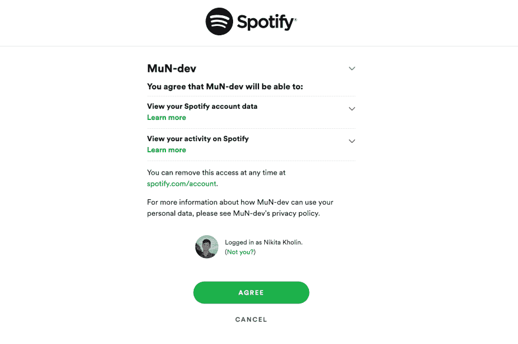
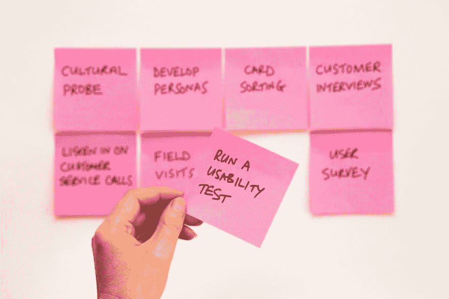

# 以解释 OAuth 如何与 Spotify 协同工作为例

> 原文：<https://dev.to/hmlon/explaining-how-oauth-works-with-spotify-as-an-example-5djl>

你有没有想过什么是 OAuth，它是如何工作的，以及为什么任何或多或少受欢迎的网站实现它？在本文中，我们将探讨这些问题，并用 Python 编写代码，将 OAuth 与 Spotify 结合使用。

# 什么事？

根据[维基百科](https://en.wikipedia.org/wiki/OAuth)，OAuth 是

> OAuth 是一种开放的访问授权标准，通常用于互联网用户授权网站或应用程序访问他们在其他网站上的信息，但不需要给他们密码。

听起来很有逻辑。让我们用一个 Spotify 来说得更具体一些。

> OAuth 通常被用作互联网用户授予*网站或应用程序*(你的网站或应用程序)*访问他们在*其他网站* ( **Spotify** )上的信息*(比如**他们最喜欢的艺术家**，或者**将新艺术家添加到收藏夹**的能力，但不需要给他们密码。

还有一件事。“OAuth 是一个*开放标准*，这意味着它将对所有其他实现 OAuth 的网站(如脸书、Twitter)起同样的作用。

# 工作原理

在高层次上，你(也被称为**客户端**，你试图认证的网站被称为**提供商**)，获得一个用户的**访问令牌**(本质上是一个密码)，有了它，你可以在一个所谓的**范围**内使用你列出的所有访问。

1.  用户单击将请求授权的提供商网站的链接
2.  用户看到一个授权屏幕

[](https://res.cloudinary.com/practicaldev/image/fetch/s--99sEhmL9--/c_limit%2Cf_auto%2Cfl_progressive%2Cq_auto%2Cw_880/https://kholinlabs.com/assets/2018-12-24-how-oauth-works-with-spotify-as-an-example/spotify-oauth-screen.png)

1.  用户接受你的范围
2.  用户被重定向到带有访问令牌的“重定向 URL”
3.  现在，您可以使用访问令牌请求您需要的数据

但是我们需要什么来使它工作呢？

# 创建一个“客户端应用程序”

首先，你需要创建一个“客户端应用”。它的主要目的是知道在第 4 步将用户重定向到哪里。

客户端应用程序的另一个目的是在步骤 2 的授权屏幕上显示项目的名称和简要描述。

您可以使用类似“#{PROVIDER_NAME} oauth app”的查询在谷歌上找到一个地方。

# 建立到“提供商”的链接

首先，你需要找到如何建立一个链接。谷歌可以再次帮助我们。只需谷歌“#{PROVIDER_NAME} oauth URL”。您应该从提供商那里找到类似官方文档的东西。

一旦我们发现如何建立链接，您很可能需要在其中使用几个参数:

*   `client_id` —您的客户端应用程序的标识符，以便提供商知道将用户重定向到哪里
*   `redirect_uri` —著名的重定向 URL(提供者可以使用在客户端应用程序中指定的 URL，但通常您可以在那里输入多个 URL，此参数用于说明)
*   `scope` —您的项目需要的访问列表(您可以在官方文档中找到范围)。

请参考官方文档，了解上面列出的参数的确切名称。

我将展示在我的情况下，我必须建立什么。关于范围，我需要`user-read-email`和`user-follow-read`来阅读用户的电子邮件和他们跟随的内容。首先，我会指向服务器运行的网址

```
provider_url = "https://accounts.spotify.com/authorize"

from urllib.parse import urlencode
params = urlencode({
    'client_id': 'MY_CLIENT_ID',
    'scope': ['user-read-email', 'user-follow-read'],
    'redirect_uri': 'http://127.0.0.1:5000/spotify/callback',
    'response_type': 'code'
})

url = provider_url + '?' + params
url
# => 'https://accounts.spotify.com/authorize?client_id=MY_CLIENT_ID&scope=%5B%27user-read-email%27%2C+%27user-follow-read%27%5D&redirect_uri=http%3A%2F%2F127.0.0.1%3A5000%2Fspotify%2Fcallback&response_type=code' 
```

# 为重定向 URL 创建端点

在步骤#4 中，用户被重定向到重定向 URL。这个 URL 是带有用户信息的访问令牌将到达的地方。

当我建立到提供商的链接时，我使用了`'http://127.0.0.1:5000/spotify/callback'`作为重定向 URL。该链接需要指向您拥有的任何服务器上的一个端点。

这里有一个如何在烧瓶
中设置端点的[快速](https://kholinlabs.com/what-to-do-when-you-need-a-web-app-quickly)示例

```
from flask import Flask
app = Flask(__name__)

@app.route("/spotify/callback")
def spotify_callback():
    return "You finally called me back!" 
```

在您刚刚创建的回调中，您可以对用户数据做任何您想做的事情。你可以在你的项目上创建一个用户的个人资料，给他发一封电子邮件或者别的什么。但是，如果您希望以后从这个用户那里获得更多的数据，最好保存一个令牌，这个令牌随请求一起发送到您的数据库。

# 测试是否工作

[](https://res.cloudinary.com/practicaldev/image/fetch/s--ceYGWl3q--/c_limit%2Cf_auto%2Cfl_progressive%2Cq_auto%2Cw_880/https://images.unsplash.com/photo-1518349619113-03114f06ac3a%3Fixlib%3Drb-1.2.1%26ixid%3DeyJhcHBfaWQiOjEyMDd9%26auto%3Dformat%26fit%3Dcrop%26w%3D1000%26q%3D80)

现在您已经获得了访问令牌，您可以在作用域中做您所请求的事情了。

我已经请求了 [`user-follow-read`](https://developer.spotify.com/documentation/general/guides/scopes/#user-follow-read) ，所以现在我可以读取用户正在关注哪些艺术家，以便在新专辑推出时[通知](http://musicnotifier.com/)。Spotify 有一个端点[来获取用户关注的艺术家，所以让我们使用它](https://developer.spotify.com/documentation/web-api/reference/follow/follow-artists-users/) 

```
artists = []
all_artists_loaded = False
limit = 50
access_token = fetch_access_token() # your function to pull the token
                                    # from the place where you saved it url = f"https://api.spotify.com/v1/me/following?type=artist&limit={limit}&access_token={access_token}"

while not all_artists_loaded:
    response = requests.get(url).json()['artists']
    current_request_artists = response['items']
    artists += current_request_artists
    if response['next']:
        url = response['next'] + f"&access_token={access_token}"
    else:
        all_artists_loaded = True

print(artists) 
```

如果你想知道更多关于如何获取最新专辑的信息，你可以阅读我以前的文章。

# 保存刷新令牌过

遗憾的是，访问令牌通常会过期。但幸运的是，我们可以用请求令牌附带的刷新令牌请求一个新的。

一旦访问令牌过期，您需要向文档中指定的端点发送带有刷新令牌的请求。我们可以用 Python
中的[请求](http://docs.python-requests.org/en/master/)库做到这一点

```
refresh_token = pull_refresh_token() # your function to pull the token
                                     # from the place where you saved it client_id = "YOUR_CLIENT_ID" # that you received once you created
                             # the Client Application client_secret = "YOUR_CLIENT_SECRET" # that you received once you created
                                     # the Client Application too 
refresh_url = "https://accounts.spotify.com/api/token" # from the docs 
payload = {
    'refresh_token': refresh_token,
    'grant_type': 'refresh_token'
}

auth_header = base64.b64encode(six.text_type(client_id + ':' + client_secret).encode('ascii'))
headers = {'Authorization': 'Basic %s' % auth_header.decode('ascii')}

response = requests.post(refresh_url, data=payload, headers=headers)

token_info = response.json() 
```

上面代码的[来源](https://github.com/plamere/spotipy/blob/4c2c1d763a3653aa225c4af848409ec31286a6bf/spotipy/oauth2.py#L231)。

URL(以及其他可能需要的参数)必须再次在官方文档中找到。

# 为什么大家都实现 OAuth？

这对最终用户来说很方便。OAuth 从用户那里接过创建密码或假账户的重担，把它放在开发者身上。但现在，使用任何提供商并充分利用用户数据的力量对你来说都不会太难。

# 不要发明自行车

[](https://res.cloudinary.com/practicaldev/image/fetch/s--dxdeqW-W--/c_limit%2Cf_auto%2Cfl_progressive%2Cq_auto%2Cw_880/https://images.unsplash.com/photo-1518050227004-c4cb7104d79a%3Fixlib%3Drb-1.2.1%26ixid%3DeyJhcHBfaWQiOjEyMDd9%26auto%3Dformat%26fit%3Dcrop%26w%3D3900%26q%3D80)

你面临的几乎任何问题都有现成的解决方案。在发明自行车之前，一定要去谷歌一下。如果你需要认证你，已经有的[库了。如果你需要访问一些 API，比如使用 Spotify 的 API，那么](https://kholinlabs.com/django-authentication-via-google-deezer-and-spotify)[也有相应的库](https://spotipy.readthedocs.io/en/latest/#)。

如果你想更深入地了解 OAuth，有一个官方指南[以一种非常容易阅读的形式涵盖了所有内容。](https://www.oauth.com/)

另外，这是关于[门](http://musicnotifier.com)系列文章的第四部分。请继续关注第 5 部分。你可以在我的 [GitHub 页面](https://github.com/hmlON)找到[这个项目](https://github.com/hmlON/mun)的代码，还有我的其他项目。如果你喜欢这篇文章，请在下面留下你的评论并关注我。