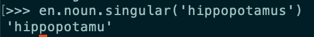

# 探索自然语言处理与爱丽丝梦游仙境

> 原文：<https://dev.to/valeriecodes/exploring-natural-language-processing-with-alice-in-wonderland-ldc>

作为一个编程狂和文学狂🤓我最近一直在试图寻找更多的方法来将这两者结合起来。我目前正在 [Recurse Center](http://recurse.com) 度过暑假，进行我自己的自我指导学习，所以这似乎是一个很好的时间来开始检查这个维恩图中的重叠。

走进这个兔子洞，我被《悲惨世界》中的这个[人物邻接矩阵迷住了，并想知道我还能通过代码研究我最喜欢的书的什么。](https://bost.ocks.org/mike/miserables/)

我一直在研究《Python 中的自然语言处理》这本书，也喜欢卡罗尔对语言的使用，包括他倾向于[创造词汇](https://www.poetryfoundation.org/poems/42916/jabberwocky)，并依靠上下文和[声音符号](https://en.wikipedia.org/wiki/Sound_symbolism)使它们变得易于理解。

考虑到这一点，我在考虑如何识别文本中的生僻词或杜撰词。

所以，带着《爱丽丝梦游仙境》的文本，我开始了我的探索(学究气的说明:“贾巴沃克”实际上是通过镜子出现在《T2》中的，所以我不确定我应该在*爱丽丝*中找到什么，如果有的话)。

这本书提供了一个函数来做这件事:

```
def unusual_words(text):
  text_vocab = set(w.lower() for w in text if w.isalpha())
  english_vocab = set(w.lower() for w in nltk.corpus.words.words())
  unusual = text_vocab.difference(english_vocab)
  return sorted(unusual) 
```

所以我插上电源试了试。我得到了 582 个单词的列表。这看起来太多了，所以我浏览了一些。其中很多似乎都很常见:*彩蛋*，*露齿一笑*，*发生*，*呈现*。

好吧，也许这比我想象的要难。我有点沮丧，并尝试使用其他一些 corpuses。但是这个语料库有 25 万个单词，当然应该有这些难以置信的常见单词？然后我注意到一些关于单词的东西。大多数名词都是复数(如 *eggs* )，动词是变化的(如*present*)。

我想把单词变成它们最“基本”的形式。名词用单数，动词用不定式。为此，我尝试了一下 [NodeBox 英语语言学库](https://www.nodebox.net/code/index.php/Linguistics)。这里有几个打嗝。例如，`is_verb?`没有为所有的动词返回 true，并且`singular`有一些意想不到的结果，所以我最终对所有的动词都运行了不定式和单数方法，如果它们返回了与起始单词不同的非空结果，就返回它们。

[](https://res.cloudinary.com/practicaldev/image/fetch/s--Vmwt_DUP--/c_limit%2Cf_auto%2Cfl_progressive%2Cq_auto%2Cw_880/https://thepracticaldev.s3.amazonaws.com/i/360k9hlt85dp5nw4tctd.png)

由于这个方法比原始方法中的简单集合差慢得多，所以我将它实现为第二遍，只用于第一遍 diff 中没有找到的单词。我把`unusual_words`改写如下:

```
def unusual_words(text):
  text_vocab = set(w.lower() for w in text if w.isalpha())
  english_vocab = set(w.lower() for w in nltk.corpus.words.words())
  unusual = text_vocab.difference(english_vocab)
  basic_forms = set(basic_word_form(w) for w in unusual)
  return sorted(basic_forms.difference(english_vocab)) 
```

并编写了一个新方法`basic_word_form`，它使用了 NodeBox 方法:

```
def basic_word_form(word):
   word = word.lower()
   singular = en.noun.singular(word)
   if singular !=  word:
       return singular
   else:
      infinitive = en.verb.infinitive(word)
      return infinitive if len(infinitive) > 0 else word 
```

这让我得到了 92 个单词的列表。不算太坏。有些是罗马数字，有些是专有名词(*法兰西*，*伦敦*，*莎翁*)，其他的则是合理的不寻常或杜撰的(*海洋学*，*鹰头狮*)。尽管如此，还是有一些词看起来不合适，比如最小的*、*、较大的*、*最可爱的*——比较级和最高级。我在 NodeBox 中没有看到任何可能有助于将它们简化为基本形容词或副词的东西。还有一些动词，像*dressed*，没有被正确地转换成它们的不定式形式。*

我注意到，在自然语言工具包(NLTK)中有一个工具就是这样做的- [获取单词的基本(或“词干”)](http://www.nltk.org/howto/stem.html)形式。

我尝试了两种不同的“词干分析器”，波特斯特梅尔和雪球斯特梅尔

```
def unusual_words_porter(text):
  text_vocab = set(w.lower() for w in text if w.isalpha())
  english_vocab = set(w.lower() for w in nltk.corpus.words.words())
  unusual = text_vocab.difference(english_vocab)
  basic_forms = set(basic_word_form_porter(w) for w in unusual)
  return sorted(basic_forms.difference(english_vocab))

def basic_word_form_porter(word):
   word = word.lower()
   stemmer = nltk.PorterStemmer()
   return stemmer.stem(word)

def unusual_words_snowball(text):
  text_vocab = set(w.lower() for w in text if w.isalpha())
  english_vocab = set(w.lower() for w in nltk.corpus.words.words())
  unusual = text_vocab.difference(english_vocab)
  basic_forms = set(basic_word_form_snowball(w) for w in unusual)
  return sorted(basic_forms.difference(english_vocab))

def basic_word_form_snowball(word):
   word = word.lower()
   stemmer = nltk.SnowballStemmer('english')
   return stemmer.stem(word) 
```

这些分别返回 187 和 188 个单词的列表。词干分析器似乎并没有完全满足我的需求——它们经常抛出词形变化或不规则复数，这样剩下的就不是英语单词了。一些输出: *trembl* ， *turtl* ， *difficulti* 。

我又找到了一个工具:`lemmatizer`。它旨在将单词简化为它们的“[词条](https://en.wikipedia.org/wiki/Lemma_(morphology))”,“一个单词的规范、字典或引用形式”听起来很有希望。

```
>>> lemmatizer = WordNetLemmatizer()
>>> lemmatizer.lemmatize('hedgehogs')
u'hedgehog'
>>> lemmatizer.lemmatize('says')
u'say' 
```

我注意到，如果通过可选的第二个参数来指定单词的词性，效果会好得多。

```
>>> lemmatizer.lemmatize('prettier')
'prettier'
>>> lemmatizer.lemmatize('smallest')
'smallest'
>>> lemmatizer.lemmatize('smallest', pos='a')
u'small'
>>> lemmatizer.lemmatize('prettier', pos='a')
u'pretty' 
```

问题是，我不知道这些词是什么词类，有些词根据上下文可能是不同的，而我没有上下文。所以我尝试了每一个没有词性的，然后作为形容词，动词和名词，并返回第一个与起始单词不匹配的。🤷

```
def basic_word_form(word):
  word = word.lower()
  lemmatized_forms = [lemmatizer.lemmatize(word), lemmatizer.lemmatize(word, pos='a'), lemmatizer.lemmatize(word, pos='v'), lemmatizer.lemmatize(word, pos='n')]
  for form in lemmatized_forms:
    if form != word:
      return form
  return word 
```

这产生了迄今为止最短的列表，只有 71 个单词。主要的误报似乎是英式拼法、*SKU rred*、*neighbor*、 *curtsey* 、罗马数字，以及原始语料库中莫名其妙丢失的真实单词、 *kid* 、 *proud* 。但是很多单词看起来确实很不寻常。

我决定做最后一个实验，通过同样的过程让*的文本穿过镜子*。我以为我会发现更多的新词，包括《贾巴沃克》中著名的 *vorpal* 、 *uffish* 、 *brillig* 和 *slithy*

默认情况下，NLTK 中不包含这段文本，所以我从古腾堡项目中获取了这段文本。

当我浏览它时，我得到了 87 个不寻常的单词，包括*布里里格*、*卡利*、*卡洛奥*、*弗鲁米亚斯*等。有趣的是， *vorpal* 和 *slithy* 似乎已经进入了 NLTK 的“真实”单词语料库，所以它们没有被返回。😂

这是我第一次尝试自然语言处理工具。这显然不是最有效的方法，所以我很想找到其他可能的方法。让我知道你的想法，如果你有问题或想法！