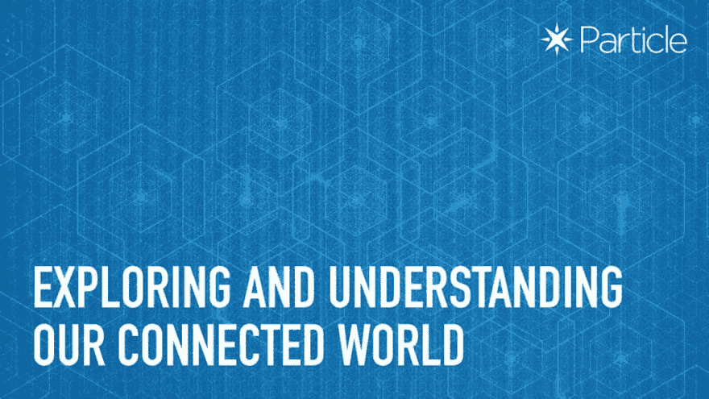

# 探索和理解我们的互联世界:Hackster 上的粒子新竞赛

> 原文：<https://dev.to/particle/exploring-understanding-our-connected-world-a-new-contest-from-particle-on-hackster-1p9a>

物联网给了我们一个前所未有的探索周围世界的机会。从[城市街道上的智能滑板车](https://dev.to/dcschelt/learn-how-to-build-this-cellular-asset-tracker-with-a-particle-boron-4o8l-temp-slug-6173996)到在[中美洲](https://dev.to/particle/learn-how-scientists-are-using-connected-devices-on-4-continents-to-understand-the-impacts-of-climate-change-4kha-temp-slug-6480412)中心追踪天气模式的联网设备，我们通过物联网的力量在世界各地了解到越来越多的东西。现在，随着由[粒子网](https://store.particle.io/collections/mesh)驱动的第三代物联网硬件被广泛使用，我们有机会了解和发现更多。

这就是为什么我们很高兴在 Hackster 上发起我们的最新比赛: [**探索&了解我们的互联世界。**T3】](https://www.hackster.io/contests/particle-iot)

## 这里是你需要知道的一切

*   请在 2019 年 6 月 3 日 之前，前往 Hackster 上的[我们的竞赛页面注册并推介您的项目 ***，有机会赢得免费硬件，让您的工作步入正轨。我们将为前 50 名注册高质量项目的人颁发一个***](https://www.hackster.io/contests/particle-iot)***[氩气套件](https://store.particle.io/products/argon-kit)——所以不要等待提交！***
*   确保你的项目符合竞赛规则，并使用至少一种来自我们 T2 第三代物联网硬件的设备。
*   现在是时候开始建设了！创造一些奇迹，记录你所有的工作，并在完成截止日期前提交你的项目:**2019 年 7 月 21 日**。
*   我们的评委将在 2019 年 7 月 26 日**之前审查提交的作品并选出获胜者。**

## 给我战利品

我们将为解决三个不同类别问题的最佳项目颁奖:城市、环境和设备群。虽然您可以将您的项目提交到多个类别，但您只能从本次竞赛中获得一个奖项。

说到获胜，我们将颁发七份大奖！无人机、运动装备、电动滑板车等等。

你还在等什么？[今天就开始你的项目](https://www.hackster.io/contests/particle-iot)。

帖子[探索&理解我们的互联世界:来自 Hackster](https://blog.particle.io/2019/05/17/exploring-understanding-our-connected-world-a-new-contest-from-particle-on-hackster/) 上的一个新的竞赛首先出现在[粒子博客](https://blog.particle.io)上。