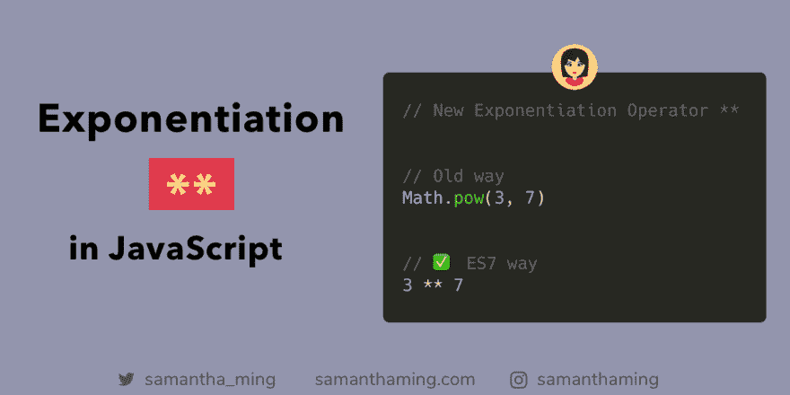

# JavaScript 中的取幂运算符

> 原文：<https://dev.to/samanthaming/exponentiation-operator-in-javascript-457c>

[](https://res.cloudinary.com/practicaldev/image/fetch/s--PyghEbJz--/c_limit%2Cf_auto%2Cfl_progressive%2Cq_auto%2Cw_880/https://thepracticaldev.s3.amazonaws.com/i/a903qm7vyl7y7rpk24oo.png)

我总是发现写指数表达式的老方法有点笨拙。幸运的是，指数运算符被引入了。这种语法也使它更类似于其他语言(即 Ruby，Python)。凉爽的👍

```
// Old way
const old = Math.pow(3, 7);
// 2187

// ✅ ES7 way 
const es7 = 3 ** 7;
// 2187 
```

## 中缀符号

使用`**`被称为中缀符号。它的特点是在操作数之间放置运算符。其他流行的中缀符号包括:`+`或`-`。

引入这种语法的原因是:

> 中缀符号比函数符号更简洁，这使它更可取

## 其他语言中的取幂运算

此外，您会注意到这个语法与其他语言非常相似:

```
// Python
a ** b

// Ruby
a ** b

// Perl
a ** b

// F#
a ** b 
```

实际上，我喜欢它和其他语言的相似之处。因为它让那些人更容易掌握 JavaScript，他们可以很快上手并运行。

## 赋值运算符

你一定见过算术运算符和赋值运算符的组合。例如`+=` :

```
a += b

// Same as
// a = a + b 
```

同样，这也可以通过指数运算符来实现。`**=` :

```
a **= b

// Same as
// a = a ** b 
```

## 负基数

有一个小问题。当你有一个负基数时，你必须用括号把它括起来。

```
// ❌ Syntax Error
const wrong = -3 ** 7;

// ✅
const correct = (-3) ** 7; 
```

然而，如果您使用旧的函数方式，这不是问题。

```
const works = Math.pow(-3, 7); 
```

## 资源

*   [MDN Web Docs: Math.pow](https://developer.mozilla.org/en-US/docs/Web/JavaScript/Reference/Global_Objects/Math/pow)
*   [MDN 网络文档:求幂**](https://developer.mozilla.org/en-US/docs/Web/JavaScript/Reference/Operators/Arithmetic_Operators#Exponentiation_(**))
*   [w3schools: JS 作业](https://www.w3schools.com/js/js_assignment.asp)
*   [2 性质:取幂运算符](http://2ality.com/2016/02/exponentiation-operator.html)
*   [ExploringJS:取幂运算符](http://exploringjs.com/es2016-es2017/ch_exponentiation-operator.html)
*   [TC39:取幂运算符](https://github.com/tc39/proposal-exponentiation-operator)
*   [JavaScript 中的取幂运算符](https://mariusschulz.com/blog/the-exponentiation-operator-in-javascript)
*   [取幂运算符](https://medium.com/@tournetorres/es6-every-day-es2016s-exponentiation-operator-eab53dec0d8a)
*   [维基百科:中缀符号](https://en.wikipedia.org/wiki/Infix_notation)

* * *

**感谢阅读❤**
问好！[insta gram](https://www.instagram.com/samanthaming/)|[Twitter](https://twitter.com/samantha_ming)|[脸书](https://www.facebook.com/hisamanthaming) | [媒体](https://medium.com/@samanthaming) | [博客](https://www.samanthaming.com/blog)