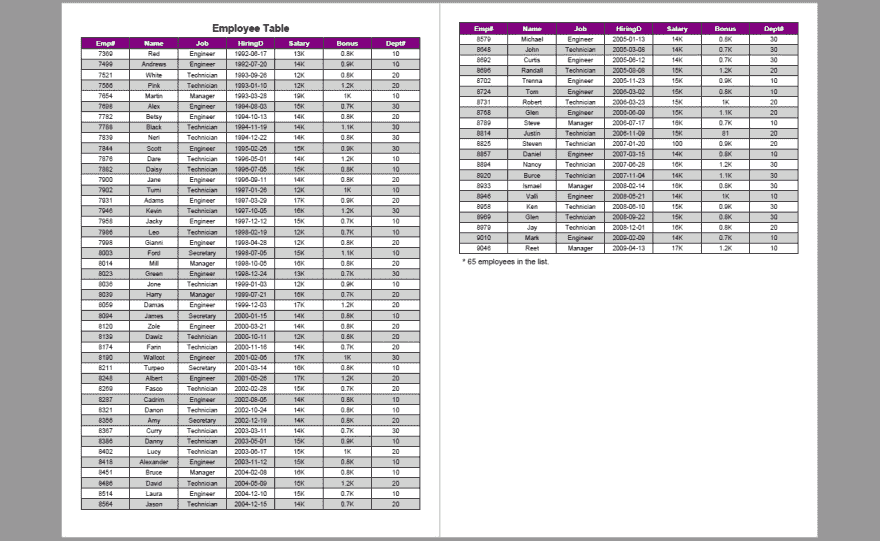
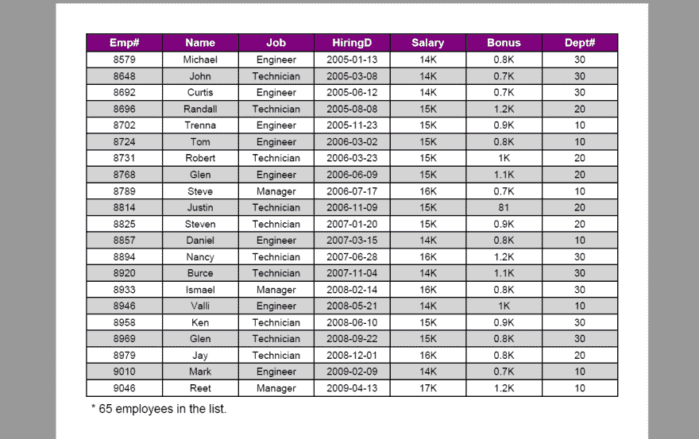

# 用 Java 将数据从数据库导出到 PDF

> 原文：<https://dev.to/eiceblue/export-data-from-database-to-pdf-in-java-874>

这篇文章将向你展示我们如何通过使用 Java 的免费 Spire.PDF 来将数据从微软 Access 数据库导出到 PDF 表格中。此外，本文还解决了如下一些相关问题。

*   表格超过一页怎么分页？
*   例如，如何设置表格的格式，如何设置交替的行颜色，以及如何在单元格内对齐文本？
*   如何检测一个表格的底部，以便我们在下面添加其他内容？

注意:JDBC-ODBC 桥已经从 Java SE 8 中移除，不再受支持。要用 Java 连接 Access 数据库，可以使用 Java SE 7 或更低版本，否则就需要使用类似[ucana Access](http://ucanaccess.sourceforge.net/site.html)这样的东西来代替 JDBC。这个例子使用 JDK 6 和 JDBC 没有任何问题。

## 使用代码

```
import com.spire.pdf.graphics.*;
import com.spire.pdf.tables.*;
import com.spire.pdf.tables.table.*;
import com.spire.pdf.tables.table.common.JdbcAdapter;
import java.awt.geom.*;
import java.awt.*;
import java.sql.*;

public class ExportDataToPdf {

    public static void main(String[] args) {

        //create a PDF document
        PdfDocument doc = new PdfDocument();

        //set page margins
        doc.getPageSettings().setMargins(30f,30f,30f,30f);

        //add a page
        PdfPageBase page = doc.getPages().add();

        //initialize y coordinate
        float y = 0;

        //create a brush
        PdfBrush brush = PdfBrushes.getBlack();

        //create four types of fonts
        PdfTrueTypeFont titleFont = new PdfTrueTypeFont(new Font("Arial", Font.BOLD, 16));
        PdfTrueTypeFont tableFont= new PdfTrueTypeFont(new Font("Arial", 0, 10));
        PdfTrueTypeFont headerFont= new PdfTrueTypeFont(new Font("Arial", Font.BOLD, 11));
        PdfTrueTypeFont textFont= new PdfTrueTypeFont(new Font("Arial", 0, 12));

        //draw title on the center of the page
        PdfStringFormat format = new PdfStringFormat(PdfTextAlignment.Center);
        page.getCanvas().drawString("Employee Table", titleFont, brush, page.getCanvas().getClientSize().getWidth() / 2, y, format);

        //calculate y coordinate
        y = y + (float) titleFont.measureString("Employee Table", format).getHeight();
        y = y + 5;

        //create a PdfTable instance
        PdfTable table = new PdfTable();

        //set the default cell style and row style
        table.getStyle().setCellPadding(2);
        table.getStyle().setBorderPen(new PdfPen(brush, 0.75f));
        table.getStyle().getDefaultStyle().setBackgroundBrush(PdfBrushes.getWhite());
        table.getStyle().getDefaultStyle().setFont(tableFont);
        table.getStyle().getDefaultStyle().setStringFormat(new PdfStringFormat(PdfTextAlignment.Center));
        table.getStyle().getAlternateStyle().setBackgroundBrush(PdfBrushes.getLightGray());
        table.getStyle().getAlternateStyle().setFont(tableFont);
        table.getStyle().getAlternateStyle().setStringFormat(new PdfStringFormat(PdfTextAlignment.Center));

        //set the header style
        table.getStyle().setHeaderSource(PdfHeaderSource.Column_Captions);
        table.getStyle().getHeaderStyle().setBackgroundBrush(PdfBrushes.getPurple());
        table.getStyle().getHeaderStyle().setFont(headerFont);
        table.getStyle().getHeaderStyle().setTextBrush(PdfBrushes.getWhite());
        table.getStyle().getHeaderStyle().setStringFormat(new PdfStringFormat(PdfTextAlignment.Center));

        //show header at every page
        table.getStyle().setShowHeader(true);

        //connect to database
        String url = "jdbc:odbc:driver={Microsoft Access Driver (*.mdb)};DBQ=" + "C:\\Users\\Administrator\\Documents\\data.mdb";
        DataTable dataTable = new DataTable();
        try {
            Class.forName("sun.jdbc.odbc.JdbcOdbcDriver");
            try {
                Connection conn = DriverManager.getConnection(url);
                Statement sta = conn.createStatement();
                ResultSet resultSet = sta.executeQuery("select * from employee ");
                JdbcAdapter jdbcAdapter = new JdbcAdapter();
                //export data from database to datatable
                jdbcAdapter.fillDataTable(dataTable, resultSet);
                table.setDataSourceType(PdfTableDataSourceType.Table_Direct);
                //fill the table with datatable
                table.setDataSource(dataTable);

            } catch (SQLException e) {
                e.printStackTrace();
            } catch (Exception e) {
                e.printStackTrace();
            }
        } catch (ClassNotFoundException e) {
            e.printStackTrace();
        }

        //paginate table
        PdfTableLayoutFormat tableLayout = new PdfTableLayoutFormat();
        tableLayout.setLayout(PdfLayoutType.Paginate);

        //draw table at the specified x, y coordinates
        PdfLayoutResult result = table.draw(page, new Point2D.Float(0, y), tableLayout);

        //calculate y coordinate
        y = (float) result.getBounds().getHeight() + 5;

        //draw text under the table
        result.getPage().getCanvas().drawString(String.format("* %1$s employees in the list.", table.getRows().getCount()), textFont, brush, 5, y);

        //save pdf file.
        doc.saveToFile("ExportDataToPdf.pdf");
    }

} 
```

这是结果文件的屏幕截图。
[](https://res.cloudinary.com/practicaldev/image/fetch/s--uvVn7h7Q--/c_limit%2Cf_auto%2Cfl_progressive%2Cq_auto%2Cw_880/https://thepracticaldev.s3.amazonaws.com/i/qf1idlenbpeosagdkq7d.jpg) 
近景。
[T8】](https://res.cloudinary.com/practicaldev/image/fetch/s--WgKFLYaw--/c_limit%2Cf_auto%2Cfl_progressive%2Cq_auto%2Cw_880/https://thepracticaldev.s3.amazonaws.com/i/49iaw6983stmwupra7cd.jpg)