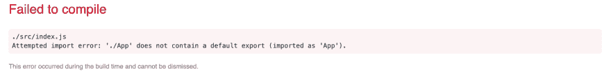

# 出口、进口和违约，天啊！

> 原文：<https://dev.to/laurieontech/exports-and-imports-and-defaults-oh-my-fa3>

我最近一直在使用 cli 或 starter 模板启动项目，我注意到的一件事是包含了多少我们认为理所当然的代码。

引起我注意的第一个片段是当您生成一个新的 React 项目时导出 App 组件的代码行。

```
class App extends Component {
  render() {
    return (
      <h1>This is my application.</h1>
    )
  }
}

export default App 
```

Enter fullscreen mode Exit fullscreen mode

因此，我想借此机会浏览一下这段简短但功能强大的代码，并分析一下正在发生什么以及为什么会发生。

# ES6 模块

ECMAScript，[标准 Javascript 基于](https://dev.to/laurieontech/the-layers-of-javascript-15op)，在 ES6 中引入了模块的概念。

模块是自包含的代码单元。该代码可以使用`export`向其他模块公开资产。它还可以使用`import`消耗其他模块的资产。

上面的代码是 React 如何使用这个概念在组件之间传递信息的一个例子。

记住这一点很重要，因为 ES6 规范略有不同。

# 一步一个脚印

让我们只检查这一行代码。

```
export default App 
```

Enter fullscreen mode Exit fullscreen mode

*   首先我们有`export`，这个关键字是向其他模块公开内容。

*   接下来，我们有`default`。

默认是 ES6 中可用的导出类型之一。使用默认关键字，我们说，如果你导入这个模块，而不指定你从它导入什么，你会得到这个！对于任何给定的模块，我们只能有一个默认的导出。

*   最后，我们有了要导出的资产的名称，在本例中是`App`。

# 好，现在让我们使用它

因为`App`是导出的，如果我们`import`它，我们可以在另一个模块中使用它。

```
import App from "./App" 
```

Enter fullscreen mode Exit fullscreen mode

*当您创建一个 React 项目时，这一行代码会出现在`index.js`中。*

我们使用上面的语法导入默认导出。有意思的是，`App`在这里只是一个名称赋值。这句话实际上是说，您还没有指定来自`.App`的资产，所以我将默认导出一个资产，并为其指定一个名称以供参考。

结果发现，我们根本不用给它起名叫`App`。这只是一个名称分配。

```
import Whatever from "./App" 
```

Enter fullscreen mode Exit fullscreen mode

在这种情况下，`Whatever`还是我们的 App 组件！我们可以利用它。

```
ReactDOM.render(<Whatever />, document.getElementById('root')); 
```

Enter fullscreen mode Exit fullscreen mode

# 缺省缺省，又名命名导入

导出多项资产或非默认资产怎么办？那看起来像什么？

```
export class App extends Component {
  render() {
    return (
      <h1>This is my application.</h1>
    )
  }
} 
```

Enter fullscreen mode Exit fullscreen mode

以上是导出的相同应用程序资源的示例，但没有使用 default 关键字。

这是可行的，但是我们不能以同样的方式导入它。如果我尝试这样做

```
import App from "./App" 
```

Enter fullscreen mode Exit fullscreen mode

它给了我这个错误

[](https://res.cloudinary.com/practicaldev/image/fetch/s--gbCGp5K_--/c_limit%2Cf_auto%2Cfl_progressive%2Cq_auto%2Cw_880/https://tenmilesquare.com/wp-content/uploads/2019/04/Screen-Shot-2019-04-19-at-8.07.39-AM.png)

我的 import 语句不知道它给那个`App`名赋了什么！

如果没有默认的导出，我需要明确地命名要导入的内容。这就是为什么它在 ES6 中被称为命名导入。

```
import {App} from "./App" 
```

Enter fullscreen mode Exit fullscreen mode

这看起来很像是破坏作业！虽然构建时和运行时在技术上有所不同，但这是记住语法的一种有用方式。所以这个声明实际上是在说，看看整个`.App`模块的内部。我希望在该模块中导出名为`App`的资产。

# 给我一切！

因为可以在一个模块中导出多个资产，所以也有必要一次导入多个资产。只要我们知道名字，我们就能做到。

```
import {App, Dev, Post} from "./App" 
```

Enter fullscreen mode Exit fullscreen mode

您可以在一个模块中同时拥有默认导出和命名导出，并将它们一起导入。让我们假设`App`仍然是默认的导出。

```
import App, {Dev, Post} from "./App" 
```

Enter fullscreen mode Exit fullscreen mode

瞧啊。

# 不算太坏

分解一下就不是超级复杂了。然而，我们经常在框架和项目中看到一些我们没有花时间去理解的代码行。我鼓励你好奇地探索你看到的一切！这会让你成为更好的程序员。