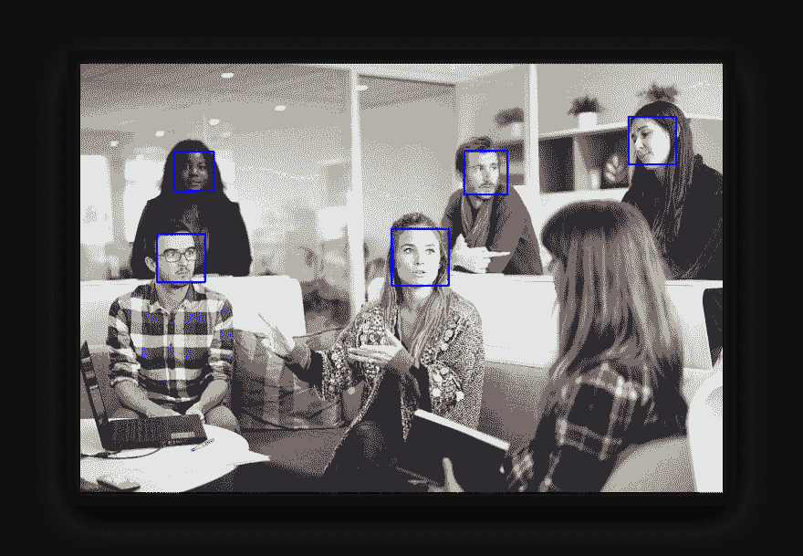

# 用 Python 实现人脸检测

> 原文：<https://dev.to/petercour/face-detection-with-python-3620>

[](https://res.cloudinary.com/practicaldev/image/fetch/s--ZAbzMc7y--/c_limit%2Cf_auto%2Cfl_progressive%2Cq_auto%2Cw_880/https://pythonbasics.org/wp-content/uploads/2019/03/face.png)

你可以用 Python 来检测人脸。这些面孔可以出现在静态图像、视频或网络摄像头馈送中。

所有这些只需要几行代码就可以完成！

这里使用的方法使用机器学习。机器学习是人工智能的一部分，它使用数据进行新的预测。

在这种情况下，您希望预测图像中是否有人脸。

## 入门

您需要安装 Python 3.x 和 OpenCV 2。您还需要一个级联文件，OpenCV 用它来检测人脸。

OpenCV 可以与 Python 包管理器一起安装:

```
pip3 install opencv-python 
```

您还需要运行时 opencv 包。

人脸检测使用机器学习方法:给定统计示例，预测图像中是否有人脸。

更多阅读:[https://pythonbasics.org/face-detection/](https://pythonbasics.org/face-detection/)