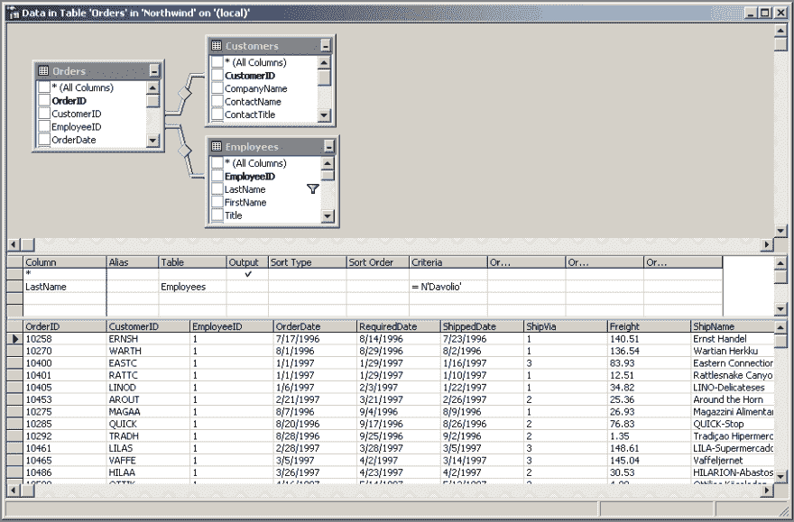
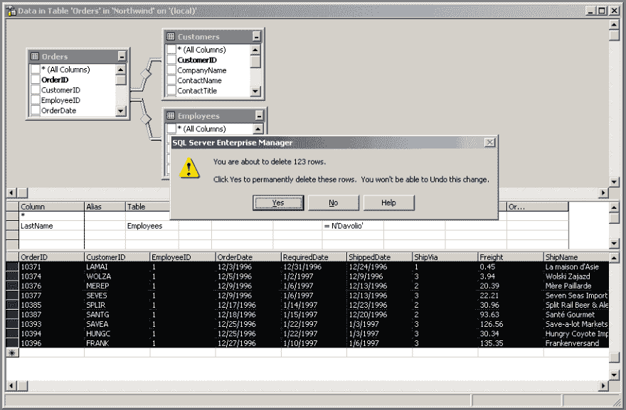
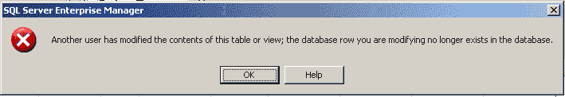
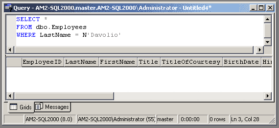
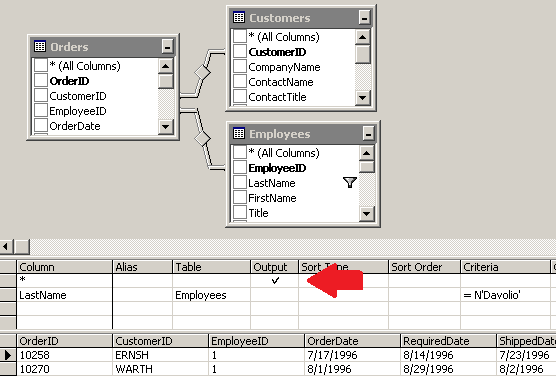
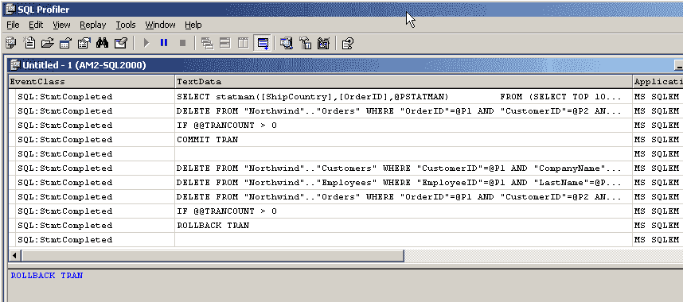

# 失败永远是一种选择

> 原文：<https://dev.to/am2/failure-is-always-an-option-304n>

不久前，我有幸坐下来与伯特·瓦格纳([博客](https://bertwagner.com/) | [推特](https://twitter.com/bertwagner))、艾琳·斯特拉托([博客](http://www.sqlskills.com/blogs/erin/) | [推特](https://twitter.com/erinstellato))和一位匿名朋友谈论我们的一些#SQLFail 时刻。

### 人人争气

每个人都有失败的时候。没有人是完美的。但是失败可能是一件好事。我们可以从失败中吸取教训，并学会在将来不再犯同样的错误。只有当我们重复犯同样的错误时，失败才会成为一个问题。博客们花了很多时间写我们的成功，但是我们也是人，我们也会犯错。这篇文章是一个分享我难忘的一次失败的机会。

### 故事时间…

我觉得我应该像爷爷给我们讲战争故事一样来构思这个故事。就像我爷爷一样，我喜欢讲故事。“当我像你这么大的时候，我没有管理工作室或运营工作室。如果我想要一个 GUI，我必须使用企业管理器……”(提示梦序列音乐。)

<figure>

<figcaption>I loved Query Analyzer.</figcaption>

</figure>

### 背景

我的第一份技术工作是在一家为流动医疗诊所制作软件套件的初创公司。这是我使用(并爱上)SQL Server 的第一份工作。和任何创业软件公司一样，我们都有很多头衔。我帮助安装和配置我们的软件、培训、技术支持，并为团队挑选就餐的餐馆。我仍然在学习 SQL Server，一次一个查询。

当我们在客户所在地进行现场培训和上线时，我们通常会在生产系统上进行培训，然后在上线前清理测试数据。在 21 世纪初，我们的客户都没有在虚拟环境中运行，而且我们客户的预算中没有额外的培训系统。

### 千钧一发的夜晚

我仍然清楚地记得那个晚上。我点了披萨，这样我就可以呆在酒店房间里，在第二天上线之前完成我的工作清单。已经过了凌晨 2 点，我正坐在密歇根州卡拉马祖市的 Residence Inn 的厨房柜台前，我边吃着一大份意大利香肠，旁边的披萨盒还开着。

我找到了“删除所有测试预约”清单上的一项。这里的逻辑非常简单:所有的测试预约都是为了同一个假想的测试病人。只需找到那个人的所有约会，然后删除它们。我决定一次只找一个医生来做，以确保我不会把事情搞得太糟。

我不喜欢为此编写 SQL 代码，所以我使用 Enterprise Manager 的“查询”GUI 来连接病人和医生的预约。我过滤了一个医生的名字，得到了所有预约的列表。如果您不熟悉企业管理器中的这个特性，下面是一个使用 Northwind 演示数据库的类似示例(坚持使用 SQL Server 2000 主题！).在这里，我将`dbo.Orders`(预约)连接到`dbo.Customers`(病人)和`dbo.Employees`(医生)。我们的数据库没有定义外键，所以我也从 Northwind 中删除了它们。Enterprise Manager 仍然根据列名计算出联接标准！

<figure>

<figcaption id="caption-attachment-6310">north wind 演示数据库的一个未压缩备份刚刚超过 2MB。</figcaption>

</figure>

接下来，我选择了与测试客户(患者)相关的订单(预约)的所有行，并点击 delete。那很容易！

<figure>

<figcaption id="caption-attachment-6311">north wind 数据库中的这个员工名叫达沃利奥。我当时的老板名叫达沃。</figcaption>

</figure>

除了当我点击“是”时，我立即收到一个错误消息:

<figure> 

<figcaption id="caption-attachment-6312">呵呵，还有谁凌晨两点还在数据库里做东西？</figcaption>

</figure>

我在企业管理器中重新运行我的查询，没有任何结果。我想它还是起作用了？我看了一下申请表，然后……医生走了。不仅她的日程表被清空了，而且我在系统里也找不到她！

在我的 Northwind 示例中，您可以看到该员工完全消失了。

<figure> 

<figcaption id="caption-attachment-6314">哎呀。这是不应该发生的。</figcaption>

</figure>

### 发生了什么？

当我使用 GUI 连接和查询这三个表时，我做了一个`SELECT *`，返回所有三个表中的行。

<figure> 

<figcaption id="caption-attachment-6316">选择*已经是我十五年的克星。</figcaption>

</figure>

当我选择行并删除它们时，Enterprise Manager 对所有三个表执行了`DELETE`。为了证明这一点，我运行了 Profiler，并在 Northwind 上重新测试了一遍。果然，您可以看到它在所有三个表上执行了`DELETE`。它试图`ROLLBACK`，但是没有`BEGIN TRANSACTION`，所以没有回滚。

<figure> 

<figcaption id="caption-attachment-6317">哦，我有没有提到数据库没有任何外键？</figcaption>

</figure>

测试病人也被删除了，但我不在乎。我需要让这个医生回到软件里。第二天就上线了。她未来所有的约会都已经在系统里了，早上 8 点必须准备好。我只有 5 个多小时来解决这个问题。我的肾上腺素激增，我完全清醒了。

### 我是怎么修好的？

因为是凌晨 2:30，我不想给老板打电话叫醒他。我想我可以自己修好它。我试图用一个`INSERT`来重新创建医生，但是`DoctorID`是一个`identity`，我需要用一个特定的`DoctorID`值来创建这个医生，以便它与所有现有的预约相匹配。我见过别人这样做，所以我知道这是可能的；我只是不知道怎么做。在搜索了互联网之后(Google 还不是动词)，我搜索了帮助文件(本地的。chm 文件)，我找到了我的救世主:`IDENTITY_INSERT`。我在这上面浪费了一个多小时，但是最后，我把那个医生排回到了日程中，一切都很好。

那天晚上，我在引发并解决了一个重大问题后上床睡觉。最重要的是，那天晚上我学到了一个教训:这是我最后一次从企业管理器 GUI 中删除任何东西。那个晚上让我确信，我需要学习更多的 T-SQL，在编写代码时更加自信。我还读到了这些被称为“外键”的东西，听起来它们在那天晚上可能会很方便。见鬼，如果我能学会如何使用`IDENTITY_INSERT`，我就能学会任何东西。

帖子[失败永远是一个选项](https://am2.co/2019/01/failure-is-always-an-option/)最早出现在[安迪·M·马龙-安](https://am2.co)上。