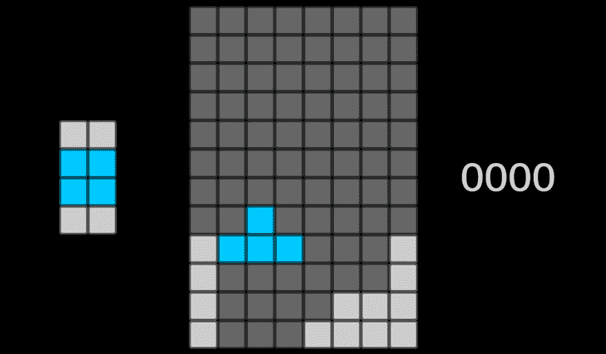

# 下落的积木 Alexa 上的“俄罗斯方块”(APL)

> 原文：<https://dev.to/willblaschko/falling-blocks-tetris-on-alexa-apl-1gc1>

## TL；速度三角形定位法(dead reckoning)

我使用 [Alexa 演示语言](https://developer.amazon.com/docs/alexa-presentation-language/apl-overview.html) (APL)为 Alexa 创建了一个功能齐全的[俄罗斯方块](https://en.wikipedia.org/wiki/Tetris)克隆版(名为 Falling Blocks ),它允许你实时游戏，完全由语音控制。基于我在[上一篇文章](https://www.linkedin.com/pulse/alexa-game-animation-experiments-apl-will-blaschko/)中的技术，游戏区域由一个由[页面](https://developer.amazon.com/docs/alexa-presentation-language/apl-pager.html)组成的 8x12 网格组成，由[页面](https://developer.amazon.com/docs/alexa-presentation-language/apl-standard-commands.html#setpage-command)命令控制，用于强制动画。最大的挑战是同步前端和后端，这是通过滥用[控制媒体](https://developer.amazon.com/docs/alexa-presentation-language/apl-commands-media.html#controlmedia)(播放/倒带)命令(在[并行](https://developer.amazon.com/docs/alexa-presentation-language/apl-standard-commands.html#parallel-command)中)和在游戏的每个节拍监听 [onPlay](https://developer.amazon.com/docs/alexa-presentation-language/apl-video.html#onplay) 事件来解决的。非常感谢[Mark s .](https://www.linkedin.com/in/mark-spitzer-299269100/)(APL 天才)提出这个解决方案！

[英国技能](https://www.amazon.co.uk/dp/B07QNPMCM2) - [美国技能](https://www.amazon.com/dp/B07QNPMCM2)

[观看游戏视频](https://youtu.be/XdgwUCVAOV4)

[见要点](https://gist.github.com/willblaschko/44b0a399084367271af1b2ab55704042)

## 简介

在这篇文章中，我将谈论落块项目的 Alexa(响应大小)和设备(性能)约束，分享我用来计算项目可行性的数学方法，并涵盖解决方案的关键要素(包括 gists)。

在我最近的一次意大利之行中，我和我的[西班牙](https://developer.amazon.com/blogs/alexa/tag/Spain)和[意大利](https://developer.amazon.com/blogs/alexa/tag/Italy)同事在晚餐时进行了一次非正式的头脑风暴会议，他们被我的[上一篇帖子](https://www.linkedin.com/pulse/alexa-game-animation-experiments-apl-will-blaschko/)逗乐了。带着对游戏(经典和现代)的共同兴趣，我们开始讨论还有哪些游戏可以应用。有点惭愧的是，我承认，当我们偶然发现俄罗斯方块时，我真的兴奋得上蹿下跳(好几次)。

我还有几个其他项目在排队，但实时语音游戏的执行能力太诱人了，不能错过，所以我把俄罗斯方块推到了最优先的位置。两个星期后，我的手指悬停在提交认证的按钮上。

在我花在这个项目上的大约 20 个小时中，大约有 8 个小时是在应对前端/后端同步的挑战。在与 Mark 快速交谈后，我能够在大约一个小时内完全解决这个问题，重用我已经编写的大部分代码(与有才华的人一起工作的优势)。

像往常一样，这里的一切都可能在明天崩溃。顾客小心上当。

## 约束

对于这个项目，我必须记住两个主要约束:1)对 Alexa 的响应大小需要在 24kb 以下[(~ 24，000 个字符)，2)越多的](https://developer.amazon.com/docs/custom-skills/request-and-response-json-reference.html#response-format)[组件](https://developer.amazon.com/docs/alexa-presentation-language/apl-component.html)，Echo 设备渲染和执行[命令](https://developer.amazon.com/docs/alexa-presentation-language/apl-commands.html)的时间就越长。我发现大约 300 个组件，我的[回声显示](https://smile.amazon.co.uk/Amazon-Echo-Show-With-Screen-2nd-Generation-Alexa/dp/B0793G9T6T)开始明显变慢。最初，我的计划是有一个 12x20 的网格，但由于 10 秒以上的渲染时间，我不得不缩小这个比例(在设备上，在模拟器上更多)。

对于这个项目，我可以用一个约束来交换另一个约束，并且在回到最初的设计之前，我尝试了几种不同的方法:

1.  定义网格分组，以便一个[分页器](https://developer.amazon.com/docs/alexa-presentation-language/apl-pager.html)控制 2+块(3 * 3 组合)来将所需的[设置页面](https://developer.amazon.com/docs/alexa-presentation-language/apl-standard-commands.html#setpage-command)命令的数量减半。这将允许两倍多的游戏命令，但 864 (9 * 8 * 12)个组件对设备来说太多了(并且完全冻结了[模拟器](https://developer.amazon.com/alexa/console/ask/displays?))。
2.  预先计算坐标和大小，并在绝对位置渲染图块，从而产生一个大得多的 [APL 文档](https://developer.amazon.com/docs/alexa-presentation-language/apl-document.html)。尽管运行时不需要计算[维度](https://developer.amazon.com/docs/alexa-presentation-language/apl-data-types.html#dimension)(相对/绝对百分比)，但我看到了巨大的性能损失。将来，我可能会尝试创建更简单的基准来找出根本原因，因为对我来说这似乎是倒退。
3.  重新加载文档。即使目标是零负载游戏，当我试图找出如何快速重置棋盘时，这也闪过了我的脑海。更新后的[文档](https://developer.amazon.com/docs/alexa-presentation-language/apl-document.html#document-properties)和数据源(未优化)的总大小与重置所有寻呼机所需的命令大致相同。这不是一个选项:加载时间杀死了这个。
4.  计算一个语音命令后的增量，只改变那些瓷砖。对于有限的响应大小，我想尽量减少发送 SetPage 命令的寻呼机数量。有一些同步问题(即使在增量计算后)导致了鬼片。更谨慎的做法是，在发出语音命令后完全重置棋盘一次，然后对每个滴答进行增量计算。

## 快速数学

(请检查我的数学！)

假设我们遵循最初的设计(我就是这么做的)，一个图块等于一个页面。对于下文，活动被定义为:构成下落形状的瓦片；非活动:已确定的结构平铺(以前的活动)，空:未使用的网格平铺。

我们的网格的尺寸为 X 乘 y。每个网格块有 3 种状态(活动、非活动、空),在父页面组件中显示为[帧](https://developer.amazon.com/docs/alexa-presentation-language/apl-frame.html)。我们的网格平铺组件的数量是:4XY(寻呼机加框架)。用我们的[容器](https://developer.amazon.com/docs/alexa-presentation-language/apl-container.html)组件来包装它们，我们有一个额外的 Y + 1(一个容器来保存所有东西，每个网格行一个容器)。

因此，采用这种设计，我们的最小元件数为:4XY + Y + 1。

我们的设置页面命令的数量将被分解为:对所有寻呼机的 1 次完全复位(XY)和每次滴答的一次增量计算。增量最少为 4 个设置页面命令(O 形移动)，最多为 4X(用 I 形清除 4 行)。关于[形状](https://tetris.fandom.com/wiki/Tetromino)的更多信息。

我发现每个 SetPage 命令的最小字符数是 47(其中 componentId 是两个字符的网格位置):

*{"type":"SetPage "，" componentId":"aa "，" value":0}*

忽略所需的所有其他响应数据([会话属性](https://developer.amazon.com/blogs/alexa/post/08edaa00-59e2-46b7-aace-4080f2a87450/using-session-attributes-in-your-alexa-skill-to-enhance-the-voice-experience)、[发言/重新提示](https://developer.amazon.com/docs/custom-skills/request-and-response-json-reference.html#response-object)，其他[命令](https://developer.amazon.com/docs/alexa-presentation-language/apl-commands.html)，留给我们以下等式:

最小命令数(I 形)= (24000/47 - XY)/4X

最大命令数(O 形)= (24000/47 - XY)/4

如上文约束中所述，如果您可以减小 X 或 Y(通过减小网格大小或使用单个分页器跨越多个图块)，您可以大大增加可以发送的 SetPage 命令的数量。因此，更长的自主游戏与更高的设备性能要求成反比。

在我的 8x12 网格中，我们有:

*最小组件:397*

*最小命令:12 个*

*最大命令数:103*

智能解决方案可以在每次滴答后计算剩余的可用空间，以查看是否有空间容纳下一个滴答，但这种计算需要在最后一步完成。对于这个项目，我选择了一个有足够余量的固定数字(27 减去用户命令，所以大约有两个完整的形状下降)，因为我在响应有效负载中有其他内容。

## 解

因为我已经在我的上一篇文章中讲述了基础知识，所以我在这里只讲述这个项目的独特之处。

[在此登记](https://gist.github.com/willblaschko/44b0a399084367271af1b2ab55704042)。

### 音频标记(Hack)

尽管看起来应该有，但当你发送多个交错延迟的命令时，几乎没有办法跟踪设备上的组件已经发生了什么。请求有效负载似乎具有关于组件子组件、可见性和每个组件的状态的状态信息，但是我没有看到这些信息被可靠地更新。页导航和序列没有 onChange 事件。我最初试图做数学来估计延迟和计算当前状态，但是游戏不可玩(或者至少不令人愉快)。

在我和 Mark 的谈话中，他建议我找到一种方法来标记每一批命令(使用[并行](https://developer.amazon.com/docs/alexa-presentation-language/apl-standard-commands.html#parallel-command)命令打勾)。他所知道的唯一向 Lambda 发送回调的命令是[媒体命令](https://developer.amazon.com/docs/alexa-presentation-language/apl-commands-media.html)。长话短说， [onEnd](https://developer.amazon.com/docs/alexa-presentation-language/apl-video.html#on-end) 不够靠谱(由于时机问题，并不是一直都火)，但是 [onPlay](https://developer.amazon.com/docs/alexa-presentation-language/apl-video.html#onplay) 每次都火。

通过监听 Lambda 上的 onPlay UserEvent，我能够转移我的服务器端状态队列，并跟踪当前的游戏位置。

[事件处理要点](https://gist.github.com/willblaschko/44b0a399084367271af1b2ab55704042#file-event_handler-js)

[布局要点](https://gist.github.com/willblaschko/44b0a399084367271af1b2ab55704042#file-audio_counter-json)

### 分页器的 InitialPage 属性

对我来说，这是“阅读文档”的时刻之一。我试图弄清楚如何在初始加载时以最佳方式显示当前的游戏状态，同时最小化性能开销(添加一个 [firstItem](https://developer.amazon.com/docs/alexa-presentation-language/apl-pager.html#firstitem) 属性，发送一组 reset SetPage 命令，等等)。).不，我想要的是[首页](https://developer.amazon.com/docs/alexa-presentation-language/apl-pager.html#initialpage)。

通过传入一个传递 X 乘 Y 维度和起始值的 2D 数组，我能够在没有额外开销的情况下计算/显示初始页面(起始平铺状态)。

[数值依据](https://gist.github.com/willblaschko/44b0a399084367271af1b2ab55704042#file-data_values-json)

[布局要点](https://gist.github.com/willblaschko/44b0a399084367271af1b2ab55704042#file-layout_game-json)

### 每次互动多次移动

更像是生活质量的实现，我允许我的用户一次发送多个命令。在大多数排列中，我得到的话语看起来像这样(见要点):

*“{方向 _ A } {方向 _ B } {方向 _ C } {方向 _ D } {方向 _ E } {方向 _ F } {方向 _ G } {方向 _ H } {方向 _ I } {方向 _ J }”*

而不需要单独说出每个“对”(“Alexa，对。Alexa，右，Alexa，右”)，用户可以说所有三个(“Alexa，右，右，右。”).在测试中，这大大减少了摩擦。如果我想让游戏变得更难，我会找出正确的时机，在正常的下落速度动作之间插入这些动作。我认为这个游戏足够难(也足够有趣)，因为它是一个概念验证。

[意图要点](https://gist.github.com/willblaschko/44b0a399084367271af1b2ab55704042#file-en-gb-json)

### 保存到持久 vs 会话属性

大多数情况下，将会话属性中的所有内容保存到您的[永久存储器](https://www.npmjs.com/package/ask-sdk-dynamodb-persistence-adapter)中是有意义的，反之亦然。如果您在会话开始/结束时这样做，而不是在每个回合都这样做，则可以节省 IO 延迟和成本。

因为我必须预先计算未来可能的状态，并且因为我已经受到了响应大小的限制，所以我决定拆分我的存储逻辑。所有游戏状态队列信息 100%的时间都在持久存储中，这意味着我在每一个对话回合(以及每一个游戏时间点)都使用了 DynamoDB。这被存储为一个状态队列，每个游戏时间点一个状态。然后，我在会话属性中使用变量，从持久化的信息中提取我需要的内容。这是我在自己的项目中第一次合法地需要以这种方式分割我的用户数据。

从整体来看，读取和保存 DynamoDB 的延迟成本并不高(通常低于 150 毫秒)。在游戏中，这不是显而易见的，但一切都加起来。

## 结论

我的一个同事问我怎么会有时间和精力做这样的项目。这是一个很好的问题。突破技术的极限让我兴奋，创造过程让我放松，完成项目/里程碑让我满足。这个项目有些部分是痛苦和令人沮丧的，但这是学习和实验的一部分(最终是值得的)。

像 [2048](https://www.amazon.co.uk/Team-Quasko-2048/dp/B07PTYCXFL/) 一样，我认为这款游戏是带屏幕的语音控制设备的另一个令人信服的理由。随着技术的进步和开发人员变得更有创造力，可能性和体验只会越来越好。

如果你是 Alexa 或 APL 的新手，我不建议从这样的项目开始。除了复杂性之外，APL 在功能上仍然受到限制；分页/序列动画是一个黑客，UI 音频标记是一个黑客。在写第一行代码之前，我做了大量的数学和设计工作，即使在那时，我也不确定这个项目是否可行。

也就是说，如果你像我一样，走出去，看看你能打破什么，然后你能从这些碎片中创造出什么。尽情享受吧！

## 免责声明

这是我代表我个人的夜间/周末项目，与我的雇主无关。这里讨论的所有方法都是基于公开可用的特性，只是有些方法被意外使用。

这里的一切都可能在明天崩溃。顾客小心上当。

[https://youtu.be/XdgwUCVAOV4](https://youtu.be/XdgwUCVAOV4)