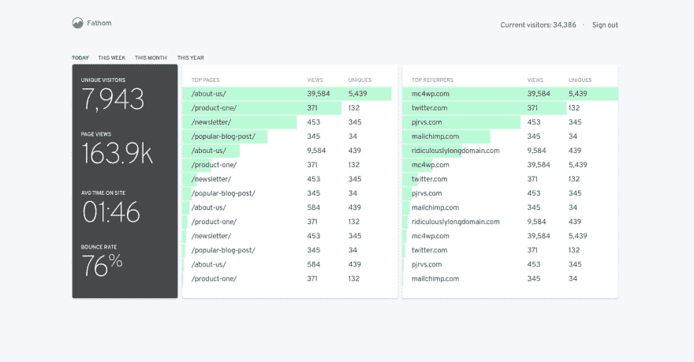
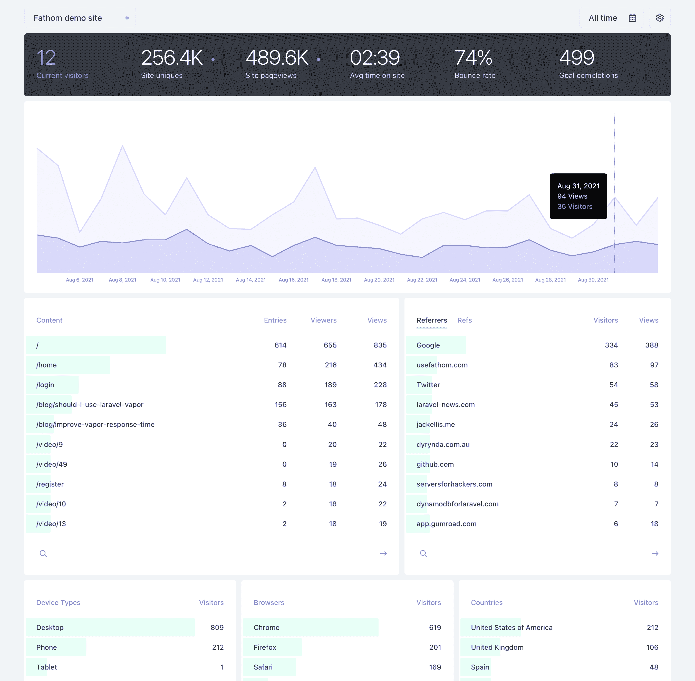

# Fathom:开源的谷歌分析替代方案

> 原文：<https://dev.to/jacobherrington/fathom-an-open-source-google-analytics-alternative-1g7g>

嘿大家好！

我开始了各种疯狂 GitHub 回购，上周我偶然发现了一个很棒的项目，我不敢相信我错过了这么久。

它叫做 Fathom——它是 Google Analytics 的开源替代品(有点讽刺的是用 Go 写的)。

##  [用英寻](https://github.com/usefathom) / [英寻](https://github.com/usefathom/fathom)

### Fathom Lite。简单、注重隐私的网站分析。与 Golang & Preact 一起建造。

<article class="markdown-body entry-content container-lg" itemprop="text">

# Fathom Lite -简单的网站分析

 

Fathom Lite 是 Fathom Analytics 的一个开源版本(一个付费的、托管的 [Google Analytics 替代品](https://usefathom.com/google-analytics-alternative))。这是我们软件的第一个版本，已经被下载了数百万次！

虽然我们不再向这个精简版添加功能，但我们将继续长期维护它，并修复出现的任何错误。

## Fathom Lite 与 Fathom Analytics

Fathom Analytics 比 Fathom Lite 更加详细，功能更加丰富，甚至更加关注隐私法合规性。

如果你想成为 Fathom Analytics 的客户，并且不必担心服务器、维护、安全，你可以用一个 [7 天免费试用](https://usefathom.com/ref/GITHUB) **来试试我们的软件(这个链接会给你 10 美元的信用)。**

| 清淡的 | 赞成 |
| --- | --- |
| 使用 Cookies | 不含饼干的 |
| - | [欧盟隔离](https://usefathom.com/features/eu-isolation) |
| - | [绕过广告拦截器](https://usefathom.com/features/custom-domains) |
| - | [电子邮件报告](https://usefathom.com/docs/features/email-reports) |
| - | [跟踪事件完成情况](https://usefathom.com/docs/features/events) |
| - | [公开分享您的仪表盘](https://usefathom.com/docs/features/shared-dashboards) |

…</article>

[View on GitHub](https://github.com/usefathom/fathom)

如果你对分析或数据(或者只是 Go 编程语言)感兴趣，这是一个值得参与的好项目！