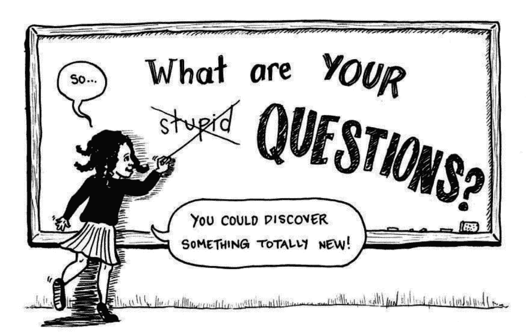
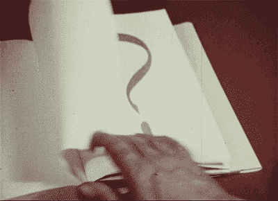

# 害怕在工作中问问题？再也不会了。

> 原文：<https://dev.to/atapas/fear-of-asking-question-at-work-never-again-1lcd>

让我们诚实地面对一个问题。在您的职业生涯中，当您参加会议、论坛或与个人交谈时，您是否有过以下任何感受？

 
*图片提供:[https://giphy.com](https://giphy.com)*

*   😕我对这个概念有一个重要的疑问，我应该问吗？

*   😡嗯，我将向我的“最好的朋友”澄清这个疑问，他也参加了这次会议。他/她一定理解得很好。我以后再问他/她！会议结束时，我们在同一条船上。

*   😔我应该打断演讲者并问这个问题吗？不，以后更好！

*   😳我有一个疑问。如何正确形成这个问题？我会犯语法错误吗？

*   😨我是一个大三学生，让我不要问这个在会议上发言的大四学生这个问题。

*   😦没什么大不了的，反正会议正在被记录。我以后查看一下就明白了。为什么现在才问！

*   😓先让人问一下。我不想成为害群之马！

*   😑我宁愿假装知道，哇，这很有效！

*   😟心脏在快速跳动。哎呀，谁也不要先拉我澄清什么。

*   😮这是和首席执行官的全体会议。伙计，那个女孩问 CEO 问题的勇气有多大啊！

如果你从未有过以上任何一种感觉，那就继续努力吧！现在，对于其他有上述任何(或所有)感觉的人(包括我在内)，我有一些东西给你。继续读...

# 自我实现

以下是我从应对害怕提问的经历中得到的一些体会。我所能做的就是，与你分享我的学习，并希望能有所帮助。

### 没有问题是傻问题

 
*图片提供:[https://www.unawe.org/updates/unawe-update-1544/](https://www.unawe.org/updates/unawe-update-1544/)*

> **(没有)愚蠢的问题**

这是千真万确的，也是我们需要的最重要的心态。如果你有任何假设，你的问题可能会变得愚蠢，那是思想需要变得更聪明，而不是问题。

### 还有其他人有同样的疑问

 
*图片提供:[https://giphy.com](https://giphy.com)*

其中一个错误是假设，我的问题不重要。这阻止了我们去问它和进一步讨论它。相信我，会议室里还有其他人也有类似的疑虑，可能和你有同样的想法。因此，行动的号召是，*只要问*！

### 不能当[哑剧](https://en.wikipedia.org/wiki/Pantomath)

 
*图片提供:[https://giphy.com](https://giphy.com)*

Pantomath 是一个*不存在的*人，他想知道而*知道一切*。我们多次阻止自己澄清疑惑，只是因为我们有一种已经知道的感觉。通过提问来澄清事情要明智得多。

### 问题越多，讨论越多

 
*图片提供:[https://giphy.com](https://giphy.com)*

在会议中提问就像，为身体做好个人卫生。问题导致讨论，讨论导致决定和结论。在会议/论坛中有提问的文化是非常健康的。

### 提问可能会赢得你的尊重

 
*图片提供:[https://giphy.com](https://giphy.com)*

你可能会发现，许多人不会主动提问(...这也是这篇文章的动机)，在论坛上提问的人被视为受尊重的人。*跻身其中*！

# 前进的道路..

### 从较小的论坛开始

你想做的就是向前迈出一步，摆脱对提问的恐惧，从一个小的、知名的论坛(或会议)开始。这有助于更快地获得你的信心，并逐渐扩展到其他更大的论坛。你猜怎么着这只是一种习惯，一旦你学会了，你就学会了！

### 接受更多面向客户的角色和职责

我还看到，当我们面对客户的工作时，消除这种恐惧的速度大大加快。我们需要学会把它作为我们工作的一部分，除此之外别无他法！所以，*挑战自己*！

# 小心

### 别问太多

 
*图片提供:[https://giphy.com](https://giphy.com)*

最好限制自己一次最多问 2-3 个问题。这是为了确保演示者/演讲者不会对回答失去兴趣。制衡总是更好。

# 在我们总结之前

你可能想看看这个鼓舞人心的视频(只有 96 秒),作者是[肯·奥克尔](https://www.kenokel.com/about-ken/)

[https://www.youtube.com/embed/c0UaHS9SHmg](https://www.youtube.com/embed/c0UaHS9SHmg)

最后，有一句名言，“问问题的人在 5 分钟内都是傻瓜。不问的人永远是个傻瓜。选择权在我们手中。

希望你觉得有用。请在帖子的评论部分分享你的想法。

*本帖最初发布于@[https://ATA pas . hash node . dev/fear-of-questing-question-in-work-never-again-cjvf 9 shh 2000 D1 ls 1 skaz n5 Mr](https://atapas.hashnode.dev/fear-of-asking-question-at-work-never-again-cjvf9shh2000d1ls1skazn5mr)T3】*