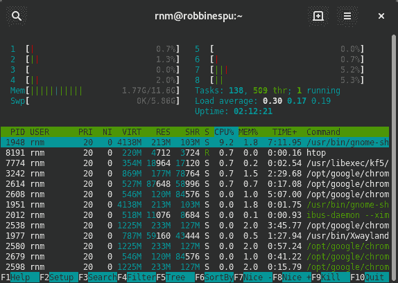
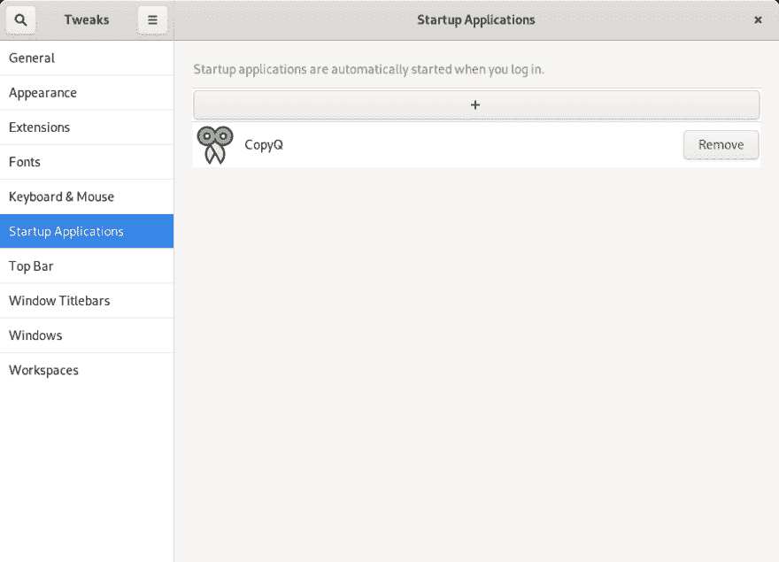

# Fedora 30 -安装后设置

> 原文：<https://dev.to/robbinespu/fedora-30-after-install-setup-f56>

**安装 Fedora 30 后我的待办事项不完整列表**

也许你已经在我以前的博客主机上看过我以前的帖子 [Fedora 28 安装(安装后)](https://robbinespu.github.io/eng/2018/05/17/My_Personal_Fedora28_setup.html)。一段时间后，我升级到 Fedora 29，但使用 KDE 旋转和不知何故，我不满意 UX，因为我太熟悉 Gnome，现在重新格式化我的笔记本电脑启动一个干净的 Fedora 30 工作站(Gnome)。

干净格式化后，很多东西需要重新配置，让我们从头开始。动手吧！

## *待办事宜*

#### 1。更改主机名

```
$ hostnamectl status # view current hostname
$ hostnamectl set-hostname --static "robbinespu" # set up new hostname 
```

注意:更改主机名后需要重新启动

### 2。DNF·崔克

使用增量和最快镜像(编辑`/etc/dnf/dnf.conf`文件)

```
[main]
    gpgcheck=1
    installonly_limit=3
    clean_requirements_on_remove=True
    fastestmirror=true
    deltarpm=true 
```

### 3。恢复 bashrc 和元数据文件

参考消息:我已经通过这个技巧 [1](https://robbinespu.github.io/eng/2018/05/17/My_Personal_Fedora28_setup.html#fn:f1) 导出并备份了选定的点文件和一些元数据文件，现在我需要使用相同的教程 [1](https://robbinespu.github.io/eng/2018/05/17/My_Personal_Fedora28_setup.html#fn:f1) 从存储库导入到我的工作站。

### 4。安装 RPM 融合存储库并获取最新更新

```
$ sudo dnf update --refresh
$ sudo dnf install https://download1.rpmfusion.org/free/fedora/rpmfusion-free-release-$(rpm -E %fedora).noarch.rpm 
$ sudo dnf install https://download1.rpmfusion.org/nonfree/fedora/rpmfusion-nonfree-release-$(rpm -E %fedora).noarch.rpm 
```

### 5。启用 SSH

因为有时我需要远程访问这台机器

```
$ sudo systemctl start sshd
$ sudo systemctl enable sshd 
```

### 6。Linux 性能监控工具

[](https://res.cloudinary.com/practicaldev/image/fetch/s--XK5CdLP3--/c_limit%2Cf_auto%2Cfl_progressive%2Cq_auto%2Cw_880/https://i.imgur.com/WwGQ0Q4.png%23center)T3】Htop 监控工具

```
$ sudo dnf install sysstat htop glances 
```

也有一些应用程序，比如 windows 上的 CCleaner，叫做 **Stacer** ，但是最新发布的版本没有 rpm 文件，而是用应用程序映像
替换

```
$ cd /tmp
$ wget https://github.com/oguzhaninan/Stacer/releases/download/v1.0.9/Stacer-x86_64.AppImage
$ sudo chmod a+x stacer*.AppImage
$ ./stacer*.AppImage 
```

### 7。娱乐材料:播放器和编解码器

```
$ sudo dnf install youtube-dl vlc

$ sudo dnf install \
gstreamer-plugins-base \
gstreamer1-plugins-base \
gstreamer-plugins-bad \
gstreamer-plugins-ugly \
gstreamer1-plugins-ugly \
gstreamer-plugins-good-extras \
gstreamer1-plugins-good \
gstreamer1-plugins-good-extras \
gstreamer1-plugins-bad-freeworld \
ffmpeg \
gstreamer-ffmpeg 
```

### 8。Gnome 插件和附件

我激活和使用的一些插件有[可选标签](https://extensions.gnome.org/extension/15/alternatetab/)、[应用菜单](https://extensions.gnome.org/extension/6/applications-menu/)、[咖啡因](https://extensions.gnome.org/extension/517/caffeine/)、 [dash to dock](https://extensions.gnome.org/extension/307/dash-to-dock/) 、[急躁](https://extensions.gnome.org/extension/277/impatience/)、[网速](https://extensions.gnome.org/extension/104/netspeed/)、[位置状态指示器](https://extensions.gnome.org/extension/8/places-status-indicator/)、[服务系统](https://extensions.gnome.org/extension/1034/services-systemd/)、[状态区水平间距](https://extensions.gnome.org/extension/355/status-area-horizontal-spacing/)和[顶部图标加](https://extensions.gnome.org/extension/1031/topicons/)

为了管理、编辑、添加和删除应用程序启动器，我使用了与 FreeDesktop 兼容的菜单编辑器

```
$ sudo dnf install menulibre 
```

### 9。剪贴板管理器

作为开发者，我喜欢剪贴板管理器，我最喜欢的 windows 和 linux 剪贴板管理器是 [CopyQ](https://hluk.github.io/CopyQ/) 。

```
$ sudo dnf install copyq -y 
```

### 10。Gnome 调整工具

有些功能是隐藏的，在标准设置中不可用，如自动启动(当机器打开时，您需要它来自动启动复印)。

[ ](https://res.cloudinary.com/practicaldev/image/fetch/s--XLTpBUrI--/c_limit%2Cf_auto%2Cfl_progressive%2Cq_auto%2Cw_880/https://i.imgur.com/fjTGiA6.png%23center) *开机时自动启动 CopyQ Fedora*

你需要安装 gnome tweak 工具来允许用户拥有这些隐藏的设置。

```
$ sudo dnf install gnome-tweak-tool 
```

### 11。办公工具

我喜欢只用 Office 来编辑和查看电子表格

```
$ sudo rpm --import "http://keyserver.ubuntu.com/pks/lookup?op=get&search=0x8320CA65CB2DE8E5"
$ sudo bash -c 'cat > /etc/yum.repos.d/onlyoffice.repo << 'EOF'
[onlyoffice]
name=onlyoffice repo
baseurl=http://download.onlyoffice.com/repo/centos/main/noarch/
gpgcheck=1
enabled=1
EOF'
$ sudo dnf install onlyoffice-desktopeditors 
```

你也可以使用 WPS 社区，从 WPS 官方网站获取最新的 RPM 包

### 12。压缩和归档工具

```
$ sudo dnf install unzip p7zip 
```

## 结束

这实际上是我要做的事情的不完整列表。我会不时地改进这个列表。安拉。感谢 Fedora 团队让它成为精彩的 Linux 发行版👍