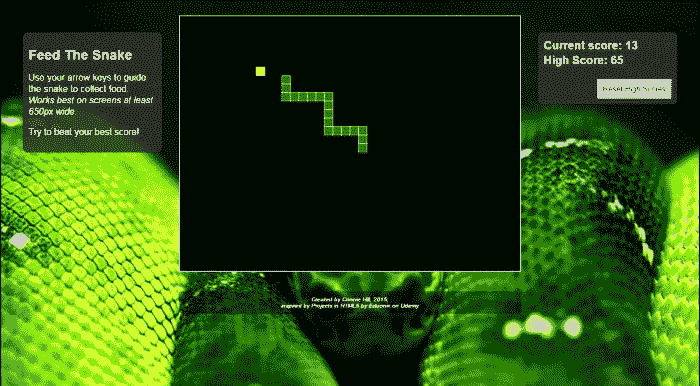
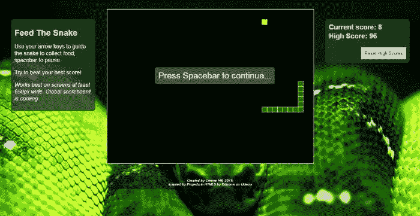

# 喂蛇游戏

> 原文：<https://dev.to/chillsunfire/feed-the-snake-game-5hlo>

免责声明:我不是这里任何东西的成员，只是分享我的真实想法。

几年前，大学毕业并获得学位后，我认为在我的研究领域不断学习和探索是很重要的。我做的第一件事是查看 Udemy，这是一个充满在线课程的网站，大部分课程都是免费的(当时——他们后来转向了一种略有不同的模式，大多数课程经常以大约 10 美元的价格出售)。在那个网站上，我遇到了许多基于项目的课程，在那里，讲师对项目进行编码，并解释正在发生的事情。我最喜欢这类课程的一点是，现在，有了一些经验之后，我做的第一件事就是把最终的项目文件拉下来，在视频播放的时候回顾它，并就我可能如何改变/改进它做笔记/评论。有时候，我甚至会回到那些项目中，试着去做。

其中一个项目是一个有趣的小游戏，我从小就喜欢玩这个游戏的某个版本——贪吃蛇。这个概念是告诉“蛇”向哪个方向移动，以便“吃掉”随机出现在游戏板上的那块“食物”。在 Eduonix 课程“HTML5 中的项目”中，我们使用了“new”`<canvas>`元素，以及一些 JavaScript 和 jQuery 来绘制和制作动画。结果是这个游戏的一个版本，页面一加载完，蛇就开始移动，用户必须刷新页面才能重新开始。它包含的另一个很酷的特性是获取和设置一个 localStorage 值，以便跟踪用户的高分。

嗯，我就是我，想要学习和探索，我开始思考改进的方法。首先，我添加了开始/暂停功能，因为没有人喜欢自动开始的游戏，你不能为了一个快速的生物休息而暂停，对吗？没错。这并不需要太多的工作:

1.  算出按空格键的数字是多少[提示:是 32]
2.  创建一个函数来存放所有与暂停游戏相关的东西
3.  确定游戏何时仍在进行(使用空格键暂停)，或者游戏是否已经结束或页面是否被重新加载(使用空格键开始新的游戏)，以及因此应该在覆盖图上显示什么
4.  确保所有与暂停/开始功能相关的元素都包含在 javascript 和 html 的其余部分中

在我知道自己在做什么之前，这是一件让人感到有些畏惧的事情，所以在我开始这些升级之前，过了一段时间。但到了 2017 年 5 月，我把它建起来，开始运作，并招待自己和一些朋友。

然后它又坐在那里。生活变得忙碌/疯狂，追求副业被压下了重要的图腾柱…

在过去的几个月里，我关闭了最初发布我的贪吃蛇游戏的网站，就在昨天，我把它重新放在了互联网上，让你们[玩我的版本，享受](http://hitsaru.com/snake)。如果你感兴趣，看看[我的 Bitbucket repo](https://bitbucket.org/sunfireweb/snake-game) 到目前为止的代码。我甚至通过在那里创建一个分支来练习我的 git 技能…

在接下来的几个月里，我的计划是进一步开发这个游戏，让它变得更有趣一点:我想添加一个全球记分牌。虽然尝试打破自己的个人最好成绩可能暂时没问题，但尝试打破别人的最好成绩更有趣。

不过，对于这个版本，我必须关注的一点是安全性。因为虽然我将测试我的数据库和 AJAX 技能，但我也想确保我从一开始就考虑到了安全性。关于安全性，我学到的第一件事是“如果用户可以在任何地方输入数据，这就是一个弱点”。开发一个全球记分牌，最大限度地减少黑客伪造分数的机会，这将是一个有趣的测试，但我期待着探索。

现在，去玩吧。喜欢就分享给别人。只需知道这不是为在小型移动设备上播放而设计的——设计的布局要求屏幕至少 650 像素宽，并且要求键盘箭头和空格键用于输入。这是我将来可以探索的另一整套变化/改进…