# 感觉筋疲力尽了吧喵？熊掌，给你自己吃一颗吧

> 原文：<https://dev.to/matthewbrophy/feeling-burnt-out-right-meow-paws-and-take-a-mewment-for-yourself-6nl>

当我接近 dev bootcamp 旅程的终点时，我发现很容易感到精疲力竭，就像我刚刚...需要休息一下。当我寻找休息的灵感时，我看到我的一只懒猫睡在我的沙发上。我意识到他们比我认识的任何人都知道如何放松。我也意识到我只是看着它们就放松了....所以废话不多说...看看我的猫！

# 见见杰瑞和萨姆

每个人都知道刚洗过的衣服是最好的床。山姆(米色的那个)8 岁了，杰瑞(红色的那个)快 6 岁了。它们都是收容所的猫，连在一起。不过，事情并不总是这样。我们比杰里早两年得到萨姆，当我们第一次把杰里带回家时，萨姆除了对他发出嘶嘶声和拍打声什么也不做。但是现在很难把它们分开。
[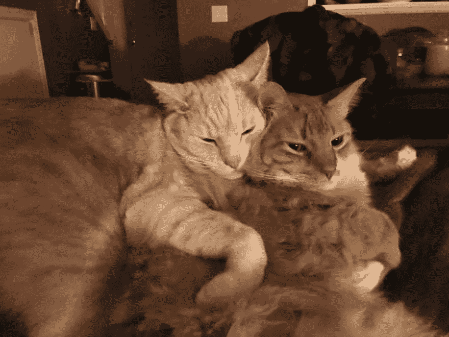](https://res.cloudinary.com/practicaldev/image/fetch/s--UbBXUVFE--/c_limit%2Cf_auto%2Cfl_progressive%2Cq_auto%2Cw_880/https://thepracticaldev.s3.amazonaws.com/i/u35e8ki61znavyct3b2r.jpg)

<figure>

<figcaption>只是两只猫抱在一起</figcaption>

</figure>

## 他们最喜欢的时光包括:

*   把他们所有的玩具都丢在沙发下面
*   把垃圾踢得我们的硬木地板到处都是，还弄到我们的床上
*   观鸟
*   吃丝带和扫帚毛
*   花费太多的钱来喂养，因为他们都需要处方兽医食品
*   每天早上从 EN 4:30 到凌晨 5 点唱着他们人民的歌
*   可爱

<figure>[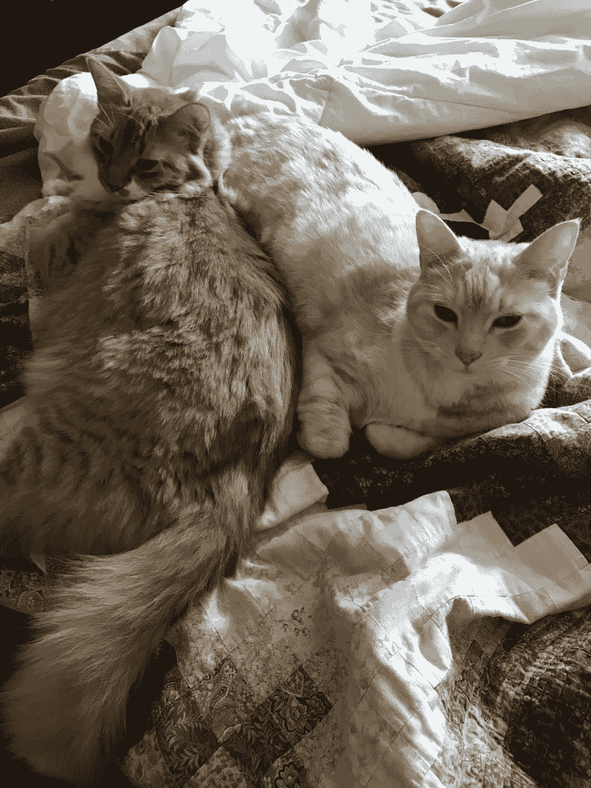](https://res.cloudinary.com/practicaldev/image/fetch/s--QnFeaVva--/c_limit%2Cf_auto%2Cfl_progressive%2Cq_auto%2Cw_880/https://thepracticaldev.s3.amazonaws.com/i/dy5ayheg6ec2guwv8pjf.jpg) 

<figcaption>你或许能分辨出来...</figcaption>

</figure>

[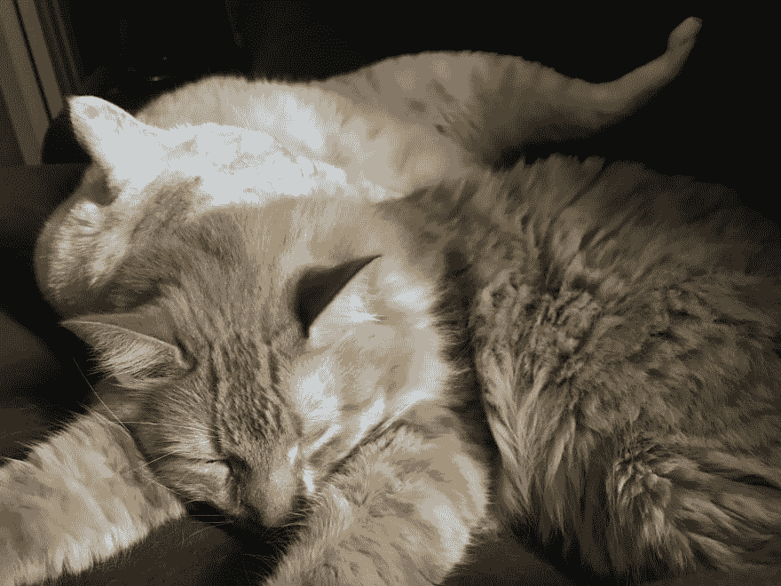](https://res.cloudinary.com/practicaldev/image/fetch/s--iYG6at2w--/c_limit%2Cf_auto%2Cfl_progressive%2Cq_auto%2Cw_880/https://thepracticaldev.s3.amazonaws.com/i/s6jk8whl6l7mzfyecfyk.jpg)

<figure>
...</figure>

[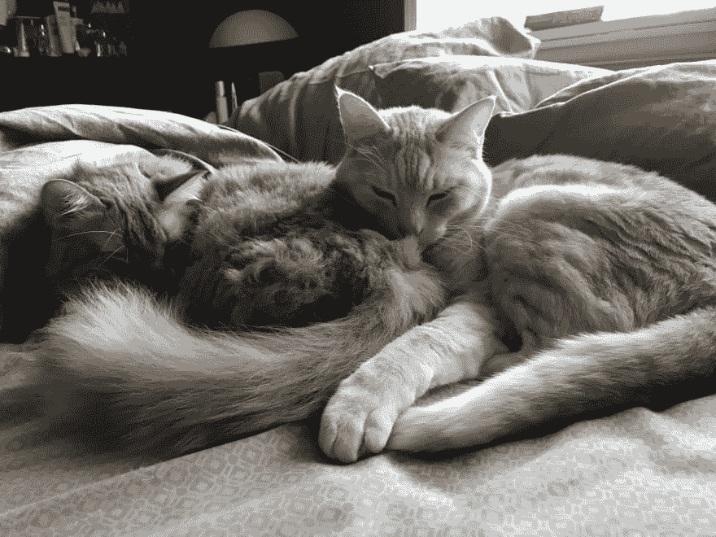](https://res.cloudinary.com/practicaldev/image/fetch/s--2Dm4VPzz--/c_limit%2Cf_auto%2Cfl_progressive%2Cq_auto%2Cw_880/https://thepracticaldev.s3.amazonaws.com/i/7teihzxcrnrl3x3pzbvo.jpg)

<figure>

<figcaption>生活非常坎坷。</figcaption>

T24】</figure>

## 他们并不总是睡着...

<figure>[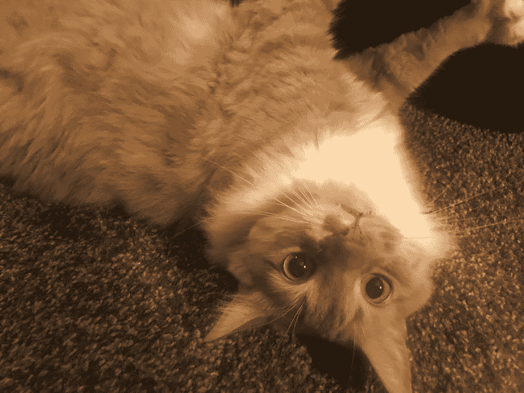](https://res.cloudinary.com/practicaldev/image/fetch/s--zOM4b7O7--/c_limit%2Cf_auto%2Cfl_progressive%2Cq_auto%2Cw_880/https://thepracticaldev.s3.amazonaws.com/i/uhvegjccha0f80j1e95h.jpg) 

<figcaption>“宠我的肚子...这样我就可以在你抓我的时候咬你、抓你了！”</figcaption>

</figure>

[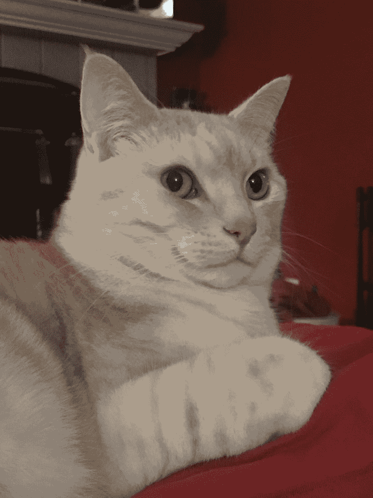](https://res.cloudinary.com/practicaldev/image/fetch/s--IFCdmAzR--/c_limit%2Cf_auto%2Cfl_progressive%2Cq_auto%2Cw_880/https://thepracticaldev.s3.amazonaws.com/i/i4wd15899lnaqdlxbrjo.jpg)

<figure>

<figcaption>“你还有那个吗(不管你在吃什么)？？?"</figcaption>

T15】</figure>

## 但是他们通常都在睡觉...

<figure>[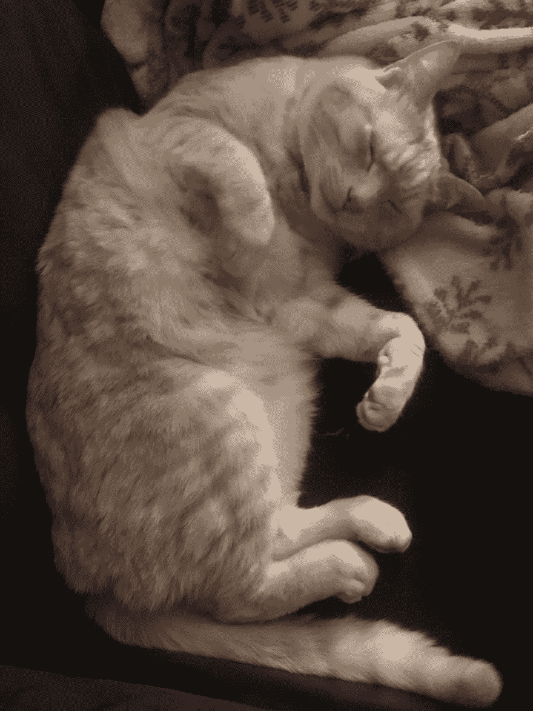](https://res.cloudinary.com/practicaldev/image/fetch/s--6tCukUt9--/c_limit%2Cf_auto%2Cfl_progressive%2Cq_auto%2Cw_880/https://thepracticaldev.s3.amazonaws.com/i/avlrvidryagx39v1m6lh.jpg) 

<figcaption>“搓马贝勒！</figcaption>

</figure>

[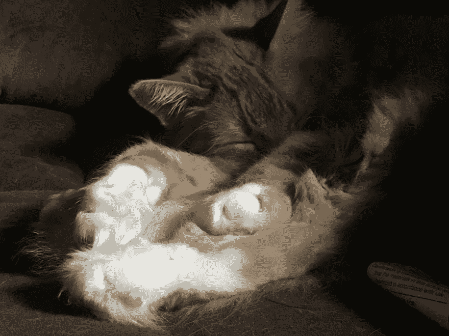](https://res.cloudinary.com/practicaldev/image/fetch/s--RDLkfg2Y--/c_limit%2Cf_auto%2Cfl_progressive%2Cq_auto%2Cw_880/https://thepracticaldev.s3.amazonaws.com/i/qvvrvup3gcfusurcksjo.jpg)

<figure>

<figcaption>“豆脚趾！</figcaption>

</figure>

[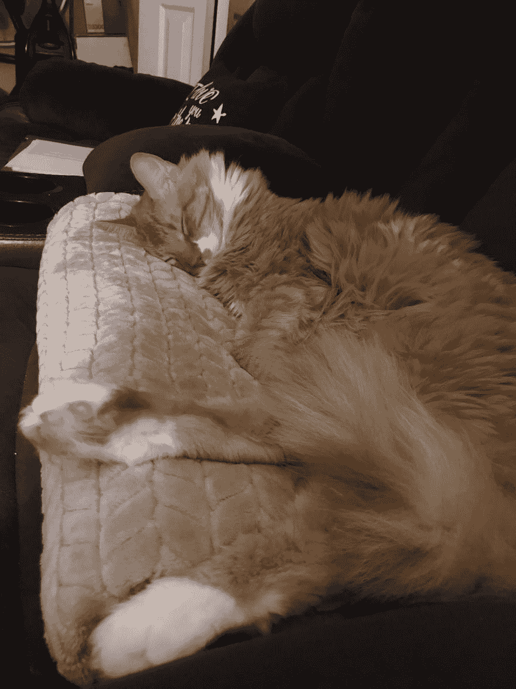](https://res.cloudinary.com/practicaldev/image/fetch/s--CbpXwbaL--/c_limit%2Cf_auto%2Cfl_progressive%2Cq_auto%2Cw_880/https://thepracticaldev.s3.amazonaws.com/i/xu440aik4hog33bz3qo7.jpg)

<figure>

<figcaption>“更豆脚趾”...</figcaption>

</figure>

[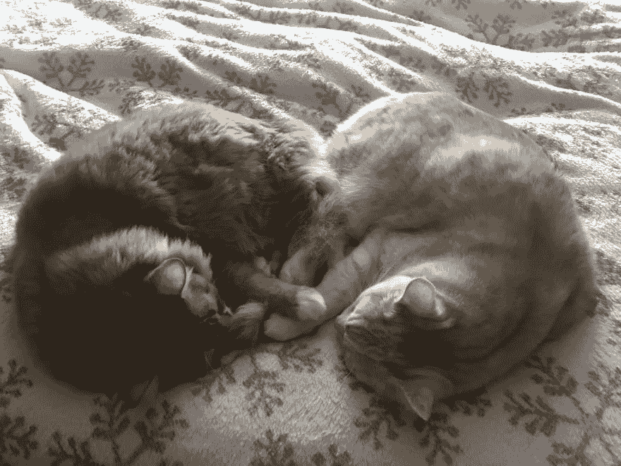](https://res.cloudinary.com/practicaldev/image/fetch/s--T9hxahMa--/c_limit%2Cf_auto%2Cfl_progressive%2Cq_auto%2Cw_880/https://thepracticaldev.s3.amazonaws.com/i/obbmywz4e10c0j3p13nh.jpg)

<figure>

<figcaption>“我永远不会让你走。</figcaption>

</figure>

[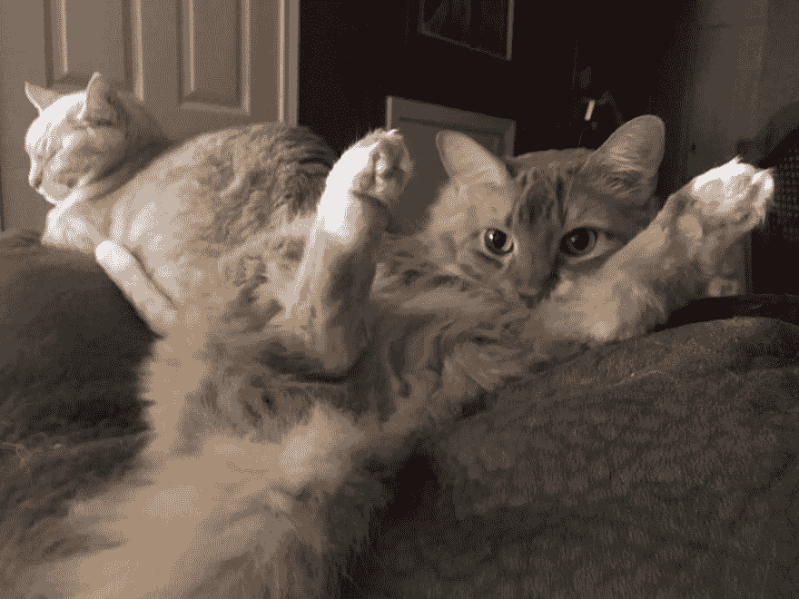](https://res.cloudinary.com/practicaldev/image/fetch/s--aCb8ESUV--/c_limit%2Cf_auto%2Cfl_progressive%2Cq_auto%2Cw_880/https://thepracticaldev.s3.amazonaws.com/i/0167ttsiss6opmgpk4ux.jpg)

<figure>

<figcaption>“如此雄伟...</figcaption>

</figure>

[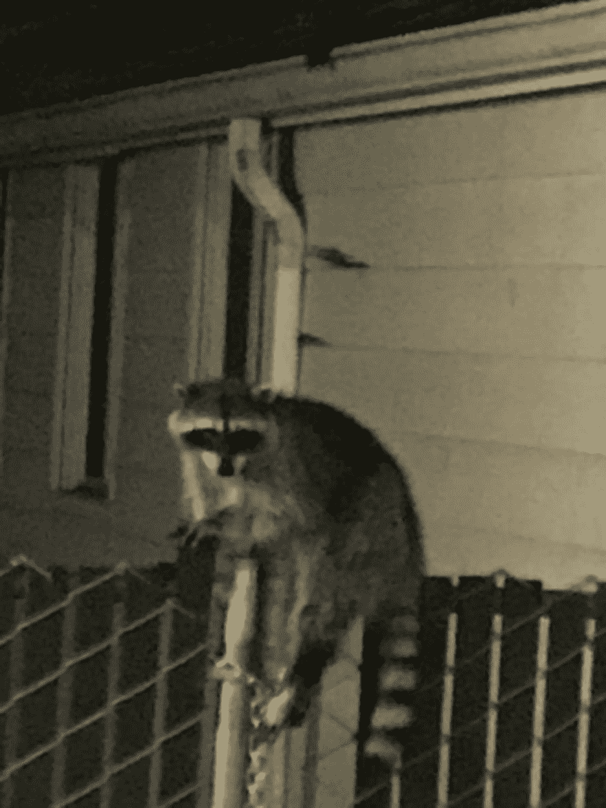](https://res.cloudinary.com/practicaldev/image/fetch/s--8aF3xcZL--/c_limit%2Cf_auto%2Cfl_progressive%2Cq_auto%2Cw_880/https://thepracticaldev.s3.amazonaws.com/i/jdyh7vec645ltpzwje8s.jpg)

<figure>

<figcaption>“我”M A RAC...我是一只猫。”</figcaption>

</figure>

[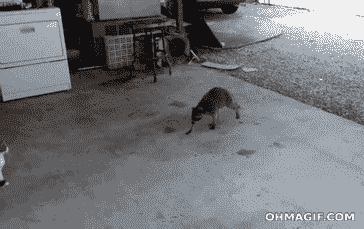](https://i.giphy.com/media/DgXnCrua99pPW/giphy.gif)

## 魅力照！

<figure>

<figure>[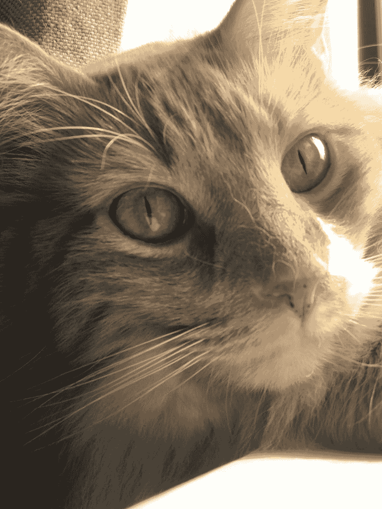](https://res.cloudinary.com/practicaldev/image/fetch/s--uHc_wemu--/c_limit%2Cf_auto%2Cfl_progressive%2Cq_auto%2Cw_880/https://thepracticaldev.s3.amazonaws.com/i/iej5oputywxe5jzkh9s4.jpg) 

<figcaption>“喏……”</figcaption>

</figure>

[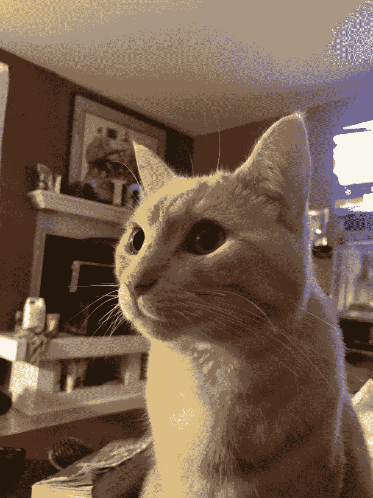](https://res.cloudinary.com/practicaldev/image/fetch/s----CNZ2vy--/c_limit%2Cf_auto%2Cfl_progressive%2Cq_auto%2Cw_880/https://thepracticaldev.s3.amazonaws.com/i/8cdszkeoa3gpsenu7si5.jpg)

<figure>

<figcaption>“我真的很软……”</figcaption>

T15
T17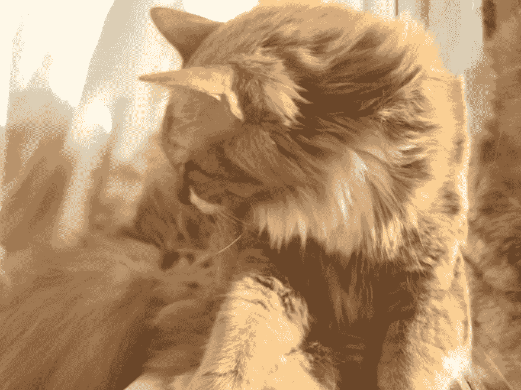T19】</figure>

<figcaption>"Sun is Nice."</figcaption>

</figure>

<figure>[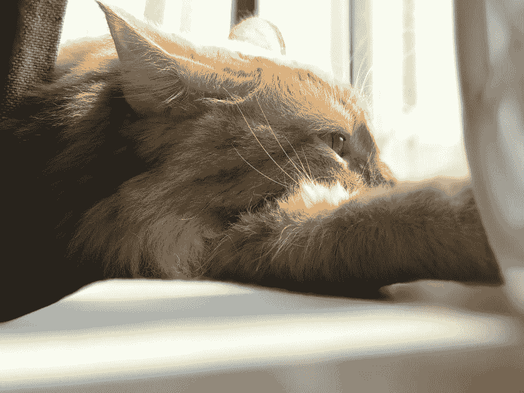](https://res.cloudinary.com/practicaldev/image/fetch/s--iz-KgSBz--/c_limit%2Cf_auto%2Cfl_progressive%2Cq_auto%2Cw_880/https://thepracticaldev.s3.amazonaws.com/i/8koe9j8dq1xuhonna4sx.jpg) 

<figcaption>【我的最爱】</figcaption>

</figure>

谢谢你喜欢我的猫！