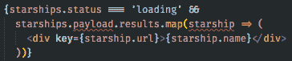

# 用 React 钩子和类型脚本获取数据

> 原文：<https://dev.to/camilomejia/fetch-data-with-react-hooks-and-typescript-390c>

在 React 中重用逻辑很复杂，HOCs 和 Render Props 等模式试图解决这个问题。随着最近钩子的加入，重用逻辑变得更加容易。在本文中，我将展示一种使用钩子`useEffect`和`useState`从 web 服务加载数据的简单方法(在示例中我使用 swapi.co 加载《星球大战》飞船)以及如何轻松管理加载状态。作为奖励，我用的是打字稿。我将建立一个简单的应用程序来买卖星球大战星际飞船，你可以在这里看到最后的结果【https://camilosw.github.io/react-hooks-services

# 加载初始数据

在 React Hooks 发布之前，从 web 服务加载初始数据的最简单方式是在`componentDidMount` :
上

```
class Starships extends React.Component {
  state = {
    starships: [],
    loading: true,
    error: false
  }

  componentDidMount () {
    fetch('https://swapi.co/api/starships')
      .then(response => response.json())
      .then(response => this.setState({ 
        starships: response.results,
        loading: false
      }))
      .catch(error => this.setState({ 
        loading: false, 
        error: true 
      }));
  }

  render () {
    const { starships, loading, error } = this.state;
    return (
      <div>
        {loading && <div>Loading...</div>}
        {!loading && !error && 
          starships.map(starship => (
            <div key={starship.name}>
              {starship.name}
            </div>
          ))
        }
        {error && <div>Error message</div>}
      </div>
    );
  }
}; 
```

但是重用这些代码很难，因为在 React 16.8 之前，你无法从组件中提取行为。流行的选择是使用高阶组件或渲染道具，但这些方法有一些缺点，如 React Hooks 文档中所述[https://React js . org/docs/Hooks-intro . html # its-hard-to-reuse-stateful-logic-between-components](https://reactjs.org/docs/hooks-intro.html#its-hard-to-reuse-stateful-logic-between-components)

使用钩子，我们可以将行为提取到一个定制的钩子中，这样我们就可以很容易地在任何组件中重用它。如果你不知道如何创建自定义挂钩，请先阅读文档:[https://reactjs.org/docs/hooks-custom.html](https://reactjs.org/docs/hooks-custom.html)。

因为我们使用 Typescript，首先我们需要定义我们期望从 web 服务接收的数据的形状，所以我定义了接口`Starship` :

```
export interface Starship {
  name: string;
  crew: string;
  passengers: string;
  cost_in_credits?: string;
  url: string;
} 
```

因为我们将处理具有多个状态的 web 服务，所以我为每个状态定义了一个接口。最后，我将`Service`定义为这些接口的联合类型:

```
interface ServiceInit {
  status: 'init';
}
interface ServiceLoading {
  status: 'loading';
}
interface ServiceLoaded<T> {
  status: 'loaded';
  payload: T;
}
interface ServiceError {
  status: 'error';
  error: Error;
}
export type Service<T> =
  | ServiceInit
  | ServiceLoading
  | ServiceLoaded<T>
  | ServiceError; 
```

`ServiceInit`和`ServiceLoading`分别定义了 web 服务在任何动作之前和加载时的状态。`ServiceLoaded`具有属性`payload`来存储从 web 服务加载的数据(注意，我在这里使用的是泛型，所以我可以使用任何数据类型的接口作为有效负载)。`ServiceError`具有属性`error`来存储任何可能发生的错误。使用这种联合类型，如果我们在`status`属性中设置字符串`'loading'`并尝试将某些内容分配给`payload`或`error`属性，Typescript 将会失败，因为我们没有定义一个允许类型为`'loading'`的`status`与名为`payload`或`error`的属性并排的接口。如果没有 Typescript 或任何其他类型检查，您的代码只会在运行时出错。

定义了类型`Service`和接口`Starship`之后，现在我们可以创建自定义钩子`usePostStarshipService` :

```
import { useEffect, useState } from 'react';
import { Service } from '../types/Service';
import { Starship } from '../types/Starship';

export interface Starships {
  results: Starship[];
}

const usePostStarshipService = () => {
  const [result, setResult] = useState<Service<Starships>>({
    status: 'loading'
  });

  useEffect(() => {
    fetch('https://swapi.co/api/starships')
      .then(response => response.json())
      .then(response => setResult({ status: 'loaded', payload: response }))
      .catch(error => setResult({ status: 'error', error }));
  }, []);

  return result;
};

export default usePostStarshipService; 
```

这是前面代码中发生的情况:

*   因为 SWAPI 在数组`results`中返回一个星际飞船数组，所以我定义了一个新的接口`Starships`，它包含属性`results`作为数组`Starship`。
*   定制钩子`usePostStarshipService`只是一个函数，按照 React 钩子文档上的建议，以单词`use`开头:[https://React js . org/docs/Hooks-custom . html # extracting-a-custom-Hook](https://reactjs.org/docs/hooks-custom.html#extracting-a-custom-hook)。
*   在这个函数中，我使用钩子`useState`来管理 web 服务状态。注意，我需要定义将由通过泛型`<Service<Starship>>`的`result`状态管理的数据的确切类型。我正在用联合类型`Service`的接口`ServiceInit`初始化钩子，所以唯一允许的属性是带有字符串`'loading'`的`status`。
*   我还使用钩子`useEffect`将回调作为第一个参数从 web 服务获取数据，并将一个空数组作为第二个参数。第二个参数告诉`useEffect`运行回调的条件是什么，因为我们传递的是一个空数组，回调将只被调用一次(如果你不熟悉钩子[https://reactjs.org/docs/hooks-effect.html](https://reactjs.org/docs/hooks-effect.html)，请阅读更多关于`useEffect`的内容)。
*   最后，我要返回`result`。该对象包含状态和任何有效负载或调用 web 服务时产生的错误。这就是我们在组件中向用户显示 web 服务的状态和检索到的数据所需要的。

注意，我在前面的例子中使用`fetch`的方式非常简单，但是对于生产代码来说还不够。例如，catch 将只捕获网络错误，而不捕获 4xx 或 5xx 错误。在您自己的代码中，最好创建另一个包装了`fetch`的函数来处理错误、标题等。

现在，我们可以使用钩子来检索星舰列表并显示给用户:

```
import React from 'react';
import useStarshipsService from '../services/useStarshipsService';

const Starships: React.FC<{}> = () => {
  const service = useStarshipsService();

  return (
    <div>
      {service.status === 'loading' && <div>Loading...</div>}
      {service.status === 'loaded' &&
        service.payload.results.map(starship => (
          <div key={starship.url}>{starship.name}</div>
        ))}
      {service.status === 'error' && (
        <div>Error, the backend moved to the dark side.</div>
      )}
    </div>
  );
};

export default Starships; 
```

这一次，我们的自定义钩子`useStarshipService`将管理状态，所以我们只需要根据返回的`service`对象的`status`属性进行有条件的渲染。

注意，如果你试图在状态为`'loading'`时访问`payload`，TypeScript 将会失败，因为`payload`只存在于`ServiceLoaded`接口中，而不存在于`ServiceLoading`接口中:

[](https://res.cloudinary.com/practicaldev/image/fetch/s--OG5lnrSU--/c_limit%2Cf_auto%2Cfl_progressive%2Cq_auto%2Cw_880/https://thepracticaldev.s3.amazonaws.com/i/zn5oo4w73c6tuevvfogq.png)

TypeScript 非常聪明，它知道如果`status`属性和字符串`'loading'`之间的比较结果为真，那么对应的接口就是`ServiceLoaded`，在这种情况下`starships`对象没有`payload`属性。

## 加载内容状态变化

在我们的例子中，如果用户点击任何一艘星舰，我们改变我们组件上的状态来设置所选的星舰，并用对应于那艘星舰的 url 调用 web 服务(注意[https://swapi.co/api/starships](https://swapi.co/api/starships)加载每艘星舰的所有数据，所以没有必要再次加载那些数据。我这样做只是为了演示。)

传统上，我们使用 componentDidUpdate 来检测状态变化并做相应的事情:

```
class Starship extends React.Component {
  ...

  componentDidUpdate(prevProps) {
    if (prevProps.starship.url !== this.props.starship.url) {
      fetch(this.props.starship.url)
        .then(response => response.json())
        .then(response => this.setState({
          starship: response,
          loading: false
        }))
        .catch(error => this.setState({ 
          loading: false, 
          error: true 
        }));
    }
  }

  ...
}; 
```

如果我们需要在不同道具和状态属性变化时做出不同的动作，`componentDidUpdate`很快就变得一塌糊涂。使用钩子，我们可以将动作封装在单独的定制钩子中。在这种情况下，我们将创建一个自定义钩子来提取`componentDidUpdate`中的行为，就像我们之前做的一样:

```
import { useEffect, useState } from 'react';
import { Service } from '../types/Service';
import { Starship } from '../types/Starship';

const useStarshipByUrlService = (url: string) => {
  const [result, setResult] = useState<Service<Starship>>({
    status: 'loading'
  });

  useEffect(() => {
    if (url) {
      setResult({ status: 'loading' });
      fetch(url)
        .then(response => response.json())
        .then(response => setResult({ status: 'loaded', payload: response }))
        .catch(error => setResult({ status: 'error', error }));
    }
  }, [url]);

  return result;
};

export default useStarshipByUrlService; 
```

这一次，我们的定制钩子接收 url 作为参数，我们使用它作为钩子`useEffect`的第二个参数。这样，每当 url 改变时，`useEffect`内部的回调将被调用来为新的 starship 检索数据。

注意，在回调函数中，我调用了`setResult`来将`status`设置为`'loading'`。这是因为回调将被多次调用，所以我们需要在开始获取之前重置状态。

在我们的`Starship`组件中，我们接收 url 作为道具，并将其传递给我们的定制钩子`useStarshipByUrlService`。每当父组件中的 url 改变时，我们的自定义钩子将再次调用 web 服务，并为我们管理状态:

```
import React from 'react';
import useStarshipByUrlService from '../services/useStarshipByUrlService';

export interface Props {
  url: string;
}

const Starship: React.FC<Props> = ({ url }) => {
  const service = useStarshipByUrlService(url);

  return (
    <div>
      {service.status === 'loading' && <div>Loading...</div>}
      {service.status === 'loaded' && (
        <div>
          <h2>{service.payload.name}</h2>
          ...
        </div>
      )}
      {service.status === 'error' && <div>Error message</div>}
    </div>
  );
};

export default Starship; 
```

## 发送内容

当状态改变时，发送内容似乎类似于加载内容。在第一种情况下，我们将一个 url 传递给我们的自定义钩子，现在我们可以传递一个包含要发送的数据的对象。如果我们尝试做同样的事情，代码会是这样:

```
const usePostStarshipService = (starship: Starship) => {
  const [result, setResult] = useState<Service<Starship>>({
    status: 'init'
  });

  useEffect(() => {
    setResult({ status: 'loading' });
    fetch('https://swapi.co/api/starships', {
      method: 'POST',
      body: JSON.stringify(starship)
    })
      .then(response => response.json())
      .then(response => {
        setResult({ status: 'loaded', payload: response });
      })
      .catch(error => {
        setResult({ status: 'error', error });
      });
  }, [starship]);

  return result;
};

const CreateStarship: React.FC<{}> = () => {
  const initialStarshipState: Starship = {
    name: '',
    crew: '',
    passengers: '',
    cost_in_credits: ''
  };
  const [starship, setStarship] = useState<PostStarship>(initialStarshipState);
  const [submit, setSubmit] = useState(false);
  const service = usePostStarshipService(starship);

  const handleChange = (event: React.ChangeEvent<HTMLInputElement>) => {
    event.persist();
    setStarship(prevStarship => ({
      ...prevStarship,
      [event.target.name]: event.target.value
    }));
  };

  const handleFormSubmit = (event: React.FormEvent<HTMLFormElement>) => {
    event.preventDefault();
    setSubmit(true);
  };

  useEffect(() => {
    if (submit && service.status === 'loaded') {
      setSubmit(false);
      setStarship(initialStarshipState);
    }
  }, [submit]);

  return (
    <form onSubmit={handleFormSubmit}>
      <input 
        type="text" 
        name="name" 
        value={starship.name} 
        onChange={handleChange}
      />
      ...
    </form>
  )
} 
```

但是前面的代码存在一些问题:

*   我们将`starship`对象传递给我们的自定义钩子，并将该对象作为`useEffect`钩子的第二个参数传递。因为 onChange 处理程序将在每次击键时改变`starship`对象，所以我们的 web 服务将在每次用户键入时被调用。
*   我们需要使用钩子`useState`来创建布尔状态`submit`，以便知道何时可以清理表单。我们可以使用这个布尔值作为`usePostStarshipService`的第二个参数来解决前面的问题，但是这会使我们的代码变得复杂。
*   布尔状态`submit`向我们的组件添加了逻辑，这些逻辑必须在重用我们的定制钩子`usePostStarshipService`的其他组件上复制。

有一个更好的方法，这次不用`useEffect`钩子:

```
import { useState } from 'react';
import { Service } from '../types/Service';
import { Starship } from '../types/Starship';

export type PostStarship = Pick<
  Starship,
  'name' | 'crew' | 'passengers' | 'cost_in_credits'
>;

const usePostStarshipService = () => {
  const [service, setService] = useState<Service<PostStarship>>({
    status: 'init'
  });

  const publishStarship = (starship: PostStarship) => {
    setService({ status: 'loading' });

    const headers = new Headers();
    headers.append('Content-Type', 'application/json; charset=utf-8');

    return new Promise((resolve, reject) => {
      fetch('https://swapi.co/api/starships', {
        method: 'POST',
        body: JSON.stringify(starship),
        headers
      })
        .then(response => response.json())
        .then(response => {
          setService({ status: 'loaded', payload: response });
          resolve(response);
        })
        .catch(error => {
          setService({ status: 'error', error });
          reject(error);
        });
    });
  };

  return {
    service,
    publishStarship
  };
};

export default usePostStarshipService; 
```

首先，我们创建了一个从`Starship`派生的新的`PostStarship`类型，选择将被发送到 web 服务的属性。在我们的定制钩子中，我们用属性`status`中的字符串`'init'`初始化服务，因为`usePostStarshipService`在被调用时不会对 web 服务做任何事情。这次我们没有使用`useEffect`钩子，而是创建了一个函数来接收发送给 web 服务的表单数据，并返回一个承诺。最后，我们用`service`对象和负责调用 web 服务的函数返回一个对象。

**注意:**我本可以在我们的自定义钩子中返回一个数组而不是一个对象来表现得像`useState`钩子一样，这样组件中的名字就可以任意命名了。我决定返回一个对象，因为我认为没有必要重命名它们。如果你愿意，你可以自由地返回一个数组。

我们的`CreateStarship`组件这次会更简单:

```
import React, { useState } from 'react';
import usePostStarshipService, {
  PostStarship
} from '../services/usePostStarshipService';
import Loader from './Loader';

const CreateStarship: React.FC<{}> = () => {
  const initialStarshipState: PostStarship = {
    name: '',
    crew: '',
    passengers: '',
    cost_in_credits: ''
  };
  const [starship, setStarship] = useState<PostStarship>(
    initialStarshipState
  );
  const { service, publishStarship } = usePostStarshipService();

  const handleChange = (event: React.ChangeEvent<HTMLInputElement>) => {
    event.persist();
    setStarship(prevStarship => ({
      ...prevStarship,
      [event.target.name]: event.target.value
    }));
  };

  const handleFormSubmit = (event: React.FormEvent<HTMLFormElement>) => {
    event.preventDefault();
    publishStarship(starship).then(() => setStarship(initialStarshipState));
  };

  return (
    <div>
      <form onSubmit={handleFormSubmit}>
        <input
          type="text"
          name="name"
          value={starship.name}
          onChange={handleChange}
        />
        ...
      </form>
      {service.status === 'loading' && <div>Sending...</div>}
      {service.status === 'loaded' && <div>Starship submitted</div>}
      {service.status === 'error' && <div>Error message</div>}
    </div>
  );
};

export default CreateStarship; 
```

我使用`useState`钩子来管理表单的状态，但是`handleChange`的行为就像我们在类组件中使用`this.state`一样。我们的`usePostStarshipService`除了在初始状态返回我们的`service`对象和返回 publishStarship 方法来调用 web 服务之外，什么也不做。当提交表单并调用`handleFormSubmit`时，我们用表单数据调用`publishStarship`。现在我们的`service`对象开始管理 web 服务变更的状态。如果返回的承诺是成功的，我们用`initialStarshipState`调用`setStarship`来清理表单。

仅此而已，我们有三个自定义钩子来检索初始数据、检索单个项目和提交数据。你可以在这里看到完整的项目:[https://github.com/camilosw/react-hooks-services](https://github.com/camilosw/react-hooks-services)

# 最后的想法

React 挂钩是一个很好的补充，但是当有更简单和完善的解决方案时，不要试图过度使用它们，比如在我们发送内容的例子中用 Promise 代替`useEffect`。

使用钩子还有一个好处。如果你仔细观察，你会发现我们的组件变得基本上是表示性的，因为我们把有状态逻辑移到了我们的定制钩子中。有一种将逻辑与表示分离的既定模式，称为容器/表示，其中将逻辑放在父组件中，将表示放在子组件中。这种模式最初是由 Dan Abramov 提出的，但是现在我们有了钩子，Dan Abramov 建议少用这种模式而用钩子:[https://medium . com/@ Dan _ abra mov/smart-and-dumb-components-7 ca 2 f 9 a 7 c 7d 0](https://medium.com/@dan_abramov/smart-and-dumb-components-7ca2f9a7c7d0)

可能你不喜欢用字符串来命名状态，并且责怪我这么做，但是如果你使用的是 Typescript，你是安全的，因为如果你拼错了状态名，Typescript 就会失败，并且你可以在 VS 代码中免费获得自动完成功能(其他编辑器也可能如此)。无论如何，如果你愿意，你可以使用布尔。