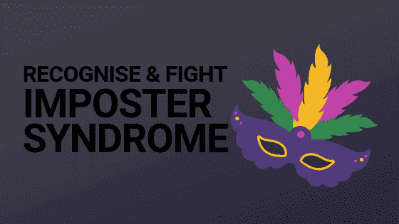

# 作为一名开发人员与冒名顶替综合症作斗争

> 原文：<https://dev.to/kendalmintcode/fighting-imposter-syndrome-as-a-developer-24i8>

冒名顶替综合征:这是一种困扰人们的疾病，比你想象的要多得多，尤其是(讽刺的是)相当成功的人。

这可能会时不时地发生在你身上，战斗可能是一个非常孤独的诅咒，会拖你的后腿，阻碍你真正成为最好的自己。那些喋喋不休的怀疑处于温和的一端，彻头彻尾的不值得或不够好的感觉处于糟糕的一端。

这是我一直在与之斗争的事情，我从我的推特上知道，你在那里关注的一些最成功的人都会觉得自己远不是你认为的顶级同行。

我们开始吧！

## *到底是什么*冒名顶替综合症

摘自[维基百科关于冒名顶替综合症的优秀文章](https://en.wikipedia.org/wiki/Impostor_syndrome):

> 冒名顶替综合征是一种心理模式，在这种模式中，一个人怀疑自己的成就，并对被揭露为“骗子”有一种持续的内在恐惧

是的，听起来没错，我知道这种描述的版本定期出现在我的时间表中，或者只是在与其他开发人员谈论他们的工作经验时出现。

一般来说，关于冒名顶替综合症的文章数不胜数，比如《快速公司》的这篇综合文章。在这篇文章中，作者 Melody Wilding 引用了 Valerie Young 博士的研究，该研究将五种不同类型的冒名顶替综合征进行了分类，并介绍了如何与之斗争。

## 如何识别它

虽然冒名顶替综合症有几种形式，但在极端光谱的两端，它通常表现为怀疑和欺诈感以及不归属感。

这种情况很常见，因为一般来说，我们非常善于私下和在内心表达我们的恐惧和疑虑，同时隐藏它们不让公众看到和听到。当然，大多数人这样做时，很容易在这些想法中感到孤独。

一些常见的注意事项包括:

*   你工作的不安全感
*   感觉自己配不上自己的成就
*   你随时会被“发现”的不祥预感
*   不断或频繁地与同龄人比较，导致个人无价值
*   尽管你取得了成就，却感觉不如你的同龄人

在我早期的职业生涯中，我经常遇到这种情况，因为我会在一家公司工作，然后觉得自己不够好，不适合呆在那里。当然，事实上其他员工已经在公司工作了很多年，在同一个代码库中工作，这在我的脑海中永远不会出现——显然他们会更好地处理事情；他们已经在学习曲线上走得更远了！

在后来的生活中，当我还是一名企业主的时候，一开始我真的很挣扎，因为我周围都是成功的商人，他们已经经营自己的企业很多年了。我怎么能希望加入他们或者和他们竞争呢？我，这个几乎没有商业经验的新人，我能提供什么？

这种感觉没有任何帮助，事实上，会很快变得有害。想一想，你有没有在这些熟悉的方式中退缩过:

*   开会时保持沉默，怕自己的想法被嘲笑？
*   因为你认为自己没有准备好或者不够好而没有去争取那份工作？
*   害怕在博客上发表文章，因为它不像 CSS 技巧那样深入和流行？
*   没有开始你一直想要的开源项目，因为谁会使用它？
*   推迟自己创业？

谢天谢地，虽然这些感觉偶尔会出现，但我已经更好地处理了冒名顶替综合症，你也可以！

我已经学会了如何快速识别它们，并使用一些我们接下来要讨论的屡试不爽的应对机制来扭转它们。

## 如何解决冒名顶替综合症？

处理冒名顶替综合症的很大一部分是关于识别它是什么，谈论它，当它出现时处理它。这是一个持续的过程，通过练习你会变得更好。这里有一些对付冒名顶替综合症的最佳方法，帮助我战胜了它。

### 拿自己和自己比，不要和别人比

我所见过的最好的建议和激励之一就是将你自己与其他版本的你进行比较，而不是与其他人进行比较！

你是唯一一个你能完全控制的人，事实上，你最多只能影响其他人。你不知道他们的历程，他们的奋斗，他们有多努力，他们的工作有什么挑战，他们做出了什么牺牲。

生活就是这样有趣:我们很容易(而且常常令人沮丧)将自己与处于类似地位的人进行比较，认为他们比我们更有价值。

然而，我们都在跑不同的比赛或玩完全不同的游戏，我们不应该试图将自己与其他人进行比较。

相反，用它们来激励你的目标。一旦你心中有了目标，将自己与之前的自己进行比较，并以此来衡量你的进步。

例如，如果你刚刚[获得了你作为开发人员的第一份工作](https://robkendal.co.uk/blog/2019-05-04-getting-hired-as-a-developer-in-the-tech-industry/)，不要把注意力放在你觉得自己不够好不适合在那里工作的事实上——他们雇用了你，当然你是！相反，记下你现在在哪里，然后在每周结束时回顾，看看你取得了怎样的进步，你学到了什么，你做得好了多少。

### 认识你的优势，承认你的劣势

当你关注消极的、关键的东西时，很容易掩盖你的优势，并真正承认你的成就。

试着客观地看待你擅长什么和不擅长什么，并把它变成一个行动计划来延续优势和改善劣势。

比如我真的很佩服[莎拉·德拉斯纳](https://twitter.com/sarah_edo)。她是 Netlify 非常受欢迎和成功的开发人员，经常谈论前端开发话题。她对 SVG 动画的了解非常丰富(说真的，她有一本关于这个主题的[巨著](https://t.co/bV6mBteksH?amp=1))比我的多得多。

然而，这并不意味着我不属于前端开发人员。这并不意味着我不值得我扮演的角色或者我获得的任何奖项。只能说明我知识上有差距。

通过认识到这是一个提高我理解领域的机会，我可以切断自我怀疑的感觉，并将它们引导到一个积极的计划中去学习学习学习！

### 谈谈吧

不知道别人的想法和感受是整个冒名顶替综合症的一个重要基础。将你的恐惧和想法内在化，同时不知道你的同龄人有类似的想法，会让一切变得更糟。

这绝对不是一件容易的事情，但是相信我，其他人也有同感。即使他们没有欺诈感，他们也很少会有优越感，不明白你从何而来。

找一两个有同情心的人倾诉你的不归属感，你很快就会发现其他人也会分享他们的感受。

### 关注积极的经历

人类处境中一个可怕的部分是我们在处理和相信我们得到的赞美时会有困难。微笑着对它们不屑一顾是很容易的，但不要把它们储存在记忆库里以备后用。

当你得到积极的反馈或对你的工作的高度赞扬时，保持它！记下它，记住它，注意它一会儿，然后当你开始怀疑你是否属于它的时候，你可以考虑它。

### 记住并提醒自己，你并不孤单

如果这篇文章不能让你意识到你并不孤单，让我来为你解释一下...

你。是。不是。一个人！

我可以告诉你，在我的职业生涯中，很多和我交谈过的开发人员至少有一次感觉自己是骗子，如果不是经常这样的话。

继续分享你的经历，养成和你的同事和同龄人谈论他们的经历的习惯，谈论你的集体挑战，你会发现你绝对不是一个人。

### 开车无论如何都要经过它

好吧，这是工具更钝的一端，但有时你无法平息内心的声音，你只能这样做。

我可以告诉你，我读了一份工作说明书，觉得自己不够好，不适合那个角色。但后来我还是申请了。毕竟，这就是求职过程，不是吗？让你和公司决定你们是否合适。如果你对自己的经历开诚布公，那么就由招聘公司来决定你是否能胜任这项工作，而不是你自己！

有时候，你必须承认自己的成就和能力，并且说‘不管我感觉如何，我都不会让它阻碍我’。

## 分享你的经历

你有过哪些冒名顶替的感觉？你什么时候觉得自己配不上自己的成就？留下评论，我们开始对话吧！