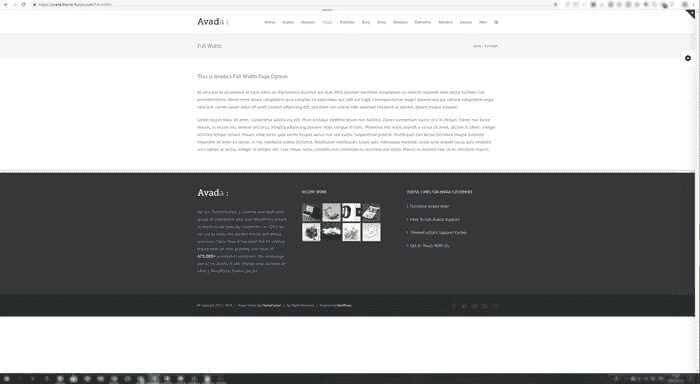
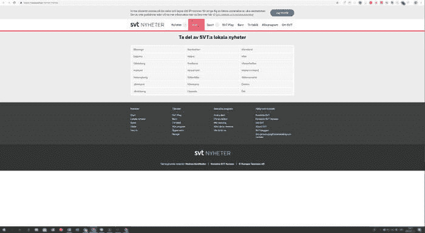
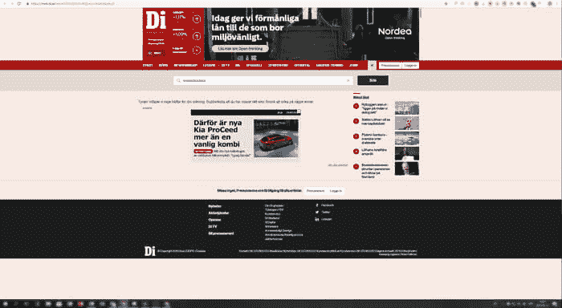

# 与飞人战斗

> 原文：<https://dev.to/fridanyvall/fighting-the-flying-footer-21c8>

“浮动页脚”是一种不总是放在页面底部的页脚。本文介绍了如何将页脚放置在布局底部的不同解决方案。

当涉及到网页设计和布局的时候，没有放在页面底部的页脚是我最讨厌的地方之一。

“浮动页脚”出现在缺乏足够的 CSS 规则将页脚始终放在底部的布局中。例如，当页面上没有足够的内容占据 100%的屏幕高度时，页脚可能会在页面结束之前结束。当显示包含少量内容的页面时，这通常发生在较大的屏幕上。

***例子***
一个使用最畅销的 WordPress 主题 Avada 在大屏幕上显示的短页面的例子。
 

<figcaption>使用畅销 WordPress 主题 Avada 在大屏幕上显示的简短页面。</figcaption>

另一个例子是瑞典最大的公共服务新闻和媒体公司 SVT 的这一观点。
 

<figcaption>瑞典最大的公共服务新闻和媒体公司 SVT 上的带有飞行页脚的短网页。</figcaption>

还有另一个例子，这次来自瑞典最大的商业新闻网站之一，di.se.
 

<figcaption>瑞典最大的商业新闻网站之一，di.se.</figcaption>

的一个短网页上的浮动页脚

* * *

## 这个真的很重要吗？

在我看来，像这样修饰细节就好比当你想让自己看起来最好的时候，穿着熨好的衬衫去参加一个重要的会议。如果你穿着一件皱巴巴的衬衫出现，世界不会毁灭，但是你可能会穿一件熨好的衬衫给人留下更好的印象。

同理，关心细节，连贯的设计，给人以扎实的印象，可以让一个网站显得质量更高。

***动态内容***
大多数网站都有动态内容。网站设计的预期外观最好不要依赖于内容是长是短。

***更大的屏幕***
移动和更小的屏幕一直是人们关注的焦点，但屏幕尺寸也在向上转移。用于访问网站的屏幕越来越大；一些用户甚至在电视屏幕上浏览互联网。因此，需要提供可缩放的布局，并在更大的屏幕上保持不变。

* * *

## 加入战斗

根据所需的浏览器支持以及页脚本身的内容，可以使用不同的技术使页脚停留在页面的底部，而不管页面之前的内容。

**负边距**
*适用时:*页脚高度已知不会改变，需要支持老浏览器。
*浏览器支持:*所有浏览器都支持。

*关于 CSS 计算属性的注意:*虽然可以将 CSS 计算属性与一个`calc()`语句结合起来，在页脚高度变化的场景中使用，但是这些技术需要更现代的浏览器。如果你主要是为更现代的浏览器构建，你也有机会使用 Flexbox 或者 CSS Grid。

[https://codepen.io/fridanyvall/embed/LqKjJX?height=600&default-tab=result&embed-version=2](https://codepen.io/fridanyvall/embed/LqKjJX?height=600&default-tab=result&embed-version=2)

**vh 单位**
*适用于:*决定了最小页脚高度，需要支持到 IE9。
*浏览器支持:* [老浏览器回 IE9 支持](https://caniuse.com/#feat=viewport-units)。

将内容添加到页脚使其超过设置的最小高度将触发网页上的 y 轴滚动(而不是调整和利用页脚上方的任何额外空间)。但是，页脚将留在页面的底部。

[https://codepen.io/fridanyvall/embed/omreYy?height=600&default-tab=result&embed-version=2](https://codepen.io/fridanyvall/embed/omreYy?height=600&default-tab=result&embed-version=2)

**Flexbox**
*适用于:*页脚内容是动态的，因为页脚高度可以变化而不破坏布局。
*浏览器支持:*edge 12 及以上版本完全支持。部分支持(由于[“大量 bug”](https://caniuse.com/#feat=flexbox))和较老的语法版本使得 IE 10-11 支持不太可靠。

[https://codepen.io/fridanyvall/embed/vbPxVX?height=600&default-tab=result&embed-version=2](https://codepen.io/fridanyvall/embed/vbPxVX?height=600&default-tab=result&embed-version=2)

**CSS 网格**
*适用于:*页脚内容是动态的，因为页脚高度可以变化而不破坏布局。
*浏览器支持:*edge 16 及以上版本全面支持。部分[支持使用旧版本规范的](https://caniuse.com/#feat=css-grid)以及 IE10-11 和 Edge12-15 中的`-ms-`前缀。

[https://codepen.io/fridanyvall/embed/GzeNWQ?height=600&default-tab=result&embed-version=2](https://codepen.io/fridanyvall/embed/GzeNWQ?height=600&default-tab=result&embed-version=2)

**关于粘性位置的注意事项**
可以使用粘性位置将页脚放置在底部，粘性位置从边缘 16 向上支撑。即使页脚放置在页面底部，使用 position sticky 进行页脚定位的缺点是，当需要 y 轴滚动时，页脚会与前面的内容重叠。

在这种情况下，这可能不是期望的行为，因此位置粘滞可能不是该工作的最佳工具。

* * *

## 总结

决定哪种技术最适合每个用例的主要约束是:

*   需要支持哪些浏览器？
*   页脚高度已知吗？
*   页脚高度会改变吗(例如，由于动态页脚内容)？
*   如果你知道你不需要支持 Internet Explorer，最好的支持技术是 flexbox，它也允许改变页脚的高度。

* * *

*最初发表于 [redonion.se](https://redonion.se/en/fighting-the-flying-footer/) 。*