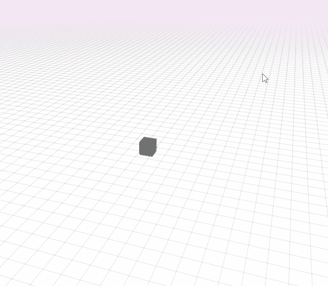

# 双子座项目最终报告

> 原文：<https://dev.to/webdva/final-gemini-project-report-298g>

双子座项目已经达到了它的目的，现在已经完成。由于该项目的非常宽松和灵活的性能限制和它的驾驶时间限制的结合，我已经确定我有足够的科学、经验和技术来开发一个 3D 多人游戏。

此最终报告将包括一个处理 3D 级别创建问题的可能解决方案，以及一个关于 3D 转换相关性的注释。

# 使用 Blender 使用元数据创建 3D 级别

可以在 Blender 3D 建模工具中创建 3D 级别或贴图。诸如可以打开和关闭的门之类的对象需要具有与其相关联的属性，以便游戏引擎可以使用这种对象-属性映射来促进预期的游戏逻辑。在映射可以被游戏引擎使用之前，首先必须有一种方法从 Blender 创建的 3D 级别中提取对象属性。以下是使用 Blender 创建具有元数据的 3D 级别的方法的建议。

## 为 3D 级别的对象/实体创建属性

我不知道，但我认为可以使用 Python-Blender 可编程接口控制台来创建和处理 3D 级别的实体属性，如果我不能使用默认的 Blender 用户界面来创建每个实体属性映射的话。这将是乏味的，因为 Blender 的界面明显(不是我所想的)繁琐，但它将是可行的和足够的。

## 用于导出实体-属性映射的 Python 实用程序

由于 Blender 允许 3D 实体具有使用 Python 编程语言的可编程接口，因此可以创建 Python 脚本来获得 3D 级别的元数据。特别是，我们可以创建一个 Python 脚本，将 3D 级别的元数据导出到一个格式为 JSON 的文件中。

这里有一个 Python 源代码技术，有人好心地免费分享了这个技术，它可以帮助促进这个工具:

```
import bpy
import json

def create_json():
    json_dictionary = {}
    json_dictionary["entities"] = []

    # obtain each 3D object in the level and retrieve its properties
    for obj in bpy.data.objects:
        entity = {"name": obj.name}

        # essential object position, rotation, and scale properties
        entity["position"] = {"x": obj.location.x, "y": obj.location.y, "z": obj.location.z}
        entity["rotation"] = {"x": obj.rotation_euler.x, "y": obj.rotation_euler.y, "z": obj.rotation_euler.z}
        entity["scale"] = {"x": obj.scale.x, "y": obj.scale.y, "z": obj.scale.z}

        # metadata for custom aspects of the object
        if len(obj.keys()) > 1:
            for k in obj.keys():
                if k not in "_RNA_UI":
                    custom_property = obj[k]
                    if isinstance(custom_property, int) or isinstance(custom_property, float) or isinstance(custom_property, str):
                        entity[k] = obj[k] # if the property is actually a valid property, then create a mapping
        json_dictionary["entities"].append(entity)

    return json.dumps(json_dictionary, indent = 4, sort_keys = True) 
```

Enter fullscreen mode Exit fullscreen mode

Blender 允许使用其 Python 可编程接口修改其图形用户界面，从而允许在编辑期间提取实体-属性映射。但是我目前没有能力实现这样的 Python-Blender 图形界面修改。因此，这个建议的方法将要求用户总是首先将文件保存到磁盘，然后指示 Python 脚本从磁盘上的 Blender 文件中提取级别元数据。

# 3D 变换

我已经开始为 3D 多人游戏开发技术。致力于 Gemini 项目的发现目标，我创建了子系统原型来调查和确定它们在特定条件下的可行性，并创建可用于实现程序和系统成功的预测(心理)模型。一个这样的子系统涉及 3D 环境中服务器和客户端之间的坐标传输。

的幕后。gif 下面，子系统由玩家客户端向服务器发送玩家 3D 网格打算行进到的地图坐标组成，该地图坐标由鼠标光标的位置确定。

[](https://res.cloudinary.com/practicaldev/image/fetch/s--bO0kPdaA--/c_limit%2Cf_auto%2Cfl_progressive%2Cq_66%2Cw_880/https://thepracticaldev.s3.amazonaws.com/i/pymhhg7ovdr4efojqm6q.gif)

的。gif 显示 3D 网格的行进方向以及每次移动完成后的最终位置与鼠标在网格平面上的位置不对齐，从而导致 3D 网格既不在玩家的预期方向上移动，也不移动到预期位置。我认为这可能是因为客户端从本地空间而不是场景的全局空间向服务器发送坐标。

由此，我推断理解从一个向量空间到另一个向量空间的变换对于在 3D 环境中操作是必不可少的。还要注意,(对我来说)理解 3D 变换并不需要太多的努力，因为我发现 3D 变换只是一个将 4×4 矩阵乘以适当大小的矩阵被乘数的过程。

# *项目双子星*的结论

由于 Gemini 项目，有了目前的数据、技术、科学和我现在拥有的关于 3D 游戏开发的经验，我可以开始开发一个 3D 多人游戏了。这不仅是一项工程努力，而且也是一项商业努力，其主要目标是在这个十年结束之前作为一名技术企业家创造收入和收入手段。这不仅是一个漫长而大胆的旅程，具有很高的技术复杂性，而且也是一个具有复杂市场空间的旅程，必须成功运营和导航。更不用说这两种范式或系统是其中一部分的超 paradigm，它需要只有冠军才拥有的系统工程和系统思维技能。

我有大约一年全职独立制作人的经验，从中获得的宝贵经验和创业经验被用作实现项目成功的实用因素。但核心的基本效用因素是勇气、承诺、力量和正直。

如果我失败了，那是因为我不具备成为企业家的条件，我没有合适的东西。

但是我说过我有这个能力。我说过我有合适的材料。我的话是我的荣誉，我有勇气维护这种荣誉，不管发生什么，因为这是我的正直和宪法。