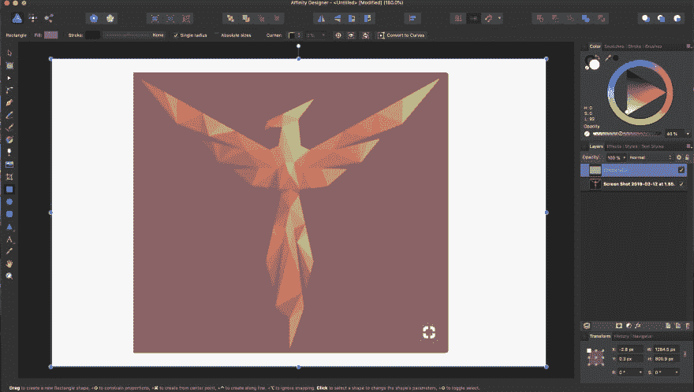
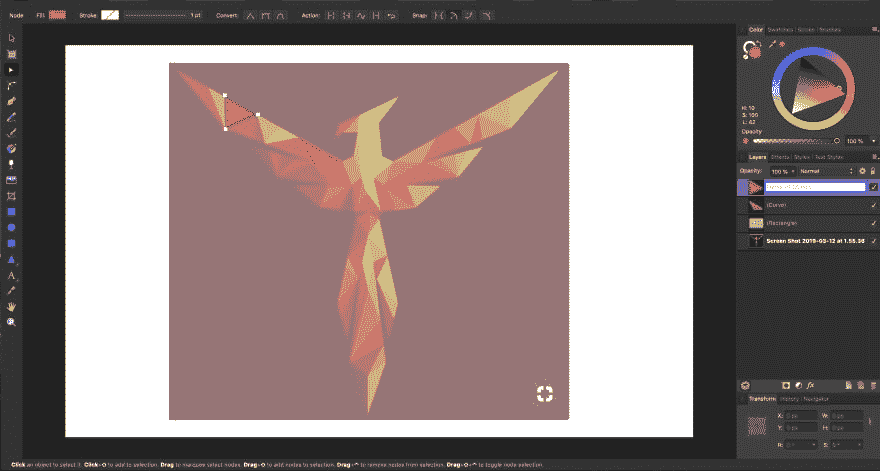
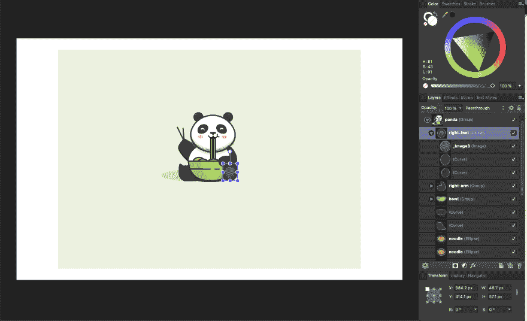
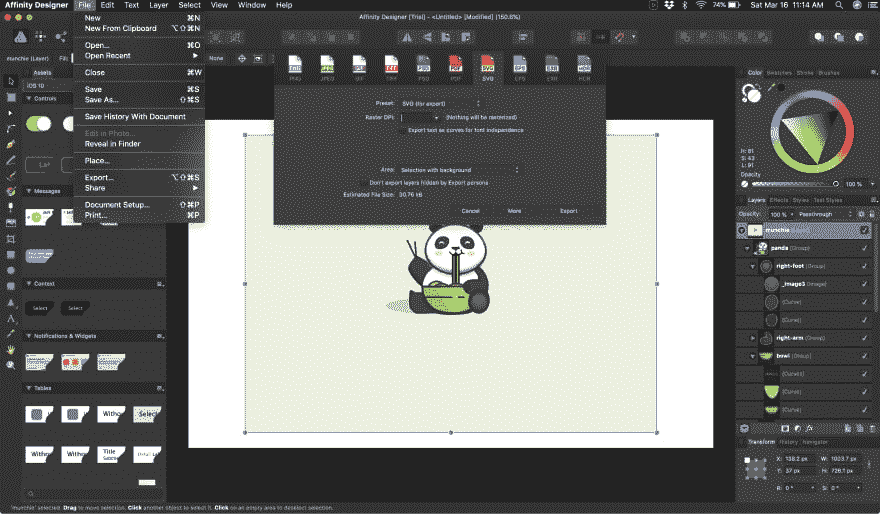
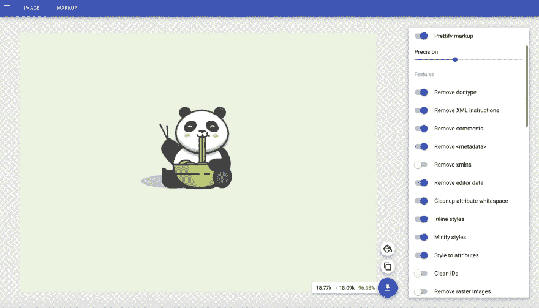

# 寻找灵感并创建 SVG

> 原文：<https://dev.to/coffeecraftcode/finding-inspiration-and-creating-svg-3m7b>

制作 SVG 动画的第一步是弄清楚你想要制作什么动画。这似乎是显而易见的，但我总是被问及我是从哪里想出动画创意的，以及我是如何创建我所使用的 SVG 的。因此，我将稍微分解一下我的流程。

## 灵感

如果我想要一个制作动画的想法，我会去几个地方看看:
[【CodePen Challenges:](https://codepen.io/challenges/)
这些是每周的提示，给你一个制作动画的起点。

[Dribbble:](https://dribbble.com/)
运球上有很多令人惊艳的设计。有些甚至是动画的，如果你想试着再现它们的话。当你从网上重新创作时，一定要相信原艺术家！

这可能看起来很傻，但我在 Pinterest 上找到了各种各样的灵感。我在 CodePen 上最受欢迎的一支笔来自我在 Pinterest 上找到的灵感。
[原图](https://www.pinterest.com/pin/860257966295464614/)
和我的动画
[https://codepen.io/cgorton/embed/BYKLQd?height=600&default-tab=result&embed-version=2](https://codepen.io/cgorton/embed/BYKLQd?height=600&default-tab=result&embed-version=2)

## 创建您的 SVG

一旦你找到了灵感，是时候制作你的 SVG 了。创建和导出 SVG 有许多不同的程序。我用的最多的是亲和设计师。这也适用于 Adobe Illustrator、InkScape 或任何其他具有基本形状工具和钢笔工具的程序。

我做的第一件事是抓取我试图创造的任何东西的图像。在我的 Mac 电脑上，我通常会对图片进行截图，然后放入 Affinity Designer 中。我在图片上添加了一层(这将有助于确定我的 svg 的大小。viewbox)并设置它的不透明度，这样我仍然可以看到下面的图像。你可以在这里阅读更多关于 SVG 视图框的信息

这就是钢笔工具成为你最好的朋友的地方。创建一个 SVG 就像用钢笔工具在图像上“描摹”一样简单。
 
我在图像上描出不同的路径，然后用拾色器填充颜色。

如果你想要一个更详细的解释，这是一个很好的教程，我在 YouTube 上学会了做这个。

对于 phoenix 示例，我没有命名我创建的任何路径。但是对于其他的 SVG，我通常会命名任何我想要制作动画的路径。因此，如果 SVG 有一只手臂或眼睛，我会在编辑器中给每个元素一个唯一的 ID。我也分组路径。在这个例子中，我给了脚一个唯一的 ID，并将脚的各个路径组合在一起。当我导出 SVG 时，这些 ID 和组将在代码中导出。
 
如果你看我的动画，你可以看到整个右脚一起运动。在我的下一篇文章中，我们将会更多地讨论如何制作群组和个人路径的动画。现在只需要知道在编辑器中把路径分组在一起并给它们 ID 可以使制作 SVG 动画更加容易。
[https://codepen.io/cgorton/embed/jQBoyo?height=600&default-tab=result&embed-version=2](https://codepen.io/cgorton/embed/jQBoyo?height=600&default-tab=result&embed-version=2)

## 导出并优化

开始制作动画前的最后一步是导出和优化。我导出为 SVG。在 Affinity Designer 中，这非常简单。我选择整个图像，然后去文件，点击导出。我选择导出为带背景的 SVG(这有助于有一个更大的视图框来制作动画。)
[T3】](https://res.cloudinary.com/practicaldev/image/fetch/s--H7WtaB2a--/c_limit%2Cf_auto%2Cfl_progressive%2Cq_auto%2Cw_880/https://thepracticaldev.s3.amazonaws.com/i/4p4qe9xgsejkgxqlewfk.png)

导出后，我抓取了所有的 SVG 代码，并将其放入[SVGOMG](https://jakearchibald.github.io/svgomg/)

中。我喜欢使用 SVG OMG，因为我喜欢在切换不同设置时能够看到我的 SVG 的样子。SVGOMG 里有很多 toggles。我确定我打开的一个特性是美化标记。当你制作动画时，这使得阅读你的代码更加容易。我一定要关掉干净的身份证。这将删除我添加到我的动画组中的所有 id。

下载优化后的 SVG 后，你就可以制作动画了！在我的下一篇文章中，我将向你展示如何开始用 GreenSock 制作 SVG 动画。