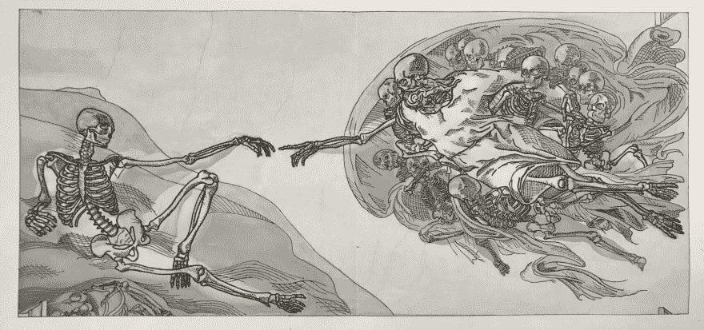
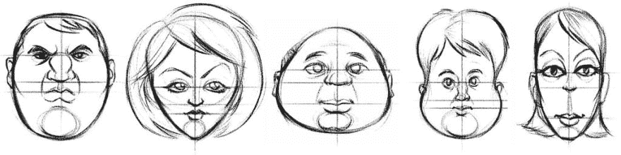
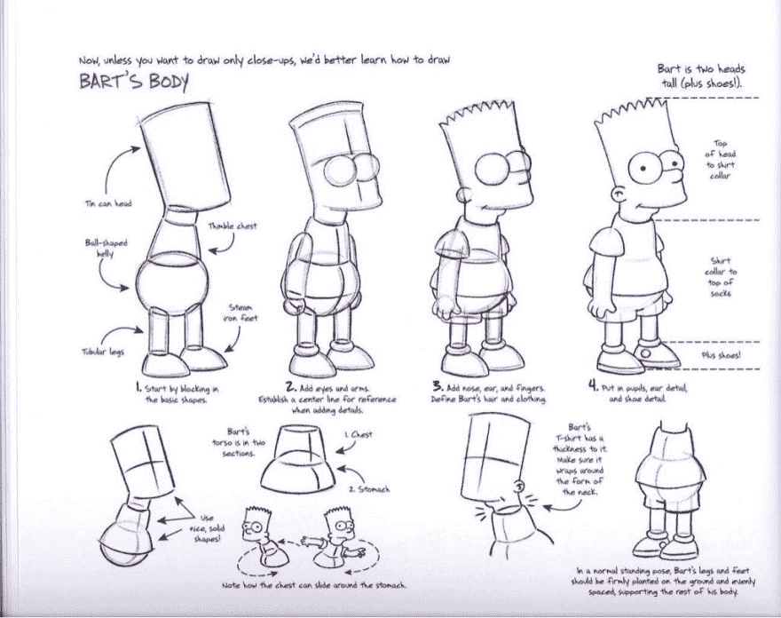
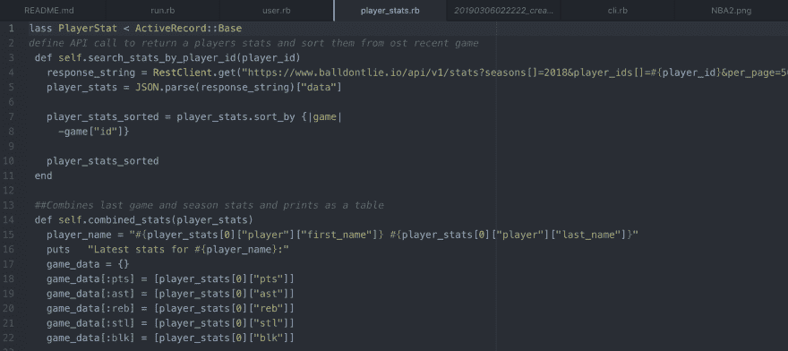

# 在代码中寻找艺术

> 原文：<https://dev.to/mshin1995/finding-the-art-in-code-243i>

[](https://res.cloudinary.com/practicaldev/image/fetch/s--wRq5GvY4--/c_limit%2Cf_auto%2Cfl_progressive%2Cq_auto%2Cw_880/https://thepracticaldev.s3.amazonaws.com/i/1rnl3n35usnienq4xc75.jpg)

首先，我想简单介绍一下我是谁。我叫马修·申，住在华盛顿州西雅图市。我刚刚从华盛顿大学毕业，目前是熨斗学校软件工程专业的学生。

在我的第一篇博文中，我想写一写我作为一个有艺术背景的人学习编码的经历。当我大学毕业拿到素描和绘画学位的时候，和很多处于我这个位置的人一样，我真的不知道我的职业生涯该何去何从。在对自己和家人进行了一番深思之后，我决定现在还不是从事艺术事业的合适时机。虽然做这个决定很难，但我对接下来的事情很乐观。

这是我开始编码之旅的地方。我的几个朋友建议学习它，所以我决定尝试一下。老实说，一开始我非常怀疑。大多数人永远不会把编码和绘画联系在一起，包括我自己。对我来说，开始学习一些全新的东西不仅是一种威胁，而且我最初关于不能应用和利用我已经掌握的知识的想法也成为了额外压力的来源。然而，在我开始在 Flatiron 工作并每天接触编码后，我意识到编码和绘画在许多方面其实是相似的。

我爱上艺术的一个原因是，做一件事有很多方法。以画一张脸的任务为例。一个人可以从眼睛开始，而另一个人可以从头部开始，但在这种情况下，最终产品总是一张脸；不管它们看起来有多不同。有些人可能会争辩说，有一个“正确”的方法来画一张脸，但最终，艺术家是一个控制他们想出一个解决方案的人。

[](https://res.cloudinary.com/practicaldev/image/fetch/s--gbCWqwI8--/c_limit%2Cf_auto%2Cfl_progressive%2Cq_auto%2Cw_880/https://thepracticaldev.s3.amazonaws.com/i/zgk1jhum61ny1tzlvq8j.jpg)

在用各种方法解决特定问题这方面，编码是相似的。两个人可能被赋予创建一个做完全相同事情的应用程序的任务，但是他们的代码可能(很可能)看起来完全不同。

```
array = [1, 2, 3]

def square(array)
  new_array = []
  array.each do |x|
    new array << (x ** 2)
  end
  new_array
end

def square(array)
  array.map do |x|
    x ** 2
  end 
end 
```

上面的 Ruby 代码只是一种非常简单明了的方式来说明一个人可以用不同的代码行完成相同的任务。在这个例子中，有两个方法接受一个数组的参数，编写方式不同，但都是对数组中的每个数字求平方并返回它们。

意识到我仍然能够在编码的同时通过以我自己的方式自由地解决问题来锻炼我的创造力，这无疑把我引入了创作艺术的道路。当我开始从事需要更多批判性思维和解决问题的实验室/项目时，编码能够激发创造力变得更加明显。

我发现编码和绘画之间的另一个有趣的相似之处是实际创造东西背后的整个过程。我在 Flatiron 的第一个大项目中发现了这种联系，这个项目是用 Ruby 开发一个命令行数据库应用程序。(我不会深入这个特定的项目，但如果有兴趣了解它是什么，请随时访问[https://github . com/njenga-Kari uki/module-one-final-project-guidelines-Seattle-web-career-021819](https://github.com/njenga-kariuki/module-one-final-project-guidelines-seattle-web-career-021819)。)

当我考虑开始一个新项目时，我的一位大学艺术导师给我的一条建议是，将艺术品视为较小形状和形式的积累。你不会马上就画出一幅杰作，而是慢慢积累起来。这些更小的东西创造了基础，并最终聚集在一起产生最终的结果。形象化这一点的一个简单方法是通过《辛普森一家》中的人物。

[](https://res.cloudinary.com/practicaldev/image/fetch/s--rr2RmBc1--/c_limit%2Cf_auto%2Cfl_progressive%2Cq_auto%2Cw_880/https://thepracticaldev.s3.amazonaws.com/i/hrh0o1wc8hvqqg3jrzqg.jpg)

看上面的图像，单个的形状首先被画出来，然后放在一起，创造出我们所看到的巴特·辛普森。

创建命令行应用程序的过程与我画一幅画的步骤非常相似。就像在空白画布上开始一幅新画一样，这个项目从一个没有任何代码行的文本编辑器开始。从一个想法的概念化开始，到用一行行代码慢慢构建程序，我开始将编码视为一种艺术形式。对我个人来说，我也认为当代码行呈现在你面前时，它有一种美感。

[](https://res.cloudinary.com/practicaldev/image/fetch/s--B_gOzS66--/c_limit%2Cf_auto%2Cfl_progressive%2Cq_auto%2Cw_880/https://thepracticaldev.s3.amazonaws.com/i/ax9hh2wfxeq5k620aac1.png)

如果让我把编写程序比作绘画，每一行代码都像是一笔一划的画。由这些代码行组成的单个文件就像由这些笔画或线条创建的形状和形式。然后，所有的文件组合在一起创建整个程序，就像绘画中的形状和形式一样。当该说的都说了，该做的都做了，你从完成一个花了几个小时的编码项目中获得的满足感和你完成一幅画时的完全一样。