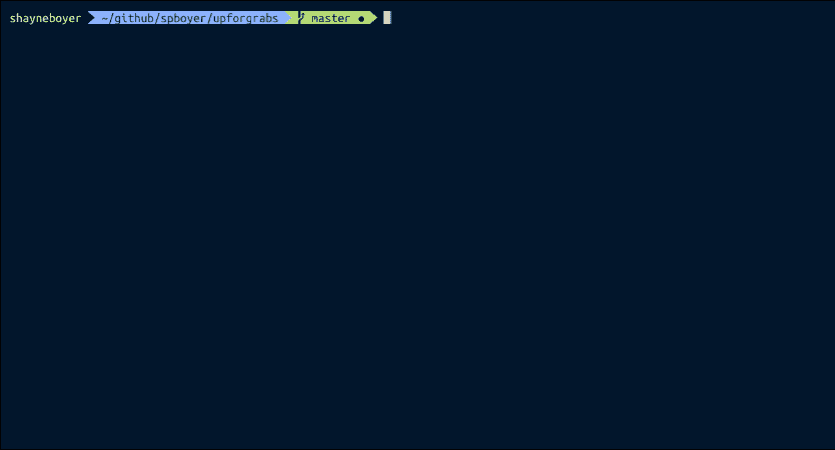

# 寻找你的下一个。使用命令行的. NET 开源项目

> 原文：<https://dev.to/spboyer/finding-your-next-net-open-source-project-using-the-command-line-38io>

[](https://res.cloudinary.com/practicaldev/image/fetch/s--TDoCcQAt--/c_limit%2Cf_auto%2Cfl_progressive%2Cq_auto%2Cw_880/http://tattoocoder.com/conteimg/2018/12/pablo--8-.png)

很多年前，我想投入到一个开源项目中，但是不知道从哪里开始。我曾使用 node.js。NET 和其他一些基于网络的技术，但不知道从哪里开始，GitHub 对我来说是新的。具有讽刺意味的是，我落到了 Omnisharp 和。NET Core `yo aspnet`项目通过我那年的微软 MVP 峰会。

在浏览 Twitter 的时候，我看到了一个朋友 Tierny ( [@bitandbang](https://twitter.com/bitandbang) )的公告，他为 node.js 项目启动了一个 CLI 工具，名为“ [good-first-issue](https://github.com/bnb/good-first-issue) ”，为提交到他的工具的项目寻找随机的 GitHub 问题。

有大量的开源项目在低门槛的问题上寻求帮助。这些问题通常被贴上**先发制人**、**待价而沽**、**求助**等标签。找到他们可能很难，https://up-for-grabs.net 是一个好的开始。

### up-for-grabs.net

站点上目前有超过 700 个项目[。来自 C++、Java、TypeScript、Ruby、Django、go 等的一切都可以在过滤器中找到。](https://up-for-grabs.net)

如果你有一个项目，正在寻求帮助，请通过他们的 GitHub-[https://github.com/up-for-grabs/up-for-grabs.net](https://github.com/up-for-grabs/up-for-grabs.net)提交你自己的项目。甚至还有一个约曼生成器来使 yaml 正确- `yo up-for-grabs`。

### upforgrabs -。净项目

[](https://res.cloudinary.com/practicaldev/image/fetch/s--_Zuqqbdo--/c_limit%2Cf_auto%2Cfl_progressive%2Cq_66%2Cw_880/https://thepracticaldev.s3.amazonaws.com/i/e4z042533acftn8dawvn.gif)

作为一名. NET 开发人员，我想创造一些像 Tierny 一样的东西，所以我选择了[全球工具](https://docs.microsoft.com/dotnet/core/tools/global-tools-how-to-create?WT.mc_id=-devto-shboyer)路线。

使用最新的[。NET Core 2.2 SDK](http://dot.net/download) ，创建了 **upforgrabs** 。

**现在安装**`dotnet tool install -g upforgrabs`

T5】https://github.com/spboyer/upforgrabs

数据的来源实际上是来自[https://up-for-grabs.net](https://up-for-grabs.net)的同一个项目列表，它被专门过滤到。NET 类型的项目。

### 获取数据

站点的每个项目都存储在一个 yaml 文件中，位于`up-for-grabs.net/_data/projects/`下。然而，消费 700 左右的 yaml 文件，过滤等。从控制台应用程序的每一个调用不是很有效。

解决方案，Docker 和 [Azure 容器实例](https://docs.microsoft.com/azure/container-instances/container-instances-overview?WT.mc_id=-devto-shboyer)。这里我使用了一个. NET 核心 Alpine Linux 容器并安装了 Subversion。

为什么要颠覆？GitHub 无法从存储库中获取特定的文件夹。我使用 Subversion 下载了`/projects`文件夹来处理所有的文件。

```
# install subversion for alpine
RUN apk --no-cache add subversion  
# download the data for projects
RUN svn export https://github.com/up-for-grabs/up-for-grabs.net/trunk/_data/projects data 
```

一旦使用 Newtonsoft 下载了 yaml。JSON，它们被组合并转换成一个单独的 **project.json** 文件。

```
var files = from file in Directory.EnumerateFiles(@"data", "*.yml", SearchOption.AllDirectories)  
                  select new
                  {
                    File = file,
                    Lines = File.ReadAllText(file)
                  };

      Console.WriteLine("Processing files...");
      foreach (var f in files)
      {
        //Console.WriteLine("Processing " + f.File);
        try
        {
          var deserializer = new Deserializer();
          var content = new StringReader(f.Lines);
          var yamlObject = deserializer.Deserialize<Project>(content);

          result.Add(yamlObject);
        }
        catch (Exception ex)
        {
          errors.Add(new Error() { name = f.File, info = ex.Message, exception = ex.Source });
          continue;
        }
      }

      JsonSerializer serializer = new JsonSerializer();
      using (StreamWriter sw = new StreamWriter(outputPath))
      using (JsonWriter writer = new JsonTextWriter(sw))
      {
        serializer.Serialize(writer, result);
      }

      PostFile(outputPath).Wait();
    } 
```

**PostFile()** 使用 [Azure SDK](https://docs.microsoft.com/azure/storage/blobs/storage-quickstart-blobs-dotnet?tabs=linux&WT.mc_id=-devto-shboyer) 将最终文件写入 Azure CDN。

> 参见我之前的一篇关于使用一个 [Azure CDN 和无服务器](https://tattoocoder.com/use-serverless-functions-and-cdn-to-speed-up-api-data-calls/)来加速 API 调用的文章。

```
private static async Task PostFile(string file)  
    {
      CloudStorageAccount storageAccount;
      CloudBlobContainer cloudBlobContainer;

      string storageConnectionString = Environment.GetEnvironmentVariable("storageconnectionstring");
      if (CloudStorageAccount.TryParse(storageConnectionString, out storageAccount))
      {
        try
        {
          // Create the CloudBlobClient that represents the Blob storage endpoint for the storage account.
          Console.WriteLine("Checking for/creating blob container");
          CloudBlobClient cloudBlobClient = storageAccount.CreateCloudBlobClient();
          cloudBlobContainer = cloudBlobClient.GetContainerReference("up-for-grabs");
          await cloudBlobContainer.CreateIfNotExistsAsync();

          // Set the permissions so the blobs are public.
          BlobContainerPermissions permissions = new BlobContainerPermissions
          {
            PublicAccess = BlobContainerPublicAccessType.Blob
          };
          await cloudBlobContainer.SetPermissionsAsync(permissions);

          Console.WriteLine("Pushing to CDN");
          CloudBlockBlob cloudBlockBlob = cloudBlobContainer.GetBlockBlobReference("projects.json");
          cloudBlockBlob.Properties.ContentType = "application/json";

          await cloudBlockBlob.UploadFromFileAsync(file);

        }
        catch (StorageException ex)
        {
          Console.WriteLine("Error returned from the service: {0}", ex.Message);
        }
        finally
        {
          Console.WriteLine("Process complete.");
        }
      }
    }
  } 
```

### 用天蓝色 DevOps 保鲜

为了让 **project.json** 保持最新，我使用 [Azure Devops](https://docs.microsoft.com/azure/devops/pipelines/languages/dotnet-core?view=vsts&tabs=yaml&WT.mc_id=-devto-shboyer) 和容器实例建立了一个预定的构建。

*   每夜运行
*   构建容器，获取新的 YAML 数据
*   推送至 Azure 容器注册表
*   在容器实例中运行容器，将 json 文件推送到 CDN
*   销毁容器实例，只确保运行时计费。

这里是建立管道 YAML

```
resources:  
- repo: self
queue:  
  name: Hosted Ubuntu 1604
steps:  
- task: Docker@1
  displayName: 'Build Docker Image'
  inputs:
    azureSubscriptionEndpoint: 'shboyer (5ca082f3-***)'
    azureContainerRegistry: shayne.azurecr.io
    arguments: '--no-cache'
    imageName: 'up-for-grabs-feed:$(Build.BuildId)'
    includeLatestTag: true

- task: Docker@1
  displayName: 'Push to ACR'
  inputs:
    azureSubscriptionEndpoint: 'shboyer (5ca082f3-***)'
    azureContainerRegistry: shayne.azurecr.io
    command: 'Push an image'
    imageName: 'up-for-grabs-feed:$(Build.BuildId)' 
```

成功构建后，将执行发布管道。这是 ACI 容器的启动/销毁。

```
az container create \  
    --resource-group up-for-grabs \
    --name firsttimersfeed \
    --image $(acrLoginServer)/up-for-grabs-feed:$(Release.Artifacts._up-for-grabs-feed.BuildId) \
    --dns-name-label up-for-grabs-feed \
    --restart-policy OnFailure \
    --registry-login-server $(acrLoginServer) \
    --registry-username $(acrName) \
    --registry-password $(acrPassword) \
    -e 'storageconnectionstring'='$(storageconnectionstring)' 
```

容器的清理

```
az container delete -n firsttimersfeed -g up-for-grabs -y 
```

“feed 项目”的资源库可以在这里获得-[https://github.com/spboyer/up-for-grabs-feed](https://github.com/spboyer/up-for-grabs-feed)。

### 反馈

有 290 多个。当前列表中的. NET 开源项目。如果你正在寻找一个新的项目，这是一个简单的方法。

打开命令行，输入`upforgrabs`。

让我知道你的想法！

[](https://res.cloudinary.com/practicaldev/image/fetch/s--Q5GtHQR2--/c_limit%2Cf_auto%2Cfl_progressive%2Cq_auto%2Cw_880/http://feeds.feedburner.com/%257Er/Tattoocoder/%257E4/RR2J04RCbUg)