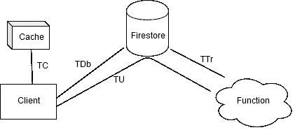
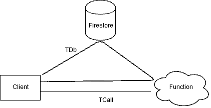

# Firestore 数据流图解和测量

> 原文：<https://dev.to/dbanisimov/firestore-dataflow-illustrated-and-measured-4kdg>

Firestore 不仅仅是一个托管的 DBaaS，它还具有实时更新支持、客户端缓存、离线持久化和后台触发的云功能。所有这些都可以用来创建具有复杂数据流的非常动态和可伸缩的应用程序，而不会有管理基础架构的麻烦。

但是，所有这些部分是如何组合在一起的，它们如何用于实现不同的用户体验呢？在这篇博文中，我展示了我对典型应用程序数据流的看法，并进行了一些测试。

没时间看书？在这里玩互动版: [Firestore 数据流测试](https://firestore-dataflow-test.firebaseapp.com/)

# 典型的 Firestore app 数据流

对于这一部分，我假设我们正在构建一个应用程序(web 或移动),通过官方 SDK 直接使用 Firestore，并启用本地缓存。我们的应用程序可能还希望对 Firestore 文档执行一些后台数据处理，并将结果写回到 Firestore 以显示在客户端上。所有的通信都是实时的，这意味着我们在客户端使用快照监听器，在功能上使用 Firestore 触发器。

> 一个例子可能是一个聊天应用程序，我们在后台获取链接预览。

看看这个图表，阅读下面的描述

### TC ~15ms
<small>从客户端写入到客户端从缓存读取</small>

最短的数据流路径是通过本地缓存。客户端写入的数据保存在缓存中，并立即触发快照侦听器。

如果您依赖本地缓存来提供乐观的 UI 更新，那么您应该关心这个数据路径。

### TDb ~200ms
<small>从客户端写入到客户端从数据库读取</small>

默认路径是从客户端到数据库后端。所有的写操作最终都会到达那里，产生最终的文档结果，并流回到客户端和所有其他侦听受影响查询的客户端。这种路径性能依赖于客户端网络连接的质量。

这是客户端到客户端实时通信的数据路径。它也是用于事务的，因为那些事务需要提交到后端。

### TTr ~400ms
<small>从 firestore 写至 firestore 更新用触发函数</small>

一旦数据被写入 Firestore，就会触发后台功能。这条路径受到冷启动时间以及您的职能部门和 Firestore 的区域位置的严重影响。

如果您正在响应文档创建或更新而进行数据更改，则此路径非常重要。

### TU ~600ms
<small>从客户端写入到客户端读取用触发函数</small>更新的数据

最后，您更新的数据需要返回到客户端。从技术上讲，它是侦听文档更新的同一个快照。对于用户体验来说，这是最长的路径。

尽管路径很长，但进行后台数据处理可能是一个不错的选择。

## 具有可调用功能的特例

有时，直接与 Firestore 对话并不是一个选项——该操作的计算量太大，或者需要访问一些敏感数据，或者需要复杂的验证，而安全规则无法做到这一点。一种常见的方法是将逻辑从客户端移动到可调用的函数中。这种情况的明显缺点是，您失去了离线功能和缓存，并且需要单独实现乐观 UI。

让我们来看看这个特例

### 从客户端请求到收到响应的 TCall～200 ms
<small></small>

 <small>直接路径是一个可调用的云函数请求。响应可以是任何内容，但是最好包括正在写入数据库的文档，这样它就可以用于客户机上的乐观更新。该路径受到冷启动时间和网络延迟的严重影响。

### 从客户端请求到客户端从数据库读取的 TDb ~ 250 ms
<small></small>

 <small>通过 Firestore 的间接途径。由该功能写入 Firestore 的数据可以在客户端和监听受影响查询的其他客户端上读回。这是获取结果的最简单方法，因为您不需要单独处理可调用函数响应。

## 测量路径长度

上面的时间是我测量的结果，这里展示的是不同路径的相对长度。他们是乐观的一方，特别是如果你考虑冷启动时间和靠近谷歌云数据中心的因素。所有时间都用于往返数据路径。

我编写了一个简单的基于 web 的测试平台来获取这些数字:

> github[dbanisimov/firestore-data flow-test](https://github.com/dbanisimov/firestore-dataflow-test)

我鼓励您克隆代码并部署您自己的项目，以查看您的案例中的性能。您的地理位置以及 Firestore 和云功能的区域将会显著改变这些数字。它还非常生动地显示了冷启动延迟、首次与 Firestore 建立连接的时间以及其他一些工件。它使用 HTM + Preact(看马，没有建立！)用于 web 客户端。

请随意使用测试平台的现场版本:

> [Firestore 数据流测试](https://firestore-dataflow-test.firebaseapp.com/)

Firestore 和 Functions 都在美国中部。

## 结论

当然，上面的两种情况并没有涵盖所有可能的数据流原语组合。通过包含 PubSub 和云存储，可以构建更复杂的系统，因为它们都与云功能很好地集成在一起。在构建整个系统之前，绘制一些高水平的图片并进行实验，可能会避免以后的一些惊喜。

快乐流淌！:)</small></small>