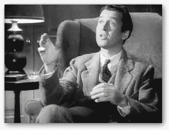

# 花生头等舱

> 原文：<https://dev.to/walkingriver/first-class-for-peanuts-8ka>

许多年前，我在一次商务旅行中，发现自己在亚特兰大哈兹菲尔德-杰克逊国际机场一个特别拥挤的航站楼里。东海岸上下的雷雨阻塞了整个东海岸的空中交通。大多数航班延误，许多航班被取消。你可以想象，人们的心情不是很好。对我来说，这变成了善良和人性的一课。

> 在这个世界上，你一定很聪明，或者很讨人喜欢。好吧，多年来我很聪明。我推荐普莱森特。你可以引用我的话。
> *——埃尔伍德·p·多德，[哈维，1950](https://www.imdb.com/title/tt0042546/)*

我刚从德克萨斯州到达，要赶去新罕布什尔州的联运航班。第一回合平安无事，但也不舒服。我的背痛，我需要在下一趟航班之前找到一些止痛药。我一到门口就知道情况不妙，看到了一群群不开心的旅行者。

和检票员说话的队伍比我很久以来看到的都长，但我还是进去了。登机口离机场的许多商店有一段距离，我想确保在登机前有足够的时间找到一些阿司匹林或其他东西。

正如我在排队时经常做的那样，我密切关注着我前面的人，看他们如何与登机口代理人互动，反之亦然。在与某人交谈之前，了解他的举止是有好处的。我看到的并不乐观。我前面的每个人似乎变得越来越好战，导致大门代理人变得越来越慌张。

就在我前面的“绅士”是最糟糕的。他斥责了那个可怜的门卫，一个 20 出头的年轻女人。他对她提出了许多不合理的要求，好像她能为暴风雨或飞行做些什么。她很冷静，很有耐心，面对一个显然试图尽可能制造威胁的人，她表现出了惊人的镇定。当她平静地解释说她已经无能为力时，他更加生气了。最后，他走开了，嘴里嘟囔着再也不要坐那家航空公司的飞机了。我暗自耸耸肩，心想没有他，航空公司会更好。

最后，轮到我了，至少我是这样认为的。另一名男子从桌子后面走近门卫，我很快意识到他是她的主管。她让我给她一点时间，而他们两人聊天，我点头表示理解。虽然没有试图听他们的谈话，但他们也没有阻止。她平静地向他解释说，她已经一个人在服务台站了六个多小时，没有休息过，处理了无数心烦意乱的乘客。她从早餐开始就没吃过东西(现在天已经黑了)，接替她的人也迟到了。她的主管似乎同情她的困境，尽管我注意到他没有亲自提供帮助。他说他要去找人来接替她，让她在岗位上多呆一会儿，然后就走开了。

最后，年轻的登机口工作人员转向我，试图微笑，深呼吸，并问她如何能帮助我。我微笑着回答说:“嗯，我来这里是希望得到航班的最新消息，但我想我已经知道答案了。”她笑得更灿烂了一点，同意她没有好消息。

我告诉她，我无意中听到她和她主管的对话，我也许能为她做点什么。我来到服务台，只是想问一下航班的情况，以及哪里能买到治腰痛的药，但她的情况似乎比我更糟。我从之前的航班上拿了一袋什锦坚果给她。我说，“这不多，但是蛋白质可能会有帮助，直到你能吃一顿真正的饭。”然后我对她说:“我一个人旅行，没有托运任何行李。如果我在这个航班上的座位可以帮助一个家庭今晚回家，就让他们拥有它。”她说他们此时不找人，但记下了我的名字(和那袋什锦坚果)，谢了我，然后带走了下一个被激怒的顾客。我走开去找止痛药，庆幸自己是别人糟糕的一天中的一个小亮点。

没过多久，我在门口的扩音器里听到了我的名字。"乘客迈克尔·卡拉汉请到服务台来好吗？"当我到达时，我遇到了同一个登机口代理人，他似乎心情好多了。她问我是否还愿意在飞机上让座，即使这意味着明天才能到家。我询问细节，结果是:

*   一天晚上，在当地的一家旅馆
*   两张餐券，晚餐和早餐
*   早上第一班飞机的头等舱座位
*   一张 200 美元的未来航班代金券

我打电话回家，告诉家人我会在明天午餐时间去看他们。我坐班车去了酒店，只有几分钟的路程。我享受了一顿轻松的晚餐，一夜好眠，免费早餐，以及第二天早上极其舒适的飞行。风暴已经转移到海上，这次旅行再好不过了。

不像我前面那个愤怒的家伙，我继续尽可能频繁地乘坐这家航空公司的航班。我有时想知道他对门卫大喊大叫会得到什么。我想我知道答案。

如果你从这篇文章中得到的信息是，“试图贿赂登机口代理人以获得航班升级”，我恭敬地建议你忽略了这一点。请再读一遍。尽管这是本案的结果，但并不总是如此。

一个更准确的信息是，你不会差到哪里去。以礼貌、礼貌和仁慈的态度对待他人。不管任何特定互动的结果如何，效果都会随着时间的推移而累积。你会自我感觉更好，善良和礼貌会成为一种习惯，你会成为一个别人想在身边的人。有一天，当你需要帮助时，你可能会发现自己接受了别人的好意来帮助你度过自己的困难。

在我目前的工作中，除了安全，我们重视对客人和员工的礼貌。虽然这件事发生在我做这份工作的很多年前，但当我思考我的行为和态度如何影响我周围的人时，我喜欢回想这件事。有时候我会忘记，这个故事提醒我要提升自己与人的互动，尤其是在糟糕的一天。

* * *

*什锦坚果图片由[pixabay.com](https://pixabay.com/photos/nuts-mixed-nuts-food-assorted-1436875/)T3】提供*

交叉发布自 [WalkingRiver 博客](https://walkingriver.com/first-class-for-peanuts/)