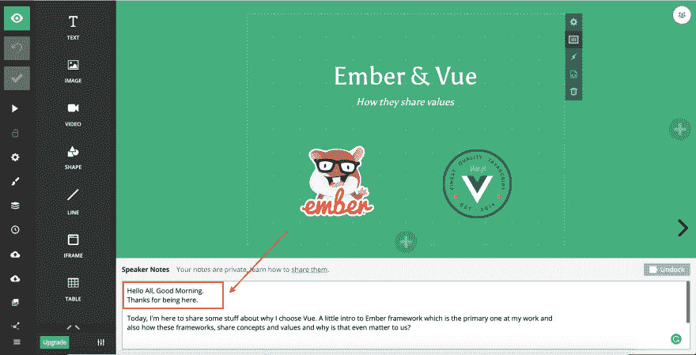

# 第一次发言(FTS)，没有什么建议

> 原文：<https://dev.to/gokatz/first-time-speaker-fts-with-few-tips-45po>

*封面人物[埃德温·安德拉德](https://unsplash.com/@theunsteady5)来自[https://unsplash.com](https://unsplash.com)T5】*

FTS:第一次发言。我做的假缩写😉

## 它是如何开始的

我可以肯定地说自己是一个内向的人😑我真的很难(或者我可以说，不可能)在一群新人中发起对话，即使是今天。我想为此做点什么，把自己推出舒适区。

所以，我决定申请当地的技术聚会。在搜索时，我发现了专注于 Vue 框架的 [AwesomeConf](http://awesomeconf.dev) 。主题是**“没有人是被动的参与者”**，意思是每个人至少要讲 5 分钟左右。我真的很喜欢，因为主题似乎迫使我说话😜。所以，我申请了这个会议。几天后，我收到主办方发来的一条我的题目被选中要呈现的 DM。

## 耶！被选中的🕺哎哟！🥴精选

这是一种复杂的感觉。我真的很高兴我的提议被选中了🤩我开始对舞台、观众和实际上的一切感到焦虑🤯。在承诺之前，我真的想了很多。最后，我回答说，我很高兴在大会上发言。

## 准备时代

从那一刻起，我倒了很多(像一个 loooottt...)的时间来准备内容和幻灯片。最初，内容还可以，我进入了准备阶段。我的母语不是英语，我的语言不太流利，尤其是在公开演讲时。于是，我开始准备幻灯片笔记。我逐字写下了我打算说的每一句话(相信我，我甚至写下了问候和感谢的便条)。

<figure>

<figcaption>Snap from my original slide deck</figcaption>

</figure>

大约有 20 张幻灯片，我在会议前一周写完了所有的笔记。接下来是实际的口语练习。这是最艰难的部分😬。首先，我开始大声读出音符(把自己锁在房间里)来练习心流。我的一个朋友，Sivakumar 建议我用 QuickTime player 或任何类似的工具录下练习对话，然后再看一遍以寻求改进。其实对我帮助很大。我记录了大约 4 条轨迹，每一条都帮助我调整我的呈现流程。TBH，当我看录音时，我被我读出要点的方式吓坏了。这就像给我的老师背诵一首诗，一遍又一遍地重复很多单词，并且在短语之间使用了很多“啊嗯”的单词。如果我不做这个练习，我无法想象我的实际演讲会是什么样😆

在正式演讲的前几天，我和我的朋友西瓦库玛做了一个模拟演讲。他指出了设置和实际流程中一些非常有用的变化。我合并了大部分。那时，我的幻灯片状态良好。

## 一个旅行故事

在会议召开前，我必须从钦奈前往会议举办地班加罗尔。这本身就是另一个挑战。我不经常旅行。前往另一个城市(准确地说是州)参加这次会议真的就像离开了我的舒适区，尽管如此，说实话，我还是喜欢这次旅行。在会议前一天的晚上，我住在一家酒店，这是我之前预定的。由于这是我有生以来第一次尝试在 meetup/conf 上发言，那天晚上我无法入睡。排练了两次，组织了我的编辑。(是的，我决定做一个现场编码😜)，准备好我的 t 恤和牛仔裤，反复访问大会网站(只看到我的名字在演讲人名单里😃).看到我的名字是一种很棒的感觉😇

终于在凌晨 3 点上床睡觉，闹钟设定在早上 6:30。设法在早上 7 点醒来。又排练了一次，梳洗完毕，吃了早餐，准备在早上 8:30 退房。上午 9 点到达会场。

## 终于到了大厅

当我一进入会议厅，我就能意识到我的心跳加快了。设法在大厅中央选了一个座位。按照时间表，我是第二个发言人。所以，我决定再浏览一遍我的幻灯片。

但是，不幸的是(或者幸运的是)，那天早上第一位演讲者迟到了，一位组织者问我是否可以先开始。我毫不犹豫地接受了，直到现在我也不知道我是怎么做到的🙃

所以，**大会第一位发言人**！走上舞台，剩下的就像变魔术一样。尽管我不能说我的演讲是完美的，但我还是设法按时(20 分钟)完成了所有的幻灯片和编码部分。

整个 20 分钟是一次很棒的经历。这给了我申请未来聚会和会议的信心。它向我证明了我可以面对一群人，投射出一个我知道的想法。这是我工具箱中急需的工具。

我得到了今天第一个发言人的特权。我看了所有 15 场演讲(是的，一天 15 场)，没有任何心跳加速😛。正如我提到的，和陌生人交谈对我来说真的很难。但是，共同发言者真的很欢迎，他们自己发起了对话，我真的很喜欢这种聚会和会议。在一天结束的时候得到了一些真正的好朋友。

## 那么，发布会怎么样？良好的...

总的来说，整个体验非常棒，对我来说这真是 2019 年的一次**“AwesomeConf】。我要感谢组织者，[拉胡尔](https://dev.to/znck)和[斯瓦普尼尔](https://dev.to/swapagarwal)以及令人敬畏的赞助商， [Meesho](https://meesho.com/) 为我们提供了精彩的场地和美味的午餐😋**

***注:**如果有人想发言，而你没有这样做，因为你认为你是一个内向的人，不适合与一群新的人在一起，我敦促你们每个人都参加/在当地的聚会和会议上发言。你永远不会后悔你的选择，你一定会感谢我。*

## 来自 FTS 的提示:

正如我提到的，这些是我从第一次演讲的经历中以及从帮助我准备演讲的朋友那里得到的一些建议:

*   **尽快准备好幻灯片**。
*   练习你的演讲足够了。如果可能的话，**把它们录下来，再看一遍**。那肯定会在很多方面帮助你。
*   试着和你的朋友一起做模拟演示，收集反馈(同样，记录)
*   如果您计划进行现场编码会话，**预先设置 ide 和服务器**(如果有的话)。您不能让您的与会者等到服务器启动或您的 IDE 索引您的所有文件。
*   如果你使用的是网络浏览器，你很可能会使用，试着**保持你的浏览器整洁**没有太多的扩展或者花哨的主题，新的标签设置。这些事情可能会分散与会者的注意力。
*   准备并**使用代码片段更快地进行编码**。你不需要在与会者面前写下每一句话。
*   如果可能的话，**准备编码会议的 gif 或视频**。如果现场编码出了问题，我们还有 b 计划。
*   让**演示者在几种媒体**上做笔记:手机、硬拷贝、桌面等。
*   **会议当天吃早餐**。
*   **在会议日期前准备好您的住宿和旅行**(如有)。这将使你的注意力集中在演示上，避免不必要的最后一分钟的意外。像优步、OYO 这样的服务真的很有帮助。
*   在会议上拍了很多照片😉
*   最重要的是，试着**与出席者和演讲者**互动。在我看来，这是聚会和会议的核心部分之一。

感谢你通读我的经历。希望提示会有帮助。我很感激我的几个朋友对此比我更兴奋。再次感谢在这个短暂但有效的旅程中帮助过我的每一个人。

我演讲的实际标题是**[“Ember 和 Vue:他们如何分享价值观？”](https://slides.com/gokatz/ember-and-vue)** 并策划另一个有实际谈话内容的博客。所以，敬请关注。你可以在[这里](https://twitter.com/hashtag/AnAwesomeConf?f=image)找到所有在大会上拍的很酷的照片

你可以在推特上找到我，我的名字是 [_gokatz](https://twitter.com/_gokatz)