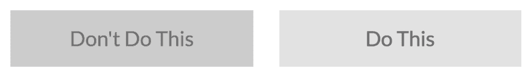

# 通过 5 个简单的步骤解决 85%的网页可访问性问题

> 原文：<https://dev.to/alvaromontoro/fix-85-of-your-web-accessibility-issues-in-5-easy-steps-pnf>

在之前的帖子中，我们看到了网页可访问性的重要性[，并提到了](https://dev.to/alvaromontoro/a-case-for-web-accessibility-d4i)[的 WebAIM Million](https://webaim.org/projects/million/) ，这是[的 WebAIM](https://webaim.org/) 对 100 万个热门页面的网页可访问性现状的分析。

结果是毁灭性的:每个被分析的主站点平均有近 60 个错误，而*干净*站点的百分比不到 3%。但是，也有好的一面:大多数错误都可以归为几类。在总共 5960 万个错误中，有 5210 万个是由五个容易预防的问题引起的:

*   3600 万是对比度不足的文本实例。
*   1230 万张图片没有替换文字。
*   [200 万是没有相应标签的输入](https://webaim.org/projects/million/#labels)。
*   [130 万是暧昧或空链接](https://webaim.org/projects/million/#links)。
*   [50 万为无序标题](https://webaim.org/projects/million/#headings)。

更正这五种问题类型可以修复大多数检测到的可访问性问题。

## 5 个简单的步骤

### 1。增加文本颜色对比度

根据 WebAIM 的报告，文本对比度差是最常见的错误。平均而言，所分析的主页包含 36 个文本与其背景之间对比度不足的问题。

[](https://res.cloudinary.com/practicaldev/image/fetch/s--tD7GmCOR--/c_limit%2Cf_auto%2Cfl_progressive%2Cq_auto%2Cw_880/https://thepracticaldev.s3.amazonaws.com/i/fup4n1sm04xzkpw3rskq.png) 

<figure>

<figcaption>有效和无效颜色对比的区别有时是微妙的。</figcaption>

</figure>

对我来说，这可能是最具限制性的要求(至少从创造性的角度来说)，因为很多次我发现一个有趣的调色板，但我最终放弃了，因为它不符合 <abbr title="Web Content Accessibility Guidelines">WCAG</abbr> 的规格。一种选择是遵循限制较少的 AA 级标准，因为[无论如何也不可能满足某些内容的所有 AAA 级成功标准](https://www.w3.org/TR/UNDERSTANDING-WCAG20/conformance.html#uc-conf-req1-head)。

WebAIM 有一个非常好的[工具来检查颜色对比度](https://webaim.org/resources/contrastchecker/)，你可以在网上找到许多其他工具。其实实现自己的真的很容易。这需要一些数学知识，但不需要什么特别的东西，这可能是一次很好的学习经历。例如，我[自己开发了一个对比度检查器](https://codepen.io/alvaromontoro/pen/YgpWZG)来测试 RGB 颜色，因为我在网上找到的所有检查器都只处理十六进制值。

### 2。给图像添加可选文本

给图片添加替代文本是网页可访问性的主要支柱和基本原则之一。然而，这是几乎每个网站中最常见的问题之一，即使图像中需要`alt`属性。

```
 
```

Enter fullscreen mode Exit fullscreen mode

虽然这看起来很简单，只需向``标签添加带有描述的`alt`属性，但是替代文本可能需要一点思考。形象的作用是什么？围绕它的文字是什么？我们可能不想忽略图像(添加一个`alt=""`)，也不想让屏幕阅读器重复两次相同的信息。

<figure>

|  | `alt="Guernica painting by Pablo Picasso"``alt="Guernica: a large oil painting by Spanish artist Pablo Picasso completed in June 1937"``alt=""` |

<figcaption>Any of the `alt` on the right could work for the image, it will depend on the context</figcaption>

</figure>

还有一点需要考虑:**如果图像被用作 <abbr title="call to action">CTA</abbr> ，`alt`应该是对要采取的动作**的描述，而不是对图像的描述！用户可能想知道图像是打印机，但他们真正想知道的是，如果他们点击它，文档会被打印出来。

### 3。标签表单元素

标签有许多好处，例如:(1)它们有助于识别和提供关于该领域的附加信息；(2)当点击时，它们将聚焦在链接的表单元素上；以及(3)它们是简单实现的。您只需要用一个`<label>`标签包装文本，并使用`for`属性指向元素的 id:

```
<label for="username">Username:</label>
<input id="username" type="text" name="user">
<label for="password">Password:</label>
<input id="password" type="password" name="pass"> 
```

Enter fullscreen mode Exit fullscreen mode

有时可能会有*种棘手的情况*，其中输入可能没有针对每个输入的特定标签(例如，包含允许编辑的行的表，或者应该应用于多个字段的标签)。在这些情况下，您可以使用属性`aria-labelledby`指向将作为标签的元素:

```
<table>
  <thead>
    <tr>
      <th id="namelabel">Name</th>
      <th id="addresslabel">Address</th>
      <th id="agelabel">Age</th>
    </tr>
  </thead>
  <tbody>
    <tr>
      <td><input aria-labelledby="namelabel" name="name" /></td>
      <td><input aria-labelledby="addresslabel" name="address" /></td>
      <td><input aria-labelledby="agelabel" name="age" /></td>
    </tr>
    ...
  </tbody>
</table> 
```

Enter fullscreen mode Exit fullscreen mode

如果您有一个包含表单元素(如输入字段或单选按钮)的表单或组件，不要忘记为不同的表单元素添加一个标签或添加一个`aria-labelledby`属性。

### 4。给链接添加意义

有多少次你发现一个网站或博客有文章的摘要和链接要求“阅读更多”？虽然这是对用户将要执行的动作的描述，但是它[并没有真正为链接](https://webaim.org/techniques/hypertext/link_text)提供实际意义。我们会读到更多关于大象、网络编程或脑外科手术的内容吗？了解更多关于什么的信息？

<figure>

| 不要做这些事情...
[阅读更多](https://codepen.io/alvaromontoro/post/a-case-for-web-accessibility) | 请做以下事情...
[阅读更多关于网页可访问性的信息](https://codepen.io/alvaromontoro/post/a-case-for-web-accessibility)
 |

<figcaption>One of these links provides actual information about the linked content</figcaption>

</figure>

现在有些人可能会说:“*但是有一个长的有意义的链接打破了我们网站的展示方式！只有“阅读更多”标题的空间！*“对他们来说还有一个选择:在你的链接中使用`aria-label`:

```
<a href="#" aria-label="Read more about Web Accessibility">
  Read more
</a> 
```

Enter fullscreen mode Exit fullscreen mode

[现代的屏幕阅读器将会阅读`aria-label`而不是锚文本](https://www.deque.com/blog/text-links-practices-screen-readers/)，所以你可以在提供有意义和可访问的文本的同时留下你的短链接标题。

### 5。正确组织内容

每一页的内容都应该[在语义上结构化，并且正确地组织](https://webaim.org/techniques/semanticstructure/)，有序地使用正确的标题。这听起来似乎很容易，但这确实是一个常见的错误:超过一半的被分析的主页都出现了这个问题。

屏幕阅读器允许用户从一个标题跳到另一个标题。对他们来说，一个组织不良的文档就像一本选择你自己的冒险书籍！这种混乱也让我们其他人以及网站爬虫感到困惑。

<figure>

| 

# Heading 1

### Heading 3

## Heading 2

#### Heading 4

 | 

# Heading 1

## Heading 2

### Heading 3

#### Heading 4

 |

<figcaption>Your document should be organized like the right column, never like the left one</figcaption>

</figure>

此外，不要忘记使用适当的语义标签；使用标题(`<h1>`、`<h2>`等)很重要。)而不是将其他元素设计成标题的样子。它们在视觉上可能是相似的，但并不是所有的用户都依赖他们的视觉。

## 结论

在 WebAIM 分析中发现的 87%的网页可访问性问题实际上是*易得之果*的错误，这看起来像是好消息，但我们需要有所保留地看待这些结果:被分析的页面只是主页，通常不包括受更复杂的可访问性问题影响的复杂组件。

此外，声称 85%的可访问性问题可以通过上面的 5 个步骤来解决有点言过其实。(很抱歉这个标题很吸引人。)尽管，实际的百分比很可能与现实相差不远([这将使旧的 80/20 法则在计算中得到验证](https://en.wikipedia.org/wiki/Pareto_principle#In_computing))。

要吸取的主要教训是**提高网页可访问性可能很有挑战性，但它并不像看起来那么复杂，**而且每一个改进，即使是最微小的改进，都很重要。