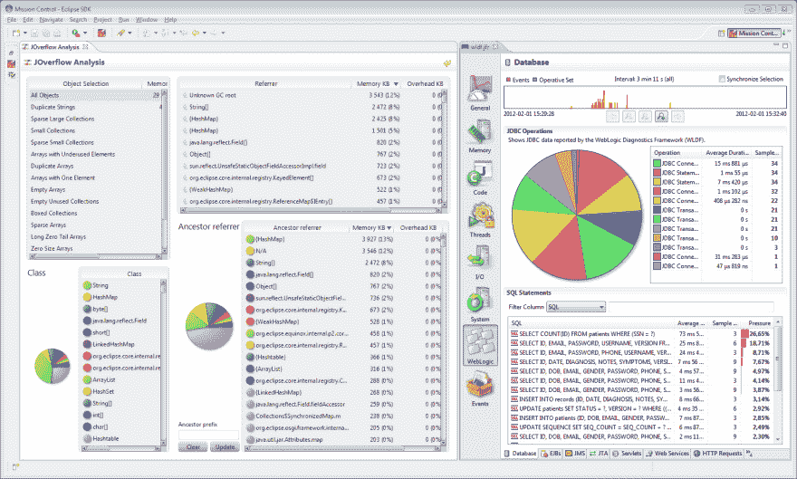

# 启用 jmx 的标志

> 原文：<https://dev.to/miranda/flags-to-enable-jmx-4oe6>

JMX 是 Java 世界的 x 射线，它允许您查看线程和内存快照，调试和跟踪应用程序中未优化的热点。JDK 附带了一个优秀的工具 Mission Control，它允许您连接到一个正在运行的 JVM 并从中收集见解。

[](https://res.cloudinary.com/practicaldev/image/fetch/s--nXeZsKd6--/c_limit%2Cf_auto%2Cfl_progressive%2Cq_auto%2Cw_880/https://thepracticaldev.s3.amazonaws.com/i/abuf0irfzk35zxe8w060.png)

要为这个连接配置 JVM，可以使用这些参数，例如在 JAVA_OPTS 中。

```
-Dcom.sun.management.jmxremote 
-Dcom.sun.management.jmxremote.authenticate=false 
-Dcom.sun.management.jmxremote.ssl=false 
-Dcom.sun.management.jmxremote.port=7199 
```