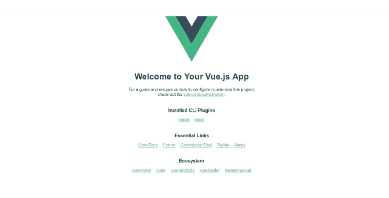

# Flask Vue.js 集成教程

> 原文：<https://dev.to/michaelbukachi/flask-vue-js-integration-tutorial-2g90>

本教程回答了这个问题，*“我如何将 Vue.js 与 Flask 集成？”*既然你正在阅读这篇教程，我假设你知道 **Flask** 是一个为快速 web 开发而构建的 Python 微框架。如果你不熟悉烧瓶，或者可能认为我要谈论热水瓶😜，那么我建议在继续本教程之前，在这里阅读一下[。](http://flask.pocoo.org/)

Vue.js 是一个用于构建用户界面的渐进式框架。如果你不熟悉它，你可以在这里了解它[。](https://vuejs.org/v2/guide/)

现在，您已经熟悉了 Flask 和 Vue.js，我们可以开始了。

## 烧瓶设置

让我们先安装几个依赖项:

```
pip install --user cookiecutter 
```

Cookiecutter 是一个非常棒的命令行工具，用于快速启动项目模板。我们正在使用 cookiecutter，这样我们就不会花太多时间来设置项目。记住，flask 不像 [Django](https://www.djangoproject.com/) 一样包含**电池**，所以相当多的工作必须放入项目的初始设置中。

现在您已经安装了 Cookiecutter，我们需要获取一个项目模板。对于本教程，我们只需要一个简单的 flask API。运行以下命令:

```
cookiecutter gh:mobidevke/cookiecutter-flask-api-starter 
```

您应该得到以下输出:

```
repo_name [api-starter]: flask-vuejs-tutorial
api_name [Api]: api
version [1.0.0]: 1.0.0 
```

应该创建一个名为 **flask-vuejs-tutorial** 的文件夹。导航到该文件夹，您应该会看到以下结构:

```
├── app
│   ├── config.py
│   ├── factory.py
│   ├── __init__.py
│   ├── models
│   │   ├── base.py
│   │   ├── database.py
│   │   ├── datastore.py
│   │   └── __init__.py
│   ├── resources
│   │   ├── example.py
│   │   └── __init__.py
│   └── utils.py
├── pytest.ini
├── README.md
├── requirements.txt
├── settings.py
├── tests
│   ├── conftest.py
│   ├── __init__.py
│   ├── test_app.py
│   ├── test_models.py
│   ├── test_resources.py
│   └── utils.py
├── unit-tests.sh
└── wsgi.py 
```

很美，不是吗😃？

在我们继续之前，我们需要设置一个虚拟环境。运行:

```
python -m venv venv 
```

现在，您可以使用您最喜欢的 IDE/文本编辑器打开项目文件夹。请记住在继续下一步之前激活虚拟环境。现在我们可以安装我们的依赖项了。运行:

```
pip install -r requirements.txt 
```

完成后打开`app/config.py`。您会注意到这个 API 模板使用了 postgres 数据库连接。如果您不介意的话，可以用必要的凭证设置一个 postgres db。否则，用下面几行代码替换该文件夹的内容:

```
import os

class Config:
    ERROR_404_HELP = False

    SECRET_KEY = os.getenv('APP_SECRET', 'secret key')

    SQLALCHEMY_DATABASE_URI = 'sqlite:///tutorial.db'
    SQLALCHEMY_TRACK_MODIFICATIONS = False

    DOC_USERNAME = 'api'
    DOC_PASSWORD = 'password'

class DevConfig(Config):
    DEBUG = True

class TestConfig(Config):
    SQLALCHEMY_DATABASE_URI = 'sqlite://'
    TESTING = True
    DEBUG = True

class ProdConfig(Config):
    DEBUG = False

config = {
    'development': DevConfig,
    'testing': TestConfig,
    'production': ProdConfig
} 
```

我们已经移除了所有 postgres 配置，转而支持 sqlite 配置。如果您想使用 postgres，请不要动`conf.py`文件。
我们现在需要导出我们的 flask 应用程序。跑:

```
export FLASK_APP=wsgi:app 
```

现在我们已经完成了 flask API 的设置，运行:

```
flask run 
```

然后打开[http://127 . 0 . 0 . 1:5000/example](http://127.0.0.1:5000/example)。您应该看到以下内容:

```
{"message":  "Success"} 
```

## vista . js 设置

现在我们的 API 已经准备好了，我们可以开始引导 vue 应用程序了。我们需要做的第一件事是安装 vue cli。运行:

```
npm install -g @vue/cli
# OR
yarn global add @vue/cli 
```

安装完成后，您可以使用以下命令检查您是否拥有正确的版本(3 . x):

```
vue --version 
```

在你的项目文件夹的根目录下运行:

```
vue create web 
```

我选择**默认(babel，eslint)** 作为预置，**纱**作为我的包管理器。如果您熟悉节点项目，您可以选择您喜欢的选项。如果没有，就按照本教程的默认设置。
现在导航到新创建的 **web** 文件夹并运行:

```
yarn serve
# OR
npm run serve 
```

如果你导航到 [http://localhost:8080/](http://localhost:8080/) ，你应该会看到一个**欢迎使用你的 Vue.js 应用**的文本。

现在我们准备开始集成。
[T3】](https://i.giphy.com/media/3o7buiQeyYFamzRoR2/giphy.gif)

在 web 文件夹中，创建一个名为`vue.config.js`的文件，粘贴以下内容:

```
const path = require('path');

module.exports = {
  assetsDir: '../static',
  baseUrl: '',
  publicPath: undefined,
  outputDir: path.resolve(__dirname, '../app/templates'),
  runtimeCompiler: undefined,
  productionSourceMap: undefined,
  parallel: undefined,
  css: undefined
}; 
```

**注意**如果您使用的是 Vue CLI 3.3 及以上版本，请使用`publicPath`而不是`baseUrl`。
这里，我们将为 vue cli 定义一些配置。
我们只对三个字段感兴趣: **assetsDir，baseUrl，outputDir** 。
让我们从输出目录开始。
这个文件夹保存了构建的 vue 文件的位置，也就是说，这个文件夹将保存`index.html`，它将加载 vue 应用程序。如果观察提供的路径，您会注意到该文件夹位于 flask 应用程序的`app`模块中。
`assetsDir`保存静态文件(css、js 等)的文件夹。**注意**它与`outputDir`字段中提供的值相关。
最后，`baseUrl`字段将保存`index.html`中静态文件的路径前缀。你可以查看这个来找到更多关于其他配置选项的信息。
现在运行:

```
yarn build
# OR
npm run build 
```

如果你打开`app`文件夹，你会注意到已经创建了两个新文件夹，`templates`和`static`。它们包含构建的 vue 文件。
现在在`app`文件夹下创建一个`views.py`文件，粘贴以下内容:

```
from flask import Blueprint, render_template, abort
from jinja2 import TemplateNotFound

sample_page = Blueprint('sample_page', 'sample_page', template_folder='templates')

@sample_page.route('/sample')
def get_sample():
    try:
        return render_template('index.html')
    except TemplateNotFound:
        abort(404) 
```

现在，这是怎么回事？
我们正在创建一个名为`sample_page`的烧瓶蓝图，并为其添加一条路线。这条路线将渲染我们的 vue 应用程序。

打开`__init__.py`并在`app = f.flask`下添加以下行:

```
.....
app = f.flask
from .views import sample_page

app.register_blueprint(sample_page, url_prefix='/views') 
```

这里，我们正在注册我们之前创建的蓝图。
我们给蓝图添加了一个 url 前缀，这样就可以从`/views/sample`访问我们的 vue 应用。

真相大白的时刻已经到来。
[T3】](https://i.giphy.com/media/l2Je18AepQC2ma9mU/giphy.gif)

打开[http://127 . 0 . 0 . 1:5000/views/sample](http://127.0.0.1:5000/views/sample)您应该会看到以下内容:

[](https://res.cloudinary.com/practicaldev/image/fetch/s--wObil_QT--/c_limit%2Cf_auto%2Cfl_progressive%2Cq_auto%2Cw_880/https://i.ibb.co/xGzGmYG/screenshot-2019-05-24-22-13-52.png)

如果您检查日志，您将看到构建的资源被正确加载:

```
 * Serving Flask app "wsgi:app"
 * Environment: production
   WARNING: Do not use the development server in a production environment.
   Use a production WSGI server instead.
 * Debug mode: off
 * Running on http://127.0.0.1:5000/ (Press CTRL+C to quit)
127.0.0.1 - - [24/May/2019 20:45:02] "GET /views/sample HTTP/1.1" 200 -
127.0.0.1 - - [24/May/2019 20:45:02] "GET /static/css/app.e2713bb0.css HTTP/1.1" 200 -
127.0.0.1 - - [24/May/2019 20:45:02] "GET /static/js/chunk-vendors.b10d6c99.js HTTP/1.1" 200 -
127.0.0.1 - - [24/May/2019 20:45:02] "GET /static/js/app.c249faaa.js HTTP/1.1" 200 -
127.0.0.1 - - [24/May/2019 20:45:02] "GET /static/img/logo.82b9c7a5.png HTTP/1.1" 200 -
127.0.0.1 - - [24/May/2019 20:45:02] "GET /views/favicon.ico HTTP/1.1" 404 - 
```

你已经成功地集成了 Flask 和 Vuejs😄。

本教程的源代码可以在[这里](https://github.com/michaelbukachi/flask-vuejs-tutorial)找到。