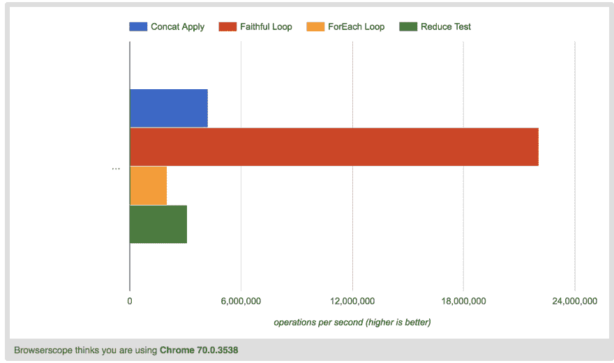

# 展平阵列，性能测试

> 原文：<https://dev.to/ryan_dunton/flattening-an-array-a-performance-test-dka>

## 提问

Javascript 中展平数组最有效的方法是什么？这个问题在面试中经常出现，也有一些实际的用例，对于面试问题来说很少见。

通过“展平”一个数组，我们的意思是将一个多维数组转换成一个常规的“单”维数组。我不确定这是否是正确的措辞，但我会照做。参见下面的示例。

```
let initialArray = [[0, 1], [2, 3], [4, 5]];

let flattenedArray = [0, 1, 2, 3, 4, 5] 
```

## 可能的解决方案

那么最有效的方法是什么呢？我草拟了四个可能的解决方案。

解决方案 1: Concat + Apply

```
let flattenedArray = Array.prototype.concat.apply([], initialArray); 
```

这是一个相当简单的单行解决方案。我们创建一个新的数组，并将每个元素连接到它上面。

解决方案 2:使用 Reduce

```
let flattenedArray = initialArray.reduce((a, b) => {
  return a.concat(b);
}); 
```

我们对数组中的每个第一级元素执行 concat 函数。然后将其连接到前一个元素上。给我们一个新的扁平数组。

解决方案 3:忠实循环

```
let flattenedArray = [];
for (let i = 0; i < initialArray.length; i++) {
  let current = initialArray[i];
  for (let j = 0; j < initialArray.length - 1; j++)
    flattenedArray.push(current[j]);
} 
```

最基本的解决方案。我们遍历第一级数组，遍历内部数组，并将它们向上推到一个空数组。我应该注意，这比我们的其他解决方案要多写很多代码。

解决方案 4:ForEach 循环

```
let flattenedArray = [];
initialArray.forEach(entry => {
  flattenedArray = flattenedArray.concat(entry);
}); 
```

更现代的方法。我们遍历每个一级数组，将它与另一个连接起来，并重新分配 flattenedArray。

## 测试结果

那么哪个最快呢？

完整的测试结果[在这里](https://jsperf.com/flatten-array-tests-by-rgd)。哇！老式的“for”循环是目前最快的。

[](https://res.cloudinary.com/practicaldev/image/fetch/s--090S42vB--/c_limit%2Cf_auto%2Cfl_progressive%2Cq_auto%2Cw_880/https://thepracticaldev.s3.amazonaws.com/i/t5lloz0gcaw6irck7rqb.png)

这是一个直接的每秒操作数指标，传统的 for 循环表现最好！这实际上让我相当震惊。有人有更好的展平方法吗？