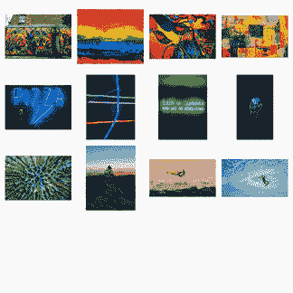

# Flex grid，响应式表格，关于我|模块星期一 37

> 原文：<https://dev.to/tyrw/flex-grid-responsive-table-about-me-module-monday-37-41ag>

## 你可以在任何地方添加模块化代码

下面所有的 mod 都是开源的，可以在你选择的任何项目中免费使用——因为有了 [Anymod](https://anymod.com) ，它们可以在任何网站或网络应用上工作。

单击一个 mod 来查看它的运行及其源代码。

## 动画伸缩网格

悬停以炫耀您的图像
[查看模式](https://anymod.com/mod/animate-flex-grid-ramkmb)
  

## 响应式表

从标准表格到列表格式的重新排列，以便更好地移动查看。
[查看 mod](https://anymod.com/mod/responsive-table-mlndna?v=29)
  

## 关于我的章节

一个美丽的，反应灵敏的部分，可以去任何地方。
[查看 mod](https://anymod.com/mod/about-me-section-lldnda?v=20)
  

## 方格图库

在任何页面上展示图片的好方法。
[查看 mod](https://anymod.com/mod/basic-gallery-squares-bamomk?v=20)
  

## 快照英雄

来自 Templated.co 的开源英雄单元。
[查看 mod](https://anymod.com/mod/snapshot-hero-kdlmbm?v=20)
  

* * *

我每周一都会在这里发布新的模块——我希望你会觉得它们有用！

快乐编码✌️