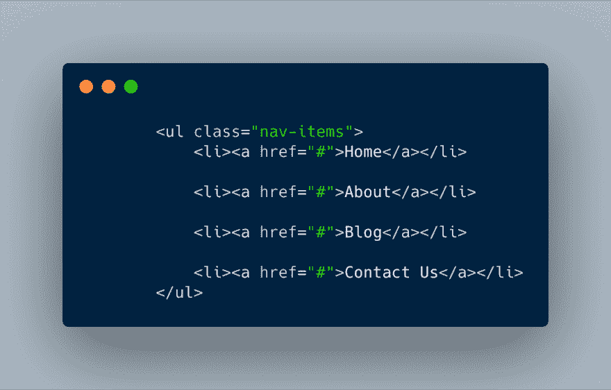
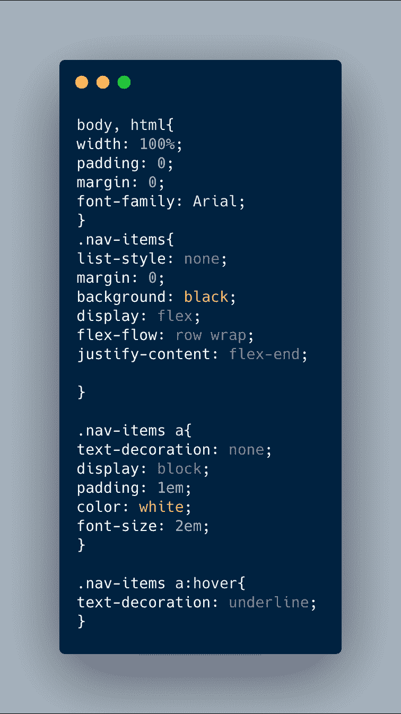

# CSS Flexbox 导航条——构建博客，第 1 部分

> 原文：<https://dev.to/njericooper/flexbox-blog-part-1-the-nav-bar-442l>

CSS Flexbox 是一种单向的方式，一次布局一个网站的组件。当显示设置为“伸缩”时，元素只能按行或列排序，然后按所需位置排序和间隔。为了方便和简洁，我很快学会了为我的所有项目/子元素创建容器的重要性。

我创建博客的第一个特点是导航条。在 CSS Flexbox 中创建导航栏比我想象的要简单。这是我使用的代码片段。

**HTML**

**CSS**

对于导航条，我不需要设计导航容器本身的样式，相反，我们只需要应用 flex 作为导航项目的显示。“Flex-flow”是结合了“flex-direction”和“flex-wrap”的简写元素。它决定了方向是在水平行还是在垂直列，也决定了项目是否会换行到下一行、反向换行或者根本不换行。

“nowrap”是默认的，所以我把它改成了“wrap”。我还对响应度行应用了一个 wrap(即将推出的手机汉堡菜单)。

“Justify-content”设置容器中各项的对齐方式。就像文本一样，有右、中、左，但是我们使用“flex-start”来对齐项目的开头，“center”和“flex-end”来对齐 flex 容器的结尾；还有一些其他选项可以设置项目的间距，但在这里它们不是必需的。对于这个导航栏，我选择了“flex-end”作为导航项，并在每个 a 标签之间添加了 1 em 的填充。

为了演示的目的，我改变了我原来的颜色，这样它们会更突出。
[https://codepen.io/njericooper/embed/QRKeBo?height=600&default-tab=result&embed-version=2](https://codepen.io/njericooper/embed/QRKeBo?height=600&default-tab=result&embed-version=2)

如果你知道 flexbox 的任何其他案例，请在 [Twitter](https://twitter.com/njericooper) 上告诉我

更喜欢视频？在 Youtube 上看我写代码

[https://www.youtube.com/embed/3iuL9rZZwfw](https://www.youtube.com/embed/3iuL9rZZwfw)

> Njeri Cooper[@ njericooper](https://dev.to/njericooper)CSS Flex 框中的简单导航栏[codepen.io/njericooper/pe…](https://t.co/CsmEWcNKK2)via[@ CodePen](https://twitter.com/CodePen)2019 年 5 月 16 日下午 17:540