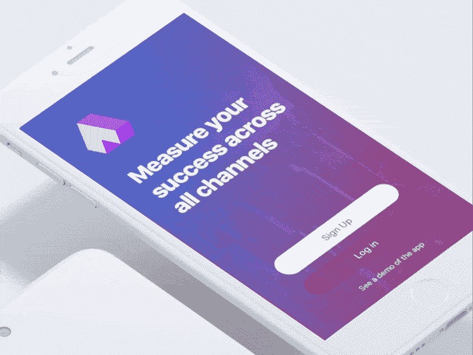
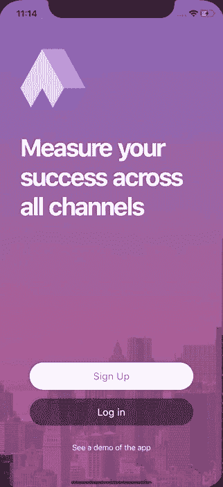
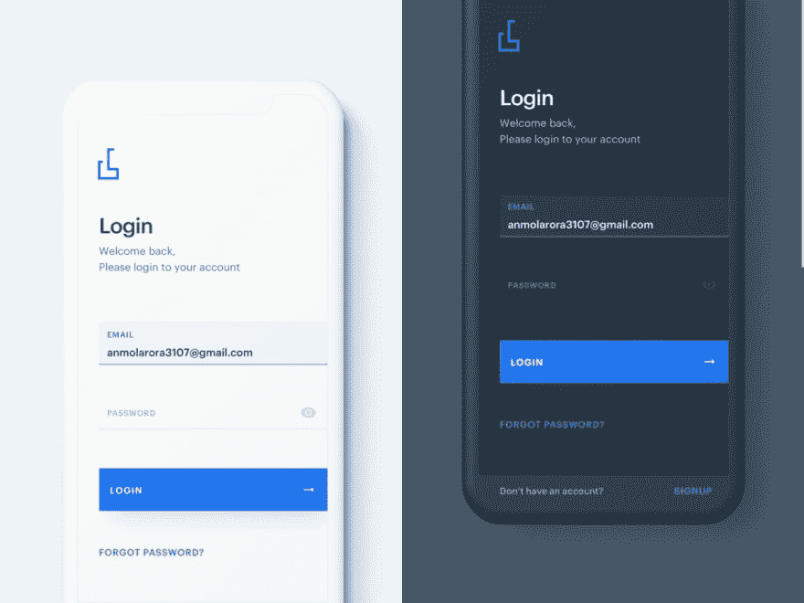
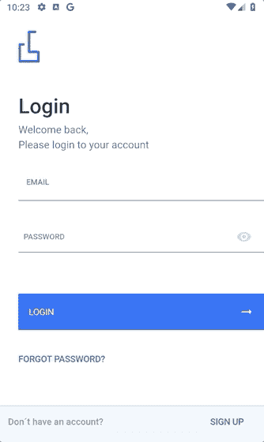
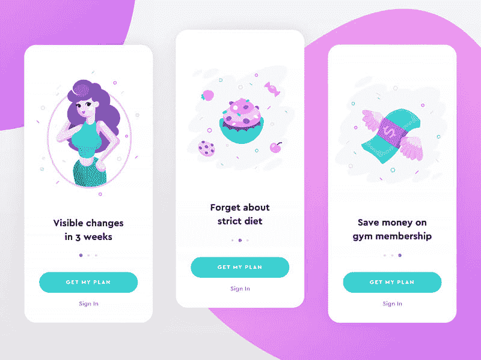
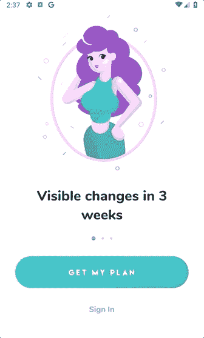
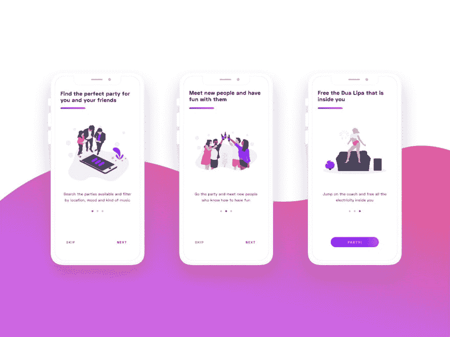
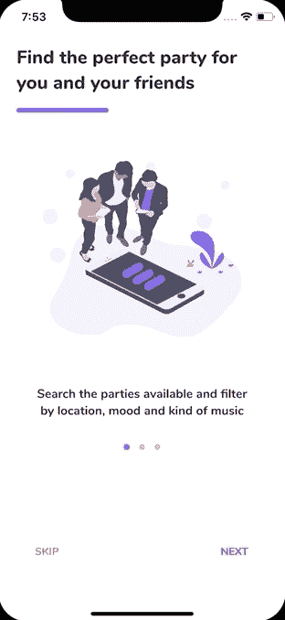

# 我在 Flutter 中开发的应用程序集合，用于实现自定义 UI/UX 设计

> 原文：<https://dev.to/crivasgomez/flutter-uiux-design-implementations-518i>

在我的[flutter-UI-UX-designs](https://github.com/CRivasGomez/flutter-ui-ux-designs)GitHub 存储库中，你会发现我在 Flutter 中开发的一系列应用，目的是掌握在 Android 和 iOS 中实现定制 UI/UX 设计的必要技能。

所有的应用程序都按主题分类，并包含原始用户界面/UX 设计的相应参考。

## 认证

### 动画背景

#### [原创设计](https://www.uplabs.com/posts/ios-login-template-freebie)作者[迈克·艾凡奇辛](https://www.uplabs.com/imvasyl):

#### iOS 演示:

#### 安卓演示:

### 最小限度登录

#### [原创设计](https://www.uplabs.com/posts/minimal-login-light-dark-version)作者[安摩尔·阿罗拉](https://www.uplabs.com/anmol3107):

#### iOS 演示:

#### 安卓演示:

### 滑行舟

#### [原创设计](https://www.uplabs.com/posts/login-ui-8357f9ec-e05d-47b2-8902-f4229c307e8f)匿名:

#### iOS 演示:

#### 安卓演示:

## 入职

### 健身

#### [原创设计](https://www.uplabs.com/posts/fitness-app-onboarding-16ea7d31-a12c-49f8-b70c-e367cf651425)作者[安娜斯塔西娅·阿格耶娃](https://www.uplabs.com/aaz127):

#### iOS 演示:

#### 安卓演示:

### 方寻

#### [原创设计](https://www.uplabs.com/posts/party-finding-concept)出自[洛伦佐·雷斯图西亚](https://www.uplabs.com/lorenzo_restuccia_8):

#### iOS 演示:

#### 安卓演示:

