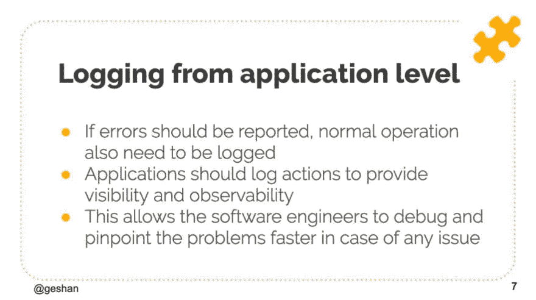

# 记录最佳实践以充分利用应用程序级记录—幻灯片

> 原文：<https://dev.to/geshan/follow-these-logging-best-practices-to-get-the-most-out-of-application-level-loggingslides-3p8j>

应用程序级别的日志是应用程序与您交流的唯一方式。拥有具有值得称赞的搜索能力的适当日志就像在黑暗的房间里有一个手电筒。

在出现任何问题的情况下充分利用日志是非常被低估的。作为软件工程师，我们可以利用应用程序的日志来解决问题，并了解应用程序的总体健康状况。

> *日志也有助于分析应用程序的性能。*

不久前我也写过关于[日志](https://geshan.com.np/blog/2015/08/importance-of-logging-in-your-applications/)的文章。

 [## 登录应用程序的重要性，今天就开始登录吧

### geshan man andhar 10 月 13 日 185 分钟阅读

#coding #webdev #devops #tips](/geshan/importance-of-logging-in-your-applications-start-logging-today-2om9)

这篇文章关注的是从应用程序级别进行日志记录时可以遵循的最佳实践，以及它如何帮助你成为一名软件工程师。

 *为什么从应用层登录*

## 在冰川上记录最佳实践

以下是日志记录的主要最佳实践:

### 1。最佳记录信息

太多的信息是噪音，太少的信息是不够的。很难找到多少日志是最佳的平衡，但这是一个挑战。在微服务的情况下，还要考虑服务之间的可追溯性，比如使用唯一的请求标识符。另一件要记住的事情是日志是暂时的，而不是永久的。因为它们没有存储在数据库中，所以它们通常有几天到几周的寿命。

### 2。始终遵循严重性级别

紧急情况意味着你的待命电话将在凌晨 2 点响起，但信息严重程度是不会打扰任何人的事情。你必须作为一个团队在一些既定的标准上达成一致，比如 [syslog one](https://tools.ietf.org/html/rfc5424) 。

### 3。构建您的日志

在你的日志行中有一个结构，比如有一个消息和一个上下文数组来添加关于消息的更多信息。遵循一致同意的 JSON 日志标准。这使得解析和搜索变得容易。你甚至可以设置更多的规则，如日期是强制性的，描述不能超过 255 个字符，额外的信息在上下文中。有了这些简单的规则，在需要时更容易找到日志。强烈建议提供带有日志行的上下文，例如，当记录订单无法发货时，添加订单的详细信息(当然是不敏感的内容)。

### 4。小心地写日志(不要影响性能)

确保添加日志不会给响应时间增加很多额外的毫秒数。尽可能以异步方式写日志，日志甚至可以在本地写在日志文件中，并使用日志发送器发送到您选择的服务。根据您使用的语言/框架，您也可以使用可靠的库。使用队列也可以是运送日志的一种选择，但是要记住查看日志时可能会有延迟。

### 5。为工作使用正确的工具

您选择运送、查看、搜索和分类日志的工具和服务是您团队的选择。根据预算、使用外部服务的偏好，团队可以使用完全自我管理的堆栈，如 [ELK](https://www.elastic.co/elk-stack) / [Graylog](https://www.graylog.org/) ，或者使用服务，如[log entries](https://logentries.com/)/[sema text log sense](https://sematext.com/logsene/)。主要思想是非常有效地使用适合您需求的工具。例如，如果您需要几乎实时的日志，使用队列可能不是最好的决定。因此，设计您的日志记录基础设施和堆栈，以很好地满足您的需求。

## 幻灯片

二月份，我在工作场所做了一个关于“记录最佳实践”的演讲，演讲的幻灯片如下:

[https://speakerdeck.com/player/4f33e89002cc4a29926808ef42457fc2](https://speakerdeck.com/player/4f33e89002cc4a29926808ef42457fc2)

您也可以在 [slideshare](https://www.slideshare.net/geshan/logging-best-practices) 和[扬声器平台](https://speakerdeck.com/geshan/logging-best-practices)上观看幻灯片。

## 结论

> 如果狗是人类最好的朋友，那么木头就是软件工程师最好的朋友。

充分利用日志来获得最大的收益，并记住关于日志记录的最佳实践。

*最初发表于[geshan.com.np](https://geshan.com.np/blog/2019/03/follow-these-logging-best-practices-to-get-the-most-out-of-application-level-logging-slides/)。*